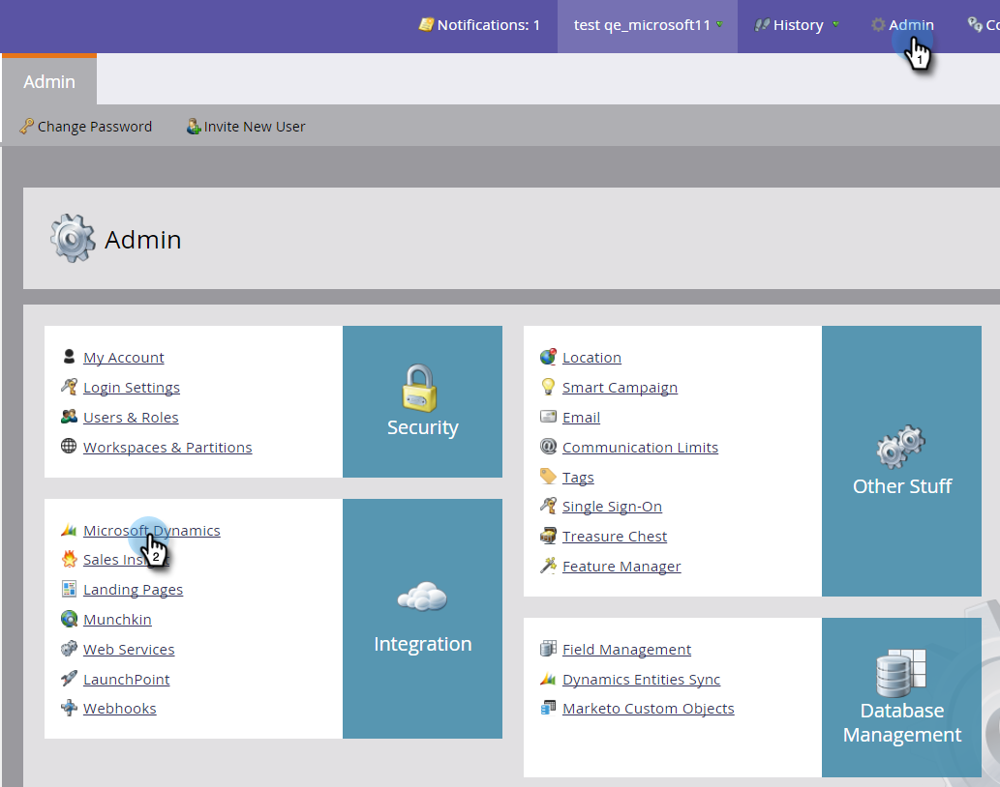
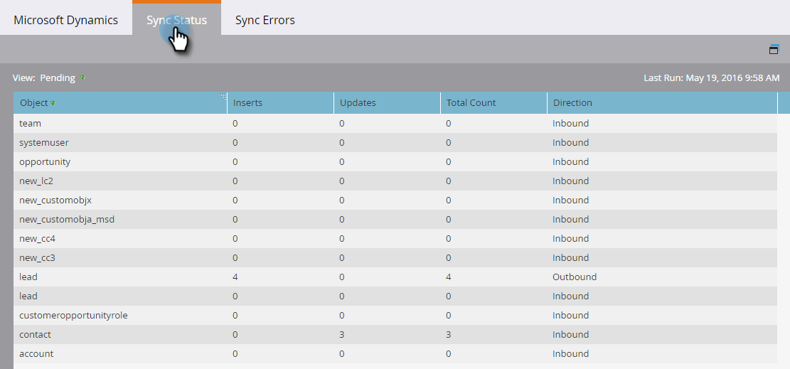
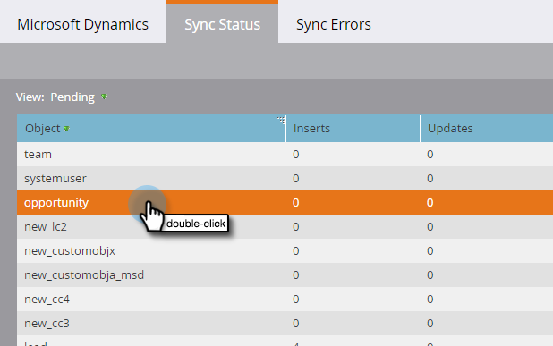
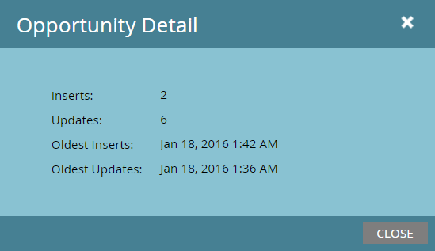
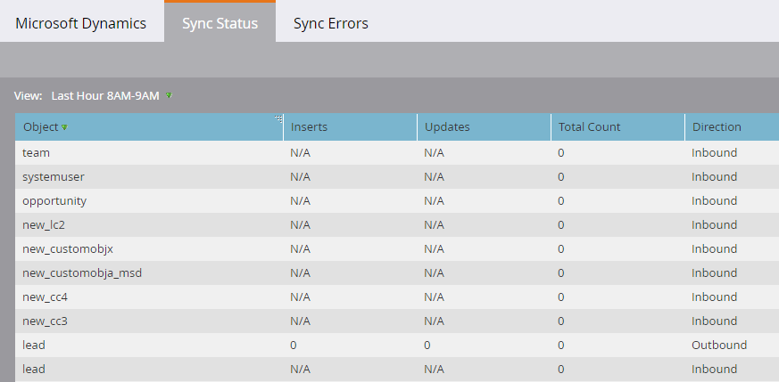
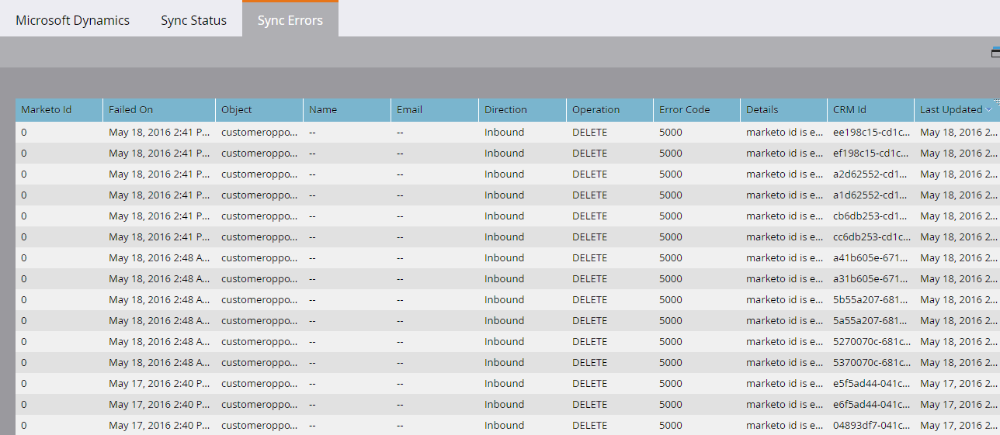

# 同期ステータス {#sync-status}

「[!UICONTROL 同期ステータス]」タブと「[!UICONTROL 同期エラー]」タブで、同期プロセスの現在のスループットとバックログをタブに保つことができます。

## 「[!UICONTROL 同期ステータス]」タブ {#sync-status-tab}

1. 「**[!UICONTROL 管理者]**」をクリックし、「**[!UICONTROL Microsoft Dynamics]**」をクリックします。

   

1. 「**[!UICONTROL 同期ステータス]**」タブをクリックします。

   

   この表は、オブジェクトごとに、まだ同期されていない挿入と更新のバックログを示しています。

1. 任意の行をダブルクリックして、商談情報を表示します。

   

   同期ステータスの詳細は、挿入と更新、および最も古い挿入と更新のレコード別に分類されます。

   

1. **[!UICONTROL 表示]**&#x200B;ドロップダウンをクリックして「**[!UICONTROL 過去 1 時間]**」を選択してスループット情報を表示します。

   

   過去 1 時間（午後 1～2 時など）に同期されたレコードの数が表示されます。

   

   >[!NOTE]
   >
   >[!UICONTROL 最終時間] ビューを見ると、[!UICONTROL 挿入]列と[!UICONTROL 更新]列にN/Aが表示されます。これは期待される動作です。

## 「[!UICONTROL 同期エラー]」タブ {#sync-errors-tab}

操作、方向、エラーコード、エラーメッセージなどの詳細との同期に失敗したリード（およびその他のオブジェクト）の参照、検索、エクスポートを行います。

>[!MORELIKETHIS]
>
>[通知のタイプ](/help/marketo/product-docs/core-marketo-concepts/miscellaneous/understanding-notifications/notification-types.md){target="_blank"}
