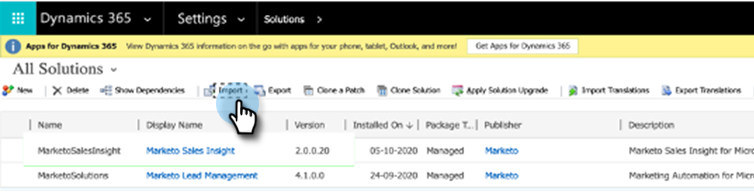

# Microsoft Dynamics MSI 向けプラグインリリース {#plug-in-releases-for-microsoft-dynamics-msi}

Microsoft Dynamics に初めて同期するときは、Marketo Sales Insight（MSI）用の最新バージョンのプラグインをダウンロードしてインストールします。Marketo Engageは定期的にこれらのプラグインを更新するので、同じ場所に戻って新しいバージョンをダウンロードできます。

Marketo独自の CRM 同期ソリューションを Dynamics に使用している場合は、Dynamics のリリースに対応する [ 最新のプラグインをダウンロード ](/help/marketo/product-docs/marketo-sales-insight/msi-for-microsoft-dynamics/installing/download-the-marketo-sales-insight-solution-for-microsoft-dynamics.md){target="_blank"} してください。 カスタム同期があり、Marketo Sales Insight を購入した方は、[ パッケージはこちら ](https://mktg-cdn.marketo.com/community/MarketoSalesInsight_NonNative.zip){target="_blank"} をご覧ください。

>[!NOTE]
>
>これらのバージョンは、Dynamics のオンプレミスバージョンとオンラインバージョンの両方で機能します。

## MSI ソリューションのアップグレード {#upgrading-your-msi-solution}

1. Dynamics の「_インポート_」ボタンを押して、Dynamics CRM の&#x200B;**[!UICONTROL 既存のバージョンに]**&#x200B;最新バージョンのソリューションをインポートします。

   

>[!NOTE]
>
>例：Dynamics CRM のバージョンが 2.0.0.20 で、最新バージョンが 2.0.0.21 の場合は、2.0.0.20 _以降_&#x200B;のバージョンをインポートします。

1. 「**[!UICONTROL 次へ]**」をクリックします。

   

1. 「**[!UICONTROL アップグレードのステージ]**」および「**[!UICONTROL カスタマイズを維持]**」を選択し、「**[!UICONTROL インポート]**」をクリックします。

   

1. 「**[!UICONTROL 次へ]**」をクリックします。

   

1. インポートが正常に完了すると、MarketoSalesInsight と MarketoSalesInsight_Upgrade の 2 つの MSI ソリューションが表示されます。古いソリューションを選択し、「ソリューションアップグレードを適用」をクリックします。

   

これで完了です。アップグレード後は、1 つの MSI ソリューションのみが表示されます。

## バージョンの更新 {#version-updates}

<table> 
 <tbody> 
  <tr> 
   <th>リリース日</th> 
   <th>バージョン</th> 
   <th>注意</th> 
  </tr>
  <tr> 
   <td>2024/14</td> 
   <td>2.00.31</td> 
   <td>匿名 Web アクティビティのページネーションの変更。
   

   ユーザービューから秘密鍵の情報を暗号化します。 暗号化を実行するには、新しいパッケージの読み込み後にパスワードを変更する必要があります。</td> 
  </tr>
  <tr> 
   <td>10/18/23</td> 
   <td>2.00.30</td> 
   <td>MSI エラーログを統合し、情報通知を削除すると、Marketo エラーエンティティに表示されない。</td> 
  </tr>
  <tr> 
   <td>2023/5/19</td> 
   <td>2.00.29</td> 
   <td>グローバルダッシュボードの web アクティビティと注目のアクションページネーションの問題を修正しました。</td> 
  </tr>
  <tr> 
   <td>2023/3/23</td> 
   <td>2.00.28</td> 
   <td>CRM への非ネイティブ接続用に MSI 用の <a href="https://mktg-cdn.marketo.com/community/MarketoSalesInsight_NonNative.zip"> 新しいパッケージ </a> を作成しました。</td> 
  </tr>
  <tr> 
   <td>2022/03</td> 
   <td>2.0.0.27</td> 
   <td>インサイトのアカウントレイアウト：注目のアクション、スコアの変更、Web アクティビティ、メールアクティビティ。</td> 
  </tr>
  <tr> 
   <td>2022/1/05</td> 
   <td>2.0.0.26</td> 
   <td>メール送信用のプログラム採用スコア。</td> 
  </tr>
  <tr> 
   <td>10/28/21</td> 
   <td>2.0.0.25</td> 
   <td>製品導入スコア指標、新しいグローバルダッシュボード（Web アクティビティ、メール、ベストベット）。</td> 
  </tr>
  <tr> 
   <td>2021/10</td> 
   <td>2.0.0.22</td> 
   <td>MSI ソリューションの自動監査の有効化とドキュメントの変更を削除します。</td> 
  </tr>
  <tr> 
   <td>2020/10/1</td> 
   <td>2.0.0.21</td> 
   <td>バグ修正：Sales Insight の役割を持つユーザーに MSI API 設定フィールドへのアクセスを割り当てる。</td> 
  </tr> 
  <tr> 
   <td>2020/07/20</td> 
   <td>2.0.0.20</td> 
   <td>バグ修正：同期されていないレコードに対する検証メッセージを追加しました。</td> 
  </tr> 
  <tr> 
   <td>2020/06/12</td> 
   <td>2.0.0.19</td> 
   <td>バグ修正：MSD API 設定で MSI シークレットパスワードを非表示にする。</td> 
  </tr> 
  <tr> 
   <td>2020/05/26</td> 
   <td>2.0.0.18</td> 
   <td>バグ修正：MSI ボタンを表示するための MSI 役割 ID 検証を変更します。</td> 
  </tr> 
  <tr> 
   <td>2020/05/21</td> 
   <td>2.0.0.17</td> 
   <td>バグ修正：所有者フィールドの非表示を解除し、フィールドを必須にしない。</td> 
  </tr> 
  <tr> 
   <td>2020/04/28</td> 
   <td>2.0.0.16</td> 
   <td>バグ修正：MSD CRM サイトマップ設定のリンク依存関係を削除する。</td> 
  </tr> 
 </tbody> 
</table>
