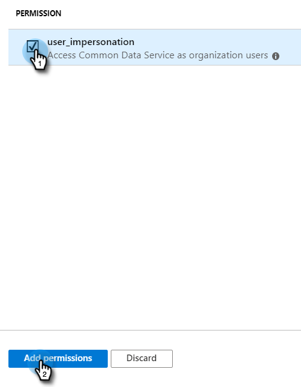

# Azureにアプリを登録して、クライアントID/アプリIDを取得する {#register-an-app-with-azure-to-acquire-your-client-id-app-id}

Azure Active Directoryは、オンプレミスのディレクトリをクラウドに拡張し、オンプレミスのADFS認証でMS Dynamics 365 CRMをサポートします。

## 新規アプリの登録 {#registering-a-new-app}

1. [管理者権限を持つアカウントを使用して](http://manage.windowsazure.com/) 、Microsoft Azure管理ポータルにログインします。 左側のナビゲーションウィンドウで[ **管理者** ]項目を展開し、[ **Azure AD**]を選択すると、Office 365 Admin Centerを介してMicrosoft Azureポータルにアクセスすることもできます。

   >[!CAUTION]
   >
   >アプリの登録先と同じOffice 365購読のアカウントを使用する必要があります。

   >[!NOTE]
   >
   >Azureアカウントをお持ちでない場合は、 [サインアップし](https://azure.microsoft.com/en-us/free/) てください。 詳細については、Microsoftのドキュメントを参照するか、Microsoftの担当者にお問い合わせください。 Azureアカウントを作成したら、以下に説明する手順を使用して1つ以上のアプリを登録できます。
   >
   >
   >Azureアカウントをお持ちで、Microsoft Dynamics 365とのOffice 365購読がAzure購読で使用できない場合は、 [次の手順に従って](https://msdn.microsoft.com/office/office365/howto/setup-development-environment#bk_CreateAzureSubscription) 、2つのアカウントを関連付けます。

1. 左側のナビゲーションウィンドウで **Azure Active Directory** を探してクリックします。

   

1. 「管理」で、「 **アプリ登録**」をクリックします。

   

1. ページ上部の「**新規登録**」をクリックします。

   

1. アプリの名前を入力し、該当するアカウントタイプを選択して、リダイレクトURLを入力します。 次に、ページの下部にある **登録** (Register)をクリックします。

   

1. これで、「 **アプリ登録** 」タブにアプリが表示されます。

   

## アプリの権限の設定 {#configuring-app-permissions}

1. Active Directoryの「 **アプリ登録** 」タブで、権限を設定するアプリをクリックします。

   

1. 「管理」で、「 **API権限**」をクリックします。

   

1. 権限 **** ボタンをクリックします。

   

1. 「 **Dynamics CRM**」を選択します。

   

1. 「 **Access Common Data Service as organization user***s** 」ボックスをオンにし、「 **権限」をクリックします。**

   

1. 権限が正常に追加されたら、少なくとも10秒待ちます。

   

1. 「 **許可管理者の同意** 」ボタンをクリックします。

   

1. 「 **はい** 」をクリックして確認します。

   

   終わった！

   

