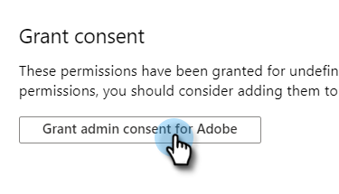

# アプリを Azure に登録してクライアント ID／アプリ ID を取得 {#register-an-app-with-azure-to-acquire-your-client-id-app-id}

Azure Active Directory は、オンプレミスのディレクトリをクラウドに拡張し、オンプレミスの ADFS 認証を備えた MS Dynamics 365 CRM をサポートします。

## 新しいアプリの登録 {#registering-a-new-app}

1. [ログイン](https://login.microsoftonline.com/)管理者権限を持つアカウントを使用して、{target=&quot;_blank&quot;} をMicrosoft Azure 管理ポータルに移動します。 また、左側のナビゲーションパネルの「**管理者**」項目を展開し、「**Azure AD**」を選択して、Office 365 Admin Center から Microsoft Azure ポータルにアクセスすることもできます。

   >[!CAUTION]
   >
   >アプリの登録先と同じ Office 365 サブスクリプションのアカウントを使用する必要があります。

   >[!NOTE]
   >
   >Azure アカウントをお持ちでない場合は、 [サインアップ](https://azure.microsoft.com/ja-jp/free/){target=&quot;_blank&quot;} （1 つ）。 詳しくは、Microsoft のドキュメントを参照するか、Microsoft の担当者にお問い合わせください。Azure アカウントを作成したら、以下の手順を使用して 1 つ以上のアプリを登録できます。
   >
   >
   >Azure アカウントをお持ちの場合、Microsoft Dynamics 365 で Office 365 サブスクリプションを Azure サブスクリプションで利用できない場合は、以下の手順に従ってください [これらの手順](https://msdn.microsoft.com/office/office365/howto/setup-development-environment#bk_CreateAzureSubscription){target=&quot;_blank&quot;} を使用して 2 つのアカウントを関連付けます。

1. 左側のナビゲーションパネルで、「**Azure Active Directory**」を検索してクリックします。

   

1. 「管理」で、「**アプリの登録**」をクリックします。

   

1. ページの上部にある「**新規登録**」をクリックします。

   

1. アプリ名を入力し、適切なアカウントタイプを選択して、リダイレクト URL を入力します。次に、ページの下部にある「**登録**」をクリックします。

   

1. これで、アプリが「**アプリの登録**」タブに表示されます。

   

## アプリの権限の設定 {#configuring-app-permissions}

1. Active Directory の「**アプリの登録**」タブで、権限を設定するアプリをクリックします。

   

1. 「管理」で、「**API 権限**」をクリックします。

   

1. 「**権限を追加**」ボタンをクリックします。

   

1. 「**Dynamics CRM**」を選択します。

   

1. 「**組織ユーザーとして共通データサービスにアクセスする**」チェックボックスにチェックを入れ、「**権限を追加する**」をクリックします。

   

1. 権限が正常に追加されたら、少なくとも 10 秒待ちます。

   

1. 「**管理者の同意を付与**」ボタンをクリックします。

   

1. 「**はい**」をクリックして確認します。

   

   これで完了です。

   
