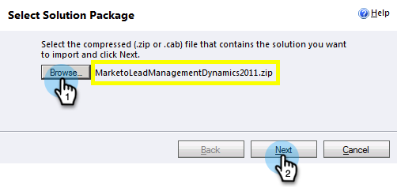

# 手順 1 / 3：Marketo ソリューション（2011 オンプレミス版）のインストール {#step-of-install-the-marketo-solution-on-premises}

Microsoft Dynamics On-Premises とMarketoを同期する前に、Dynamics にMarketoソリューションをインストールする必要があります。

>[!NOTE]
>
>Marketoを CRM に同期した後は、インスタンスを置き換えないと、新しい同期を実行できません。

>[!PREREQUISITES]
>
>必ず [インターネット対応の導入](https://www.microsoft.com/en-us/download/confirmation.aspx?id=41701) (IFD) [Active Directory フェデレーションサービス](https://msdn.microsoft.com/en-us/library/bb897402.aspx) 2.0、2.1、または 3.0(ADFS) が設定されました。 **注意**:IFD ドキュメントは、リンクをクリックすると自動的にダウンロードされます。
>
>[Marketo Lead Management Solution のダウンロード](/help/marketo/product-docs/crm-sync/microsoft-dynamics-sync/sync-setup/download-the-marketo-lead-management-solution.md) 始める前に

>[!NOTE]
>
>**Dynamics 管理権限が必要です。**
>
>この同期を実行するには、CRM 管理者権限が必要です。

1. にログインします。 **Dynamics**&#x200B;を選択します。 **設定** をクリックします。

   

1. ツリーで「**ソリューション**」を選択します。

   

1. 「**インポート**」をクリックします。

   

1. 「**参照**」をクリックします。お使いのMarketo Lead Management ソリューションを選択してください [ダウンロード](/help/marketo/product-docs/crm-sync/microsoft-dynamics-sync/sync-setup/download-the-marketo-lead-management-solution.md). 「**次へ**」をクリックします。

   

1. ソリューション情報を表示し、 **ソリューションパッケージの詳細を表示**.

   

1. すべての詳細を確認したら、 **閉じる**.

   

1. ソリューション情報ページに戻り、 **次へ**.

   

1. 「 SDK メッセージオプション」チェックボックスがオンになっていることを確認します。 「**次へ**」をクリックします。

   

   >[!TIP]
   >
   >インストールプロセスを完了するには、ブラウザーでポップアップを有効にする必要があります。

1. インポートが完了するまで待ちます。起き上がってストレッチを行う。

   

1. 「**閉じる**」をクリックします。

   >[!NOTE]
   >
   >「Marketo Lead Management completed with warning」というメッセージが表示される場合があります。 これは完全に期待されています。

   

1. Marketoリード管理が **すべてのソリューション** ページ。

   

1. 「 Marketo Lead Management 」を選択し、「 **すべてのカスタマイズを公開します。**

   

悪くなかったでしょ？ さあ、あとは歩き続ける。

>[!CAUTION]
>
>Marketo SDK メッセージングプロセスを無効にすると、インストールが壊れます。

>[!MORELIKETHIS]
>
>[手順 2 / 3：Dynamics（2011 オンプレミス）での Marketo 同期ユーザーのセットアップ](/help/marketo/product-docs/crm-sync/microsoft-dynamics-sync/sync-setup/microsoft-dynamics-2011-on-premises/step-2-of-3-set-up.md)
