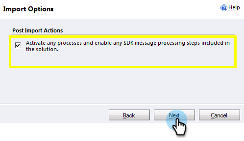

# 手順 1 / 3：Marketo ソリューション（2011 オンプレミス版）のインストール {#step-of-install-the-marketo-solution-on-premises}

Microsoft Dynamics をオンプレミスとMarketo Engageで同期する前に、まずMarketo ソリューションを Dynamics にインストールする必要があります。

>[!NOTE]
>
>Marketo を CRM に同期した後は、インスタンスを置き換えないと、新しい同期を実行できません。

>[!PREREQUISITES]
>
>[Active Directory フェデレーション サービス ](https://www.microsoft.com/en-us/download/confirmation.aspx?id=41701){target="_blank"} 2.0、2.1、または 3.0 （ADFS）が構成されている [ インターネット接続展開 ](https://msdn.microsoft.com/en-us/library/bb897402.aspx){target="_blank"} （IFD）が必要です。 **注意**：IFD ドキュメントは、リンクをクリックすると自動的にダウンロードされます。
>
>始める前に、[Marketo リード管理ソリューションをダウンロード](/help/marketo/product-docs/crm-sync/microsoft-dynamics-sync/sync-setup/download-the-marketo-lead-management-solution.md){target="_blank"}します。

>[!NOTE]
>
>**Dynamics 管理者権限が必要です**。
>
>この同期を実行するには、CRM 管理者権限が必要です。

1. Dynamics にログインし、左下のメニューで **[!UICONTROL 設定]** を選択します。

   

1. ツリーで「**[!UICONTROL ソリューション]**」を選択します。

   

1. 「**[!UICONTROL インポート]**」をクリックします。

   

1. 「**[!UICONTROL 参照]**」をクリックします。[ダウンロードした](/help/marketo/product-docs/crm-sync/microsoft-dynamics-sync/sync-setup/download-the-marketo-lead-management-solution.md){target="_blank"} Marketo リード管理ソリューションを選択します。「**[!UICONTROL 次へ]**」をクリックします。

   

1. ソリューション情報を表示し、「**[!UICONTROL ソリューションパッケージ詳細を表示]**」をクリックします。

   

1. すべての詳細を確認したら、「**[!UICONTROL 閉じる]**」をクリックします。

   

1. ソリューション情報ページに戻り、「**[!UICONTROL 次へ]**」をクリックします。

   

1. 「SDK メッセージ」オプションチェックボックスがオンになっていることを確認します。「**[!UICONTROL 次へ]**」をクリックします。

   

   >[!TIP]
   >
   >インストールプロセスを完了するには、ブラウザーでポップアップを有効にする必要があります。

1. インポートが完了するまで待ちます。ストレッチでもしながらお待ちください。

   

1. 「**[!UICONTROL 閉じる]**」をクリックします。

   >[!NOTE]
   >
   >「Marketo Lead Management completed with warning」というメッセージが表示される場合があります。これは十分予期されているものです。

   

1. Marketo リード管理が、**すべてのソリューション**&#x200B;ページに表示されます。

   

1. Marketo Lead Management を選択し、**[!UICONTROL すべてのカスタマイズをPublish]** をクリックします。

   

>[!CAUTION]
>
>Marketo SDK メッセージングプロセスを無効にすると、不完全なインストールになります。

>[!MORELIKETHIS]
>
>[手順 2 / 3：Dynamics（2011 オンプレミス）での Marketo 同期ユーザーのセットアップ](/help/marketo/product-docs/crm-sync/microsoft-dynamics-sync/sync-setup/connecting-to-legacy-versions/step-2-of-3-set-up-2011.md){target="_blank"}
