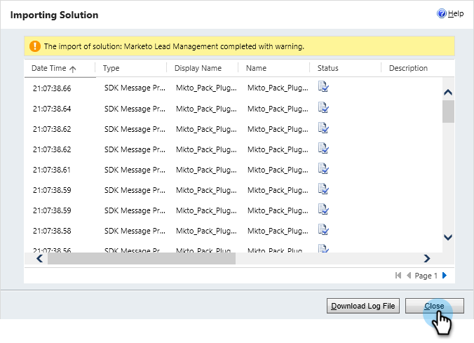

# 手順 1 / 3：Marketo（2015 オンプレミス）の同期ユーザーの設定 {#step-of-configure-sync-user-for-marketo-on-premises-2015}

Microsoft Dynamics 2015 オンプレミスと Marketo Engage を同期する前に、Dynamics に Marketo ソリューションをインストールする必要があります。

>[!NOTE]
>
>Marketo を CRM に同期した後は、新しい CRM を既存の Marketo インスタンスに同期できません。

>[!PREREQUISITES]
>
>Microsoft Dynamics オンプレミスを使用している場合は、[Active Directory Federation Services](https://msdn.microsoft.com/en-us/library/bb897402.aspx){target="_blank"} 2.0 以降（ADFS）が設定された、[インターネットに接続する展開](https://learn.microsoft.com/ja-jp/dynamics365/customerengagement/on-premises/deploy/configure-an-internet-facing-deployment){target="_blank"}（IFD）が構成されている必要があります。注意：IFD ドキュメントは、リンクをクリックすると自動的にダウンロードされます。
>
>始める前に、[Marketo リード管理ソリューションをダウンロード](/help/marketo/product-docs/crm-sync/microsoft-dynamics-sync/sync-setup/download-the-marketo-lead-management-solution.md){target="_blank"}します。

>[!NOTE]
>
>**Dynamics 管理者権限が必要**&#x200B;です。
>
>この同期を実行するには、CRM 管理者権限が必要です。

1. Dynamics にログインします。「**[!UICONTROL Microsoft Dynamics CRM]**」ドロップダウンをクリックし、「**[!UICONTROL 設定]**」を選択します。

   

1. 「**[!UICONTROL 設定]**」で、「**[!UICONTROL ソリューション]**」を選択します。

   

1. 「**[!UICONTROL インポート]**」をクリックします。

   

1. 「**[!UICONTROL 参照]**」をクリックし、[ダウンロード](/help/marketo/product-docs/crm-sync/microsoft-dynamics-sync/sync-setup/download-the-marketo-lead-management-solution.md)したソリューションを選択します。「**[!UICONTROL 次へ]**」をクリックします。

   

1. ソリューション情報を表示し、「**[!UICONTROL ソリューションパッケージ詳細を表示]**」をクリックします。

   

1. すべての詳細を確認したら、「**[!UICONTROL 閉じる]**」をクリックします。

   

1. ソリューション情報ページに戻り、「**[!UICONTROL 次へ]**」をクリックします。

   

1. 「SDK」オプションチェックボックスがオンになっていることを確認します。「**[!UICONTROL インポート]**」をクリックします。

   

1. インポートが完了するまで待ちます。

   >[!TIP]
   >
   >インストールプロセスを完了するには、ブラウザーでポップアップを有効にする必要があります。

   

1. 必要に応じて、ログファイルをダウンロードし、「**[!UICONTROL 閉じる]**」をクリックします。

   >[!NOTE]
   >
   >「Marketo Lead Management completed with warning」というメッセージが表示される場合があります。これは十分予期されているものです。

   

1. Marketo リード管理が、**[!UICONTROL すべてのソリューション]**&#x200B;ページに表示されます。

   

1. Marketo ソリューションを選択し、「**[!UICONTROL すべてのカスタマイズを公開]**」をクリックします。

   

   お疲れさまでした。インストールが完了しました。

   >[!CAUTION]
   >
   >Marketo SDK メッセージングプロセスを無効にすると、不完全なインストールになります。

   >[!MORELIKETHIS]
   >
   >[Microsoft Dynamics 2015 オンプレミス向け Marketo インストール手順 2 / 3](/help/marketo/product-docs/crm-sync/microsoft-dynamics-sync/sync-setup/connecting-to-legacy-versions/step-2-of-3-set-up-2015.md){target="_blank"}
