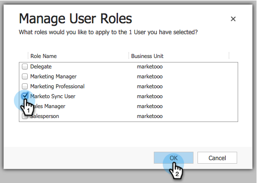

# 手順 2 / 3：Marketo（2013 オンプレミス）の同期ユーザーの設定 {#step-of-configure-sync-user-for-marketo-on-premises}

前の手順を完了した素晴らしい仕事です。次に、この作業を進めましょう。

>[!PREREQUISITES]
>
>[手順 1 / 3：Dynamics（2013 オンプレミス）での Marketo ソリューションのインストール](/help/marketo/product-docs/crm-sync/microsoft-dynamics-sync/sync-setup/microsoft-dynamics-2013-on-premises/step-1-of-3-install.md)

## 同期ユーザーロールの割り当て {#assign-sync-user-role}

Marketo同期ユーザーの役割をMarketo同期ユーザーにのみ割り当てます。 他のユーザーに割り当てる必要はありません。

>[!NOTE]
>
>これは、Marketoプラグインバージョン 4.0.0.14 以降に当てはまります。 以前のバージョンでは、すべてのユーザーに同期ユーザーの役割が必要です。 Marketoをアップグレードするには、 [Microsoft Dynamics 用Marketoソリューションのアップグレード](/help/marketo/product-docs/crm-sync/microsoft-dynamics-sync/sync-setup/update-the-marketo-solution-for-microsoft-dynamics.md).

>[!IMPORTANT]
>
>同期ユーザーの言語設定 [は英語に設定する必要があります](https://portal.dynamics365support.com/knowledgebase/article/KA-01201/en-us).

1. の下 **設定**&#x200B;をクリックし、 **管理**.

   

1. 選択 **ユーザー**.

   

1. ユーザーのリストがここに表示されます。 専用のMarketo Sync ユーザーを選択するか、 [Active Directory フェデレーションサービス (AFDS)](https://msdn.microsoft.com/en-us/library/bb897402.aspx) [管理者：Marketo専用の新しいユーザーを作成します。](https://blogs.technet.com/b/askpfeplat/archive/2014/04/21/introduction-to-active-directory-federation-services-ad-fs-alternateloginid-feature.aspx)

   

1. 同期ユーザーを選択します。 クリック  を選択し、 **役割の管理**

   

1. チェック **Marketo同期ユーザー** をクリックし、 **OK**.

   

   >[!TIP]
   >
   >の役割が表示されない場合は、に戻ります。 [手順 1 / 3](/help/marketo/product-docs/crm-sync/microsoft-dynamics-sync/sync-setup/microsoft-dynamics-2013-on-premises/step-1-of-3-install.md) ソリューションを読み込みます。

   >[!NOTE]
   >
   >同期ユーザーが CRM でおこなった更新はすべて次のとおりです **not** をMarketoに同期し直します。

## Marketo Solution の設定 {#configure-marketo-solution}

ほぼ完了です！ 次の記事に進む前に、設定の最後の部分をいくつか用意します。

1. 「**設定**」で、「**Marketo 設定**」をクリックします。

   

   >[!NOTE]
   >
   >If **Marketo Config** が見つかりません。ページを更新してみてください。 問題が解決しない場合は、 [Marketoソリューションの公開](/help/marketo/product-docs/crm-sync/microsoft-dynamics-sync/sync-setup/microsoft-dynamics-2013-on-premises/step-1-of-3-install.md) もう一度試すか、ログアウトしてから再度ログインしてください。

1. クリック **デフォルト**.

   

1. 次をクリック： **Marketo User** 「 」フィールドをクリックし、同期ユーザーを選択します。

   

1. クリック  をクリックして、変更を保存します。

   

1. クリック **すべてのカスタマイズを公開**.

   

## 手順 3 に進む前に {#before-proceeding-to-step}

* 同期するレコード数を制限する場合は、 [カスタム同期フィルターの設定](/help/marketo/product-docs/crm-sync/microsoft-dynamics-sync/create-a-custom-dynamics-sync-filter.md) 今すぐ。
* を実行します。 [Microsoft Dynamics 同期の検証](/help/marketo/product-docs/crm-sync/microsoft-dynamics-sync/sync-setup/validate-microsoft-dynamics-sync.md) プロセス。 初期設定が正しく行われたことを確認します。
* Microsoft Dynamics CRM でMarketo同期ユーザーにログインします。

これで完了です。

>[!MORELIKETHIS]
>
>[手順 3 / 3：Marketo と Dynamics（2013 オンプレミス）の接続](/help/marketo/product-docs/crm-sync/microsoft-dynamics-sync/sync-setup/microsoft-dynamics-2013-on-premises/step-3-of-3-connect.md)
