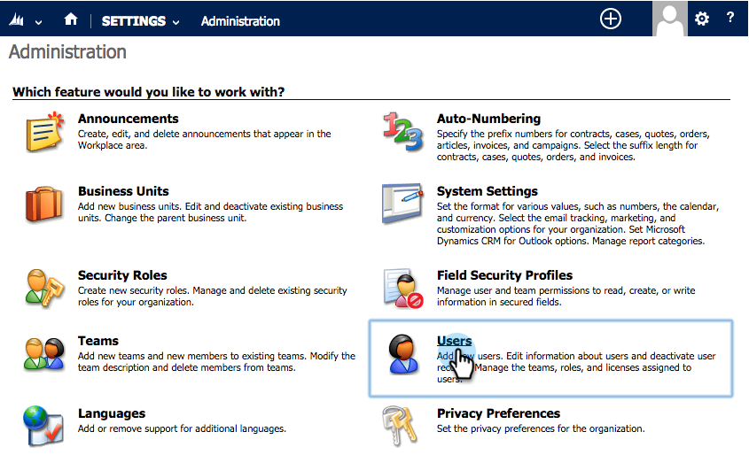

# 手順 2 / 3：Marketo（2013 オンプレミス）の同期ユーザーの設定 {#step-of-configure-sync-user-for-marketo-on-premises}

前の手順を完了させたら、先に進みましょう。

>[!PREREQUISITES]
>
>[ 手順 1/3:Marketo ソリューションを  [!DNL Dynamics]  （2013 オンプレミス）にインストールする ](/help/marketo/product-docs/crm-sync/microsoft-dynamics-sync/sync-setup/connecting-to-legacy-versions/step-1-of-3-install-2013.md)

## 同期ユーザのロールの割り当て {#assign-sync-user-role}

Marketo 同期ユーザロールを Marketo 同期ユーザにのみ割り当てます。他のユーザに割り当てる必要はありません。

>[!NOTE]
>
>これは、Marketo プラグインバージョン 4.0.0.14 以降に当てはまります。以前のバージョンでは、すべてのユーザに同期ユーザロールが必要です。Marketoをアップグレードするには、[Marketo ソリューションのアップグレード  [!DNL Microsoft Dynamics]](/help/marketo/product-docs/crm-sync/microsoft-dynamics-sync/sync-setup/update-the-marketo-solution-for-microsoft-dynamics.md) を参照してください。

>[!IMPORTANT]
>
>同期ユーザーの言語設定は[英語に設定する必要があります](https://learn.microsoft.com/ja-jp/power-platform/admin/enable-languages){target="_blank"}。

1. 「**[!UICONTROL 設定]**」で、「**[!UICONTROL 管理]**」をクリックします。

   

1. 「**[!UICONTROL ユーザー]**」を選択します。

   

1. ユーザーのリストが表示されます。専用の Marketo 同期ユーザを選択するか、[Active Directory Federation Services（AFDS）](https://msdn.microsoft.com/en-us/library/bb897402.aspx){target="_blank"}管理者に問い合わせて、[Marketo 専用ユーザ](https://blogs.technet.com/b/askpfeplat/archive/2014/04/21/introduction-to-active-directory-federation-services-ad-fs-alternateloginid-feature.aspx){target="_blank"}の新規作成を依頼します。

   

1. 同期ユーザを選択します。 をクリックして、「**[!UICONTROL 役割を管理]**」を選択します。

   

1. 「**[!UICONTROL Marketo 同期ユーザー]**」をクリックし、「**[!UICONTROL OK]**」をクリックします。

   

   >[!TIP]
   >
   >役割が表示されない場合は、[手順 1 / 3](/help/marketo/product-docs/crm-sync/microsoft-dynamics-sync/sync-setup/connecting-to-legacy-versions/step-1-of-3-install-2013.md){target="_blank"} に戻ってソリューションをインポートします。

   >[!NOTE]
   >
   >同期ユーザが CRM で行った更新は Marketo に同期&#x200B;_されません_。

## Marketo ソリューションの設定 {#configure-marketo-solution}

あと少しで完了です。次の記事に進む前に、最後の部分を設定しましょう。

1. 「**[!UICONTROL 設定]**」で、「**[!UICONTROL Marketo 設定]**」をクリックします。

   

   >[!NOTE]
   >
   >**[!UICONTROL Marketo 設定]**&#x200B;が見つからない場合は、ページを更新してみてください。問題が解決しない場合は、もう一度 [Marketo ソリューションを公開](/help/marketo/product-docs/crm-sync/microsoft-dynamics-sync/sync-setup/connecting-to-legacy-versions/step-1-of-3-install-2013.md)するか、またはログアウトしてから再度ログインしてみてください。

1. 「**[!UICONTROL デフォルト]**」をクリックします。

   

1. 「**[!UICONTROL Marketo ユーザー]**」フィールドをクリックし、同期ユーザーを選択します。

   

1. 右下隅の  をクリックして、変更を保存します。

   

1. 「**[!UICONTROL すべてのカスタマイズを公開]**」をクリックします。

   

## 手順 3 に進む前に {#before-proceeding-to-step}

* 同期するレコード数を制限する場合は、[カスタム同期フィルターを設定](/help/marketo/product-docs/crm-sync/microsoft-dynamics-sync/create-a-custom-dynamics-sync-filter.md)します。
* [Validate [!DNL Microsoft Dynamics] Sync](/help/marketo/product-docs/crm-sync/microsoft-dynamics-sync/sync-setup/validate-microsoft-dynamics-sync.md) プロセスを実行します。 初期設定が正しく行われたことを確認します。
* [!DNL Microsoft Dynamics] CRM でMarketo同期ユーザーにログインします。

これで完了です。

>[!MORELIKETHIS]
>
>[ 手順 3/3:Marketoと  [!DNL Dynamics]  （2013 オンプレミス）を接続する ](/help/marketo/product-docs/crm-sync/microsoft-dynamics-sync/sync-setup/connecting-to-legacy-versions/step-3-of-3-connect-2013.md)
