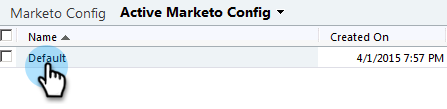
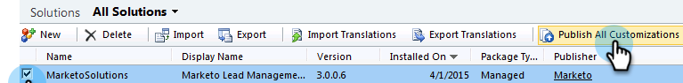

# 手順 2／3：[!DNL Dynamics]（2011 オンプレミス）での Marketo 同期ユーザの設定 {#step-of-set-up-marketo-sync-user-in-dynamics-on-premises}

前の手順は完了しました。

>[!PREREQUISITES]
>
>[手順 1／3：Marketo ソリューション（2011 オンプレミス版）のインストール](/help/marketo/product-docs/crm-sync/microsoft-dynamics-sync/sync-setup/connecting-to-legacy-versions/step-1-of-3-install-2011.md){target="_blank"}

## 同期ユーザのロールの割り当て {#assign-sync-user-role}

Marketo 同期ユーザロールを Marketo 同期ユーザにのみ割り当てます。 他のユーザーに割り当てる必要はありません。

>[!NOTE]
>
>これは、Marketo プラグインバージョン 4.0.0.14 以降に当てはまります。 以前のバージョンでは、すべてのユーザに同期ユーザロールが必要です。 Marketo をアップグレードする方法について詳しくは、[&#x200B; [!DNL Microsoft Dynamics]](/help/marketo/product-docs/crm-sync/microsoft-dynamics-sync/sync-setup/update-the-marketo-solution-for-microsoft-dynamics.md) 用 Marketo ソリューションのアップグレードを参照してください。

>[!IMPORTANT]
>
>同期ユーザの言語設定は、[英語に設定する必要があります](https://learn.microsoft.com/ja-jp/power-platform/admin/enable-languages){target="_blank"}。

1. 左下のメニューで、「**[!UICONTROL 設定]**」を選択します。

   

1. ツリーで、「**[!UICONTROL 管理者]**」を選択します。

   

1. 「**[!UICONTROL ユーザー]**」を選択します。

   

1. ユーザーのリストが表示されます。 専用の Marketo 同期ユーザーを選択するか、[Active Directory Federation Services](https://msdn.microsoft.com/ja-jp/library/bb897402.aspx)（AFDS）管理者に問い合わせて、Marketo 専用ユーザーの新規作成を依頼します。 「**[!UICONTROL ロールを管理]**」をクリックします。

   

1. 「**[!UICONTROL Marketo 同期ユーザ]**」のチェックをオンにして、「**[!UICONTROL OK]**」をクリックします。

   

   >[!TIP]
   >
   >役割が表示されない場合は、[手順 1 / 3](/help/marketo/product-docs/crm-sync/microsoft-dynamics-sync/sync-setup/connecting-to-legacy-versions/step-1-of-3-install-2011.md){target="_blank"} に戻ってソリューションをインポートします。

   >[!NOTE]
   >
   >同期ユーザが CRM で行った更新は Marketo に同期&#x200B;_されません_。

## Marketo ソリューションの設定 {#configure-marketo-solution}

次の記事に移行する前に、いくつかの最後の構成が残っています。

1. 「**[!UICONTROL 設定]**」を選択します。 次に、ツリーで「**[!UICONTROL Marketo 設定]**」を選択します。

   

   >[!NOTE]
   >
   >[!UICONTROL Marketo 設定]が見つからない場合は、ページを更新してみてください。 問題が解決しない場合は、[Marketo ソリューションをもう一度公開](/help/marketo/product-docs/crm-sync/microsoft-dynamics-sync/sync-setup/connecting-to-legacy-versions/step-1-of-3-install-2011.md)するか、ログアウトしてから再度ログインします。

1. 「**[!UICONTROL デフォルト]**」をクリックします。

   

1.  をクリックします。

   

1. ポップアップで、同期ユーザーを選択します。 次に、「**[!UICONTROL OK]**」をクリックします。

   

1. 「**[!UICONTROL 保存]**」をクリックして、変更を保存します。

   

1. 「**[!UICONTROL すべてのカスタマイズを公開]**」をクリックします。

   

## 手順 3 に進む前に {#before-proceeding-to-step}

    *同期するレコード数を制限する場合は、[ カスタム同期フィルターを設定] （/help/marketo/product-docs/crm-sync/microsoft-dynamics-sync/create-a-custom-dynamics-sync-filter.md）今すぐ設定してください。
    * [検証 [!DNL Microsoft Dynamics] 同期] （/help/marketo/product-docs/crm-sync/microsoft-dynamics-sync/sync-setup/validate-microsoft-dynamics-sync.md）プロセスを実行します。 最初の設定が正しく行われたことを確認します。
    * [!DNL Microsoft Dynamics] CRMのMarketo Sync Userにログインします。

>[!MORELIKETHIS]
>
>[手順 3／3： [!DNL Microsoft Dynamics]  と Marketo（2011 オンプレミス）の接続](/help/marketo/product-docs/crm-sync/microsoft-dynamics-sync/sync-setup/connecting-to-legacy-versions/step-3-of-3-connect-2011.md)
