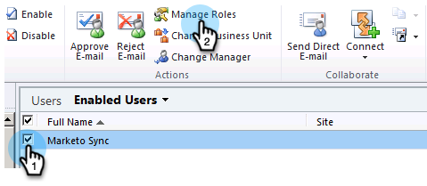
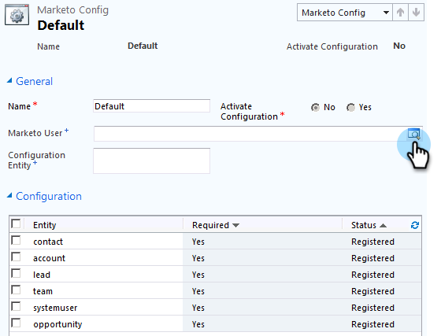

# 手順 2 / 3：Dynamics（2011 オンプレミス）での Marketo 同期ユーザーのセットアップ {#step-of-set-up-marketo-sync-user-in-dynamics-on-premises}

前の手順を完了させたら、先に進みましょう。

>[!PREREQUISITES]
>
>[手順 1 / 3：Marketo ソリューション（2011 オンプレミス版）のインストール](/help/marketo/product-docs/crm-sync/microsoft-dynamics-sync/sync-setup/connecting-to-legacy-versions/step-1-of-3-install-2011.md)

## 同期ユーザー役割を割り当てる {#assign-sync-user-role}

Marketo 同期ユーザー役割を Marketo 同期ユーザーにのみ割り当てます。他のユーザーに割り当てる必要はありません。

>[!NOTE]
>
>これは、Marketo プラグインバージョン 4.0.0.14 以降に当てはまります。以前のバージョンでは、すべてのユーザーに同期ユーザー役割が必要です。Marketo をアップグレードするには、[Microsoft Dynamics 用 Marketo ソリューションのアップグレード](/help/marketo/product-docs/crm-sync/microsoft-dynamics-sync/sync-setup/update-the-marketo-solution-for-microsoft-dynamics.md)を参照してください。

>[!IMPORTANT]
>
>同期ユーザーの言語設定は[英語に設定する必要があります](https://portal.dynamics365support.com/knowledgebase/article/KA-01201/en-us)。

1. 左下のメニューで、「**設定**」を選択します。

   

1. ツリーで、「**管理者**」を選択します。

   

1. 「**ユーザー**」を選択します。

   

1. ユーザーのリストが表示されます。専用の Marketo 同期ユーザーを選択するか、[Active Directory Federation Services](https://msdn.microsoft.com/en-us/library/bb897402.aspx)（AFDS）管理者に問い合わせて、Marketo 専用ユーザーの新規作成を依頼します。「**役割を管理**」をクリックします。

   

1. 「**Marketo 同期ユーザー**」をクリックし、「**OK**」をクリックします。

   

   >[!TIP]
   >
   >役割が表示されない場合は、[手順 1 / 3](/help/marketo/product-docs/crm-sync/microsoft-dynamics-sync/sync-setup/connecting-to-legacy-versions/step-1-of-3-install-2011.md) に戻ってソリューションをインポートします。

   >[!NOTE]
   >
   >同期ユーザーが CRM で実行した更新は、再度 Marketo に&#x200B;**同期されません**。

## Marketo ソリューションを設定する {#configure-marketo-solution}

あと少しで完了です。次の記事に進む前に、最後の部分を設定しましょう。

1. 「**設定**」を選択します。次に、ツリーで「**Marketo 設定**」を選択します。

   

   >[!NOTE]
   >
   >Marketo 設定が見つからない場合は、ページを更新してみてください。問題が解決しない場合は、[Marketo ソリューションをもう一度公開](/help/marketo/product-docs/crm-sync/microsoft-dynamics-sync/sync-setup/connecting-to-legacy-versions/step-1-of-3-install-2011.md)するか、ログアウトしてから再度ログインします。

1. 「**デフォルト**」をクリックします。

   

1.  をクリックします。

   

1. ポップアップで、同期ユーザーを選択します。次に、「**OK**」をクリックします。

   

1. 「**保存**」をクリックして、変更を保存します。

   

1. 「**すべてのカスタマイズを公開**」をクリックします。

   

## 手順 3 に進む前に {#before-proceeding-to-step}

    * 同期するレコードの数を制限する場合は、[カスタム同期フィルターを設定](/help/marketo/product-docs/crm-sync/microsoft-dynamics-sync/create-a-custom-dynamics-sync-filter.md) します。
    * [Microsoft Dynamics 同期の検証](/help/marketo/product-docs/crm-sync/microsoft-dynamics-sync/sync-setup/validate-microsoft-dynamics-sync.md) プロセスを実行します。初期設定が正しく行われたことを確認します。
    * Microsoft Dynamics CRM で、Marketo 同期ユーザーにログインします。

これで完了です。

>[!MORELIKETHIS]
>
>[手順 3 / 3：Microsoft Dynamics と Marketo（2011 オンプレミス）の接続](/help/marketo/product-docs/crm-sync/microsoft-dynamics-sync/sync-setup/connecting-to-legacy-versions/step-3-of-3-connect-2011.md)
