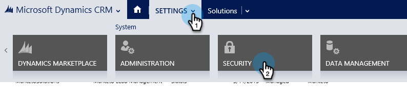
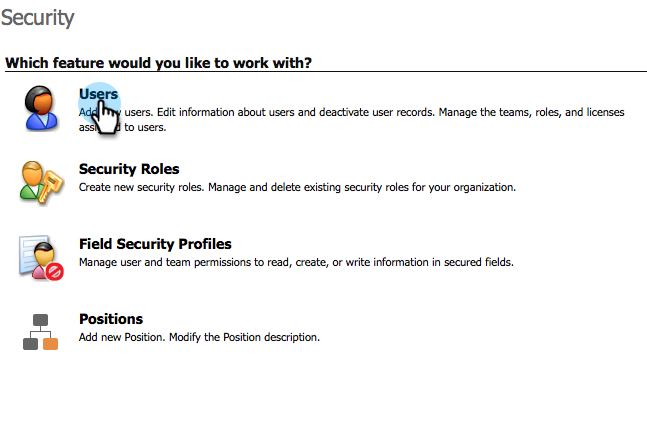
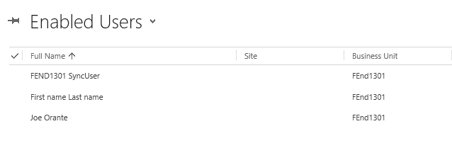
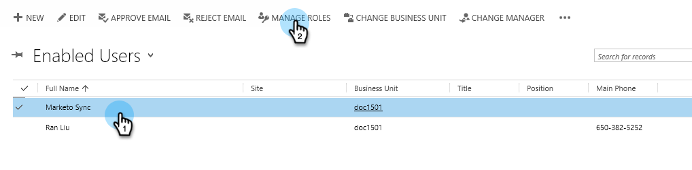
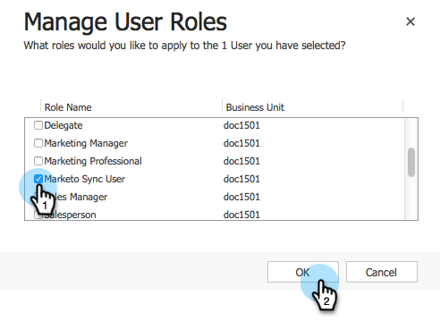
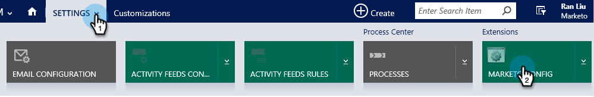
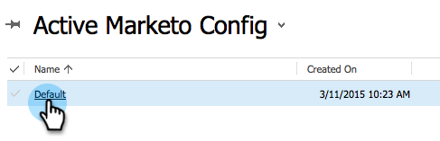
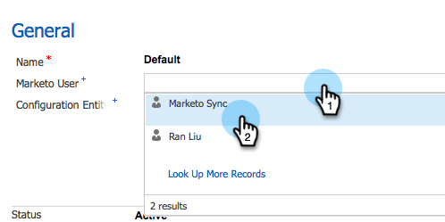
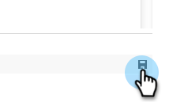
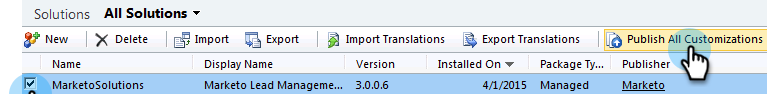

# 手順 2／3 [!DNL Dynamics]（2015 オンプレミス）向け Marketo の設定{#step-of-set-up-for-marketo-on-premises-2015}

前の手順は完了しました。

>[!PREREQUISITES]
>
>[&#x200B; [!DNL Microsoft Dynamics]  2015 オンプレミス向け Marketo インストール手順 1／3](/help/marketo/product-docs/crm-sync/microsoft-dynamics-sync/sync-setup/connecting-to-legacy-versions/step-1-of-3-install-2015.md)

## 同期ユーザーロールの割り当て {#assign-sync-user-role}

Marketo 同期ユーザロールを Marketo 同期ユーザにのみ割り当てます。 他のユーザーに割り当てる必要はありません。

>[!NOTE]
>
>これは、Marketo バージョン 4.0.0.14 以降に適用されます。 以前のバージョンでは、すべてのユーザーに同期ユーザーロールが必要です。 お使いの Marketo をアップグレードする方法について詳しくは、[&#x200B; [!DNL Microsoft Dynamics]](/help/marketo/product-docs/crm-sync/microsoft-dynamics-sync/sync-setup/update-the-marketo-solution-for-microsoft-dynamics.md) 用 Marketo ソリューションのアップグレードを参照してください。

>[!IMPORTANT]
>
>同期ユーザの言語設定は[英語に設定する必要があります](https://learn.microsoft.com/ja-jp/power-platform/admin/enable-languages){target="_blank"}。

1. 「**[!UICONTROL 設定]**」で、「**[!UICONTROL セキュリティ]**」をクリックします。

   

1. 「**[!UICONTROL ユーザ]**」をクリックします。

   

1. ユーザのリストが表示されます。 専用の Marketo 同期ユーザーを選択するか、[Active Directory Federation Services](https://msdn.microsoft.com/ja-jp/library/bb897402.aspx){target="_blank"}（ADFS）管理者に問い合わせて、Marketo 専用ユーザーの作成を依頼します。

   

1. 同期ユーザーを選択します。 「**[!UICONTROL ロールを管理]**」をクリックします。

   

1. 「[!UICONTROL Marketo 同期ユーザー]」のチェックをオンにして、「**[!UICONTROL OK]**」をクリックします。

   

   >[!IMPORTANT]
   >
   >同期ユーザーには、Marketo 設定に対する読み取り権限が必要です。

   >[!TIP]
   >
   >ロールが表示されない場合は、[手順 1 / 3](/help/marketo/product-docs/crm-sync/microsoft-dynamics-sync/sync-setup/connecting-to-legacy-versions/step-1-of-3-install-2015.md){target="_blank"} に戻ってソリューションをインポートします。

   >[!NOTE]
   >
   >同期ユーザーが CRM で行った更新は Marketo に同期&#x200B;_されません_。

## Marketo ソリューションの設定 {#configure-marketo-solution}

次の記事に移行する前に、いくつかの最後の構成が残っています。

1. 「**[!UICONTROL 設定]**」で、「**[!UICONTROL Marketo 設定]**」をクリックします。

   

   >[!NOTE]
   >
   >Marketo 設定が見つからない場合は、ページを更新してみてください。 問題が解決しない場合は、、[Marketo ソリューションを公開](/help/marketo/product-docs/crm-sync/microsoft-dynamics-sync/sync-setup/connecting-to-legacy-versions/step-1-of-3-install-2015.md){target="_blank"}するか、またはログアウトしてから再度ログインしてみてください。

1. 「**[!UICONTROL デフォルト]**」をクリックします。

   

1. 「**[!UICONTROL Marketo ユーザ]**」フィールドをクリックし、同期ユーザを選択します。

   

1. 右下隅の「保存」アイコンをクリックします。

   

1. 「**[!UICONTROL すべてのカスタマイズを公開]**」をクリックします。

   

   >[!NOTE]
   >
   >同期ユーザーには、Marketo 設定に対する読み取り権限が必要です。

## 手順 3 に進む前に {#before-proceeding-to-step}

* 同期するレコード数を制限する場合は、[カスタム同期フィルターを設定](/help/marketo/product-docs/crm-sync/microsoft-dynamics-sync/create-a-custom-dynamics-sync-filter.md)します。
* [&#x200B; [!DNL Microsoft Dynamics]  同期を検証](/help/marketo/product-docs/crm-sync/microsoft-dynamics-sync/sync-setup/validate-microsoft-dynamics-sync.md)プロセスを実行します。 初期設定が正しく行われたことを確認します。
* [!DNL Microsoft Dynamics] CRM で、Marketo 同期ユーザーにログインします。

>[!MORELIKETHIS]
>
>[&#x200B; [!DNL Microsoft Dynamics]  2015 オンプレミス向け Marketo インストール手順 3／3](/help/marketo/product-docs/crm-sync/microsoft-dynamics-sync/sync-setup/connecting-to-legacy-versions/step-3-of-3-connect-2015.md)
