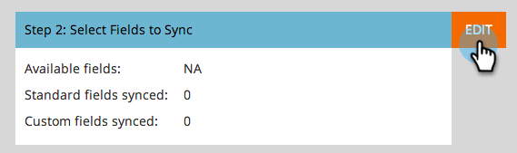

# 手順 3／3 - [!DNL Microsoft Dynamics] と Marketo（2011 オンプレミス）の接続 {#step-of-connect-microsoft-dynamics-with-marketo-on-premises}

ソリューションがインストールされ、同期ユーザーが設定されます。 次に、Marketoと[!DNL Dynamics]を接続します。

>[!PREREQUISITES]
>
>* [手順 1／3：Marketo ソリューション（2011 オンプレミス版）のインストール](/help/marketo/product-docs/crm-sync/microsoft-dynamics-sync/sync-setup/connecting-to-legacy-versions/step-1-of-3-install-2011.md)
>* [手順 2／3： [!DNL Dynamics] （2011 オンプレミス）での Marketo 同期ユーザの設定](/help/marketo/product-docs/crm-sync/microsoft-dynamics-sync/sync-setup/connecting-to-legacy-versions/step-2-of-3-set-up-2011.md)

>[!NOTE]
>
>**管理者権限が必要**

## [!DNL Dynamics] 同期ユーザ情報の入力 {#enter-dynamics-sync-user-information}

1. Marketo にログインし、**[!UICONTROL 管理]**&#x200B;をクリックします。

   

1. 「**[!UICONTROL CRM]**」をクリックします。

   

1. 「**[!UICONTROL Microsoft]**」をクリックします。

   

1. **[!UICONTROL 手順 1：資格情報を入力]**&#x200B;で「**[!UICONTROL 編集]**」をクリックします。

   

   >[!CAUTION]
   >
   >資格情報が正しいことを確認します。 送信後に後続のスキーマ変更を元に戻すことはできません。 誤った資格情報が保存された場合は、新しいMarketo サブスクリプションが必要になります。

1. 「**[!UICONTROL ユーザ名]**」、「**[!UICONTROL パスワード]**」と CRM の「**[!UICONTROL URL]**」を入力し、「**[!UICONTROL 保存]**」をクリックします。

   

   >[!NOTE]
   >
   >* Marketo の[!UICONTROL ユーザ名]は、CRM の同期ユーザのユーザ名と一致する必要があります。 形式は、`user@domain.com` または DOMAIN\user です。
   >* URL がわからない場合は、[こちらで見つける方法をご確認ください](/help/marketo/product-docs/crm-sync/microsoft-dynamics-sync/sync-setup/view-the-organization-service-url.md)。

## 同期するフィールドを選択 {#select-fields-to-sync}

同期するフィールドを選択します。

1. **[!UICONTROL 手順 2：同期するフィールドを選択]**&#x200B;の「**[!UICONTROL 編集]**」をクリックします。

   

1. 同期されるフィールドは事前に選択されています。 必要に応じて追加し、「**[!UICONTROL 保存]**」をクリックします。

   

   >[!NOTE]
   >
   >Marketo は、同期するフィールドへの参照を保存します。 [!DNL Dynamics] でフィールドを削除する場合は、[同期無効](/help/marketo/product-docs/crm-sync/salesforce-sync/enable-disable-the-salesforce-sync.md)の状態で実行することをお勧めします。 次に、「[同期するフィールドを選択](/help/marketo/product-docs/crm-sync/microsoft-dynamics-sync/microsoft-dynamics-sync-details/microsoft-dynamics-sync-field-sync/editing-fields-to-sync-before-deleting-them-in-dynamics.md)」を編集および保存して、Marketo のスキーマを更新します。

## カスタムフィルターのフィールドを同期する {#sync-fields-for-a-custom-filter}

カスタムフィルターを作成した場合は、に移動し、Marketoと同期する新しいフィールドを選択します。

1. 「管理者」に移動し、「**[!UICONTROL Microsoft Dynamics]**」を選択します。

   

1. 「[!UICONTROL フィールド同期の詳細]」で「**[!UICONTROL 編集]**」をクリックします。

   

1. 下にスクロールしてフィールドを確認します。 実際の名前は new_synctomkto にする必要がありますが、表示名は任意の名前にすることができます。 「**[!UICONTROL 保存]**」をクリックします。

   

## 同期を有効にする {#enable-sync}

1. **[!UICONTROL 手順 3：同期を有効にする]**&#x200B;の「**[!UICONTROL 編集]**」をクリックします。

   

   >[!CAUTION]
   >
   >Marketo は、[!DNL Microsoft Dynamics] の同期に対して、または人物やリードを手動で入力した場合には、自動的に重複排除を行いません。

1. ポップアップの内容をすべて読み、メールアドレスを入力して、「**[!UICONTROL 同期を開始]**」をクリックします。

   

1. レコードの数によっては、初期同期に数時間から数日かかる場合があります。 完了すると、メール通知が届きます。

   
