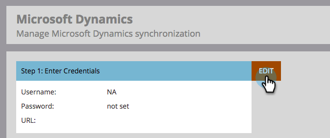

# 手順 3/3:Marketo [!DNL Dynamics] を接続する（2015 オンプレミス） {#step-of-connect-marketo-dynamics-on-premises-2015}

>[!PREREQUISITES]
>
>* [Marketo for [!DNL Microsoft Dynamics] 2015 オンプレミスでのインストール手順 1/3](/help/marketo/product-docs/crm-sync/microsoft-dynamics-sync/sync-setup/connecting-to-legacy-versions/step-1-of-3-install-2015.md)
>* [Marketo for [!DNL Microsoft Dynamics] 2015 オンプレミスのインストール手順 2/3](/help/marketo/product-docs/crm-sync/microsoft-dynamics-sync/sync-setup/connecting-to-legacy-versions/step-2-of-3-set-up-2015.md)

>[!NOTE]
>
>**管理者権限が必要**

## 同期ユーザー情報 [!DNL Dynamics] 入力 {#enter-dynamics-sync-user-information}

1. Marketo にログインし、「**[!UICONTROL 管理者]**」をクリックします。

   

1. 「**[!UICONTROL CRM]**」をクリックします。

   

1. 「**[!UICONTROL Microsoft]**」を選択します。

   

1. **[!UICONTROL 手順 1：資格情報を入力]**&#x200B;の「**[!UICONTROL 編集]**」をクリックします。

   

   >[!CAUTION]
   >
   >送信後に後続のスキーマの変更を元に戻すことができないので、資格情報が正しいことを確認してください。間違った資格情報を保存した場合は、新しい Marketo サブスクリプションを取得する必要があります。

1. **[!UICONTROL ユーザー名]**、**[!UICONTROL パスワード]**、[!DNL Microsoft Dynamics] **URL** および **[!UICONTROL クライアント ID]/[!UICONTROL  クライアントシークレット]** を入力します。 終了したら「**[!UICONTROL 保存]**」をクリックします。

   

   >[!NOTE]
   >
   >* 2020年10月より前に Marketo がプロビジョニングされている場合、「クライアント ID 」と「シークレット」はオプションのフィールドです。それ以外の場合は、必須です。この情報の取得方法は、使用している MSD のバージョンによって異なります。
   >* Marketo のユーザー名は、CRM の同期ユーザーのユーザー名と一致する必要があります。形式は、`user@domain.com` または DOMAIN\user です。
   >* URL がわからない場合は、[こちらで見つける方法をご確認ください](/help/marketo/product-docs/crm-sync/microsoft-dynamics-sync/sync-setup/view-the-organization-service-url.md){target="_blank"}。

   >[!TIP]
   >
   >URL がわからない場合は、こちらの [Dynamics 組織サービス URL](/help/marketo/product-docs/crm-sync/microsoft-dynamics-sync/sync-setup/view-the-organization-service-url.md){target="_blank"} の検索方法をご覧ください。

## 同期するフィールドを選択 {#select-fields-to-sync}

1. **[!UICONTROL 手順 2：同期するフィールドを選択]**&#x200B;の「**[!UICONTROL 編集]**」をクリックします。

   

1. Marketo と同期するフィールドを選択すると、事前に選択されるようになります。「**[!UICONTROL 保存]**」をクリックします。

   

>[!NOTE]
>
>Marketo は、同期するフィールドへの参照を保存します。[!DNL Dynamics] でフィールドを削除する場合は、[ 同期を無効 ](/help/marketo/product-docs/crm-sync/salesforce-sync/enable-disable-the-salesforce-sync.md) にして行うことをお勧めします。 次に、[[!UICONTROL 同期するフィールドを選択]](/help/marketo/product-docs/crm-sync/microsoft-dynamics-sync/microsoft-dynamics-sync-details/microsoft-dynamics-sync-field-sync/editing-fields-to-sync-before-deleting-them-in-dynamics.md)を編集および保存して、Marketo のスキーマを更新します。

## カスタムフィルターのフィールドを同期する {#sync-fields-for-a-custom-filter}

カスタムフィルターを作成した場合は、Marketo と同期する新しいフィールドを選択するようにします。

1. [!UICONTROL  管理者 ] に移動し、「**[!UICONTROL Microsoft Dynamics]**」を選択します。

   

1. **[!UICONTROL フィールド同期の詳細]** で [!UICONTROL  編集 ] をクリックします。

   

1. 下にスクロールしてフィールドを確認します。実際の名前は new_synctomkto にする必要がありますが、表示名は任意の名前にすることができます。「**[!UICONTROL 保存]**」をクリックします。

   

## 同期を有効にする {#enable-sync}

1. **[!UICONTROL 手順 3：同期を有効にする]**&#x200B;の「**[!UICONTROL 編集]**」をクリックします。

   

   >[!CAUTION]
   >
   >Marketoは、[!DNL Microsoft Dynamics] 同期に対する重複除外、またはユーザーを手動で入力しても自動的に重複除外を実行しません。

1. ポップアップの内容をすべて読み、メールアドレスを入力して、「**[!UICONTROL 同期を開始]**」をクリックします。

   

1. レコードの数によっては、初期同期に数時間から数日かかる場合があります。完了すると、メール通知が届きます。

   
