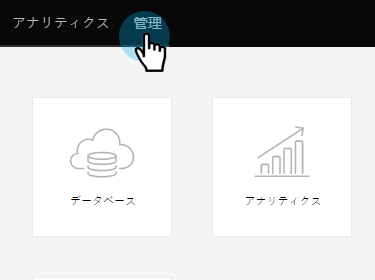
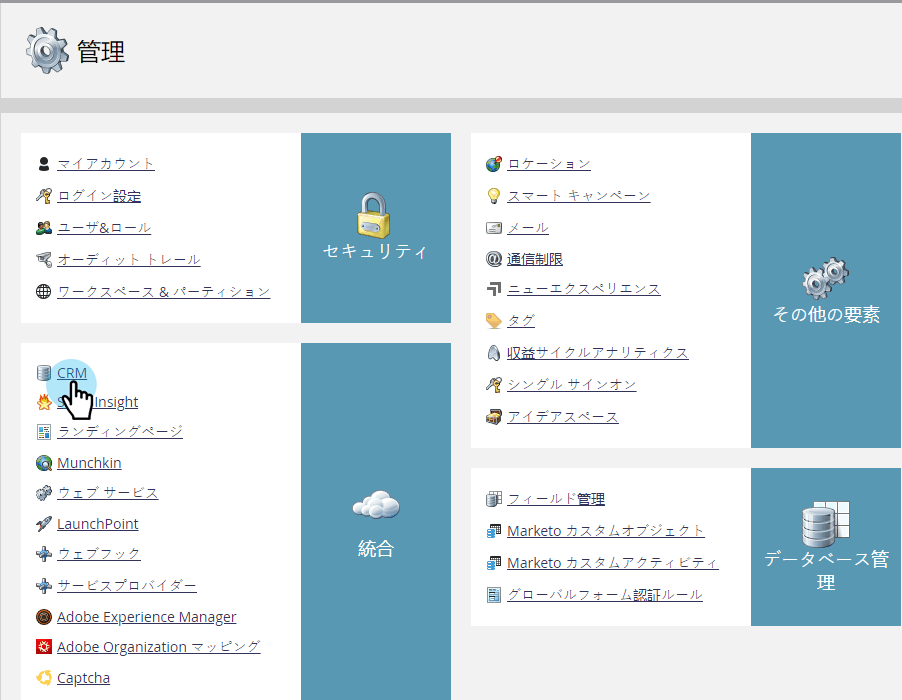
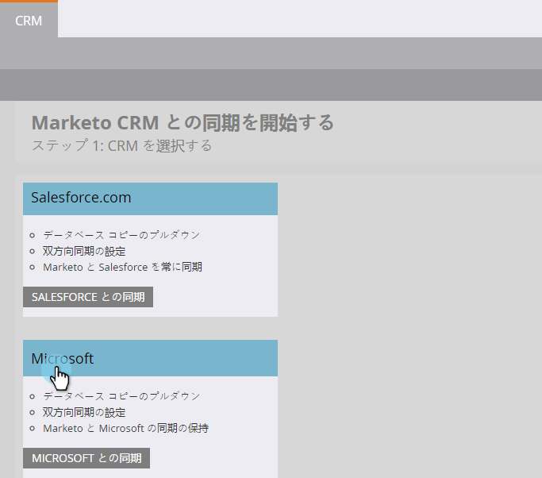
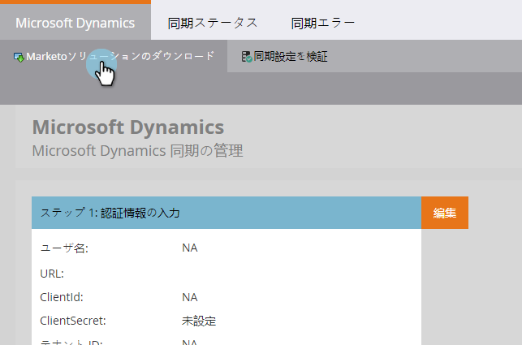

# Marketo リード管理ソリューションのダウンロード {#download-the-marketo-lead-management-solution}

>[!NOTE]
>
>**管理者権限が必要**

同期を開始するには、 Microsoft Dynamics アカウントにMarketoソリューションをダウンロードしてインストールする必要があります。

>[!CAUTION]
>
>最新のMarketoソリューションを必ずダウンロードしてください _前_ アップグレードを実行します。

>[!NOTE]
>
>Marketo は、現時点では、Java 7  と互換性のある SSL 証明書のみをサポートしています。

1. 次に移動： **管理者** 領域

   

1. クリック **CRM**.

   

1. 選択 **Microsoft**.

   

1. 選択 **Marketo Solution のダウンロード**.

   

1. Microsoft Dynamics のバージョンに適したソリューションを選択します。

   

これで完了です。ソリューションの zip ファイルがデバイスにダウンロードされます。
