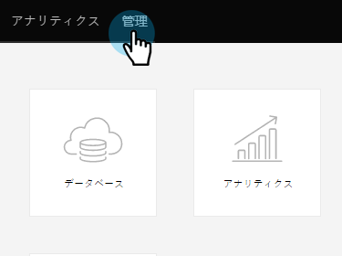
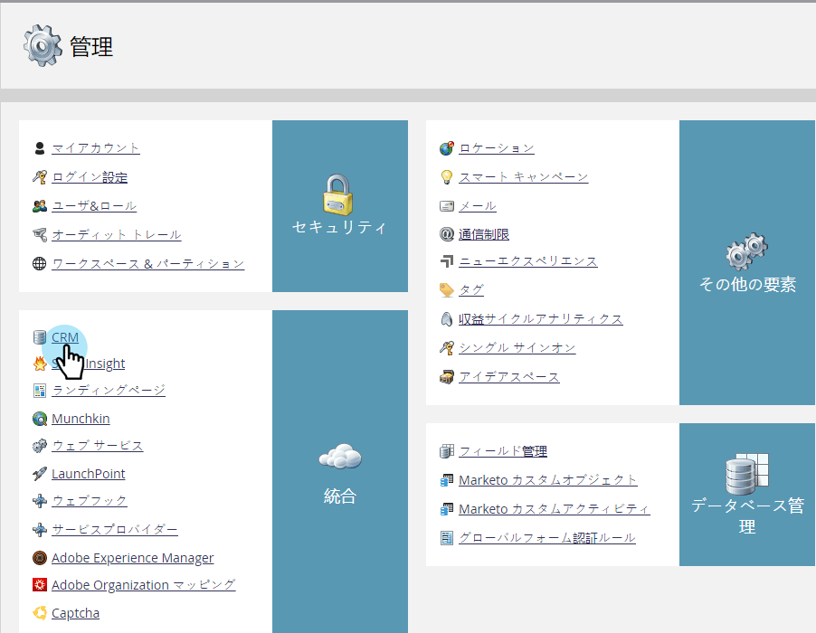
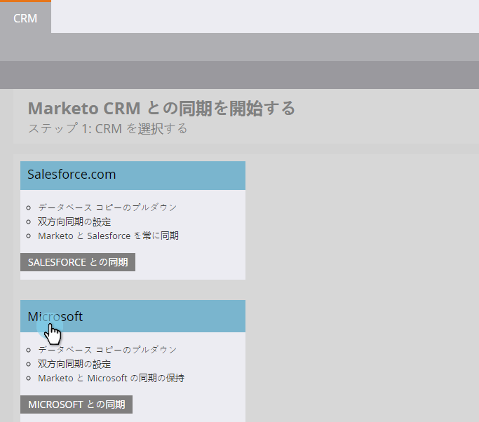
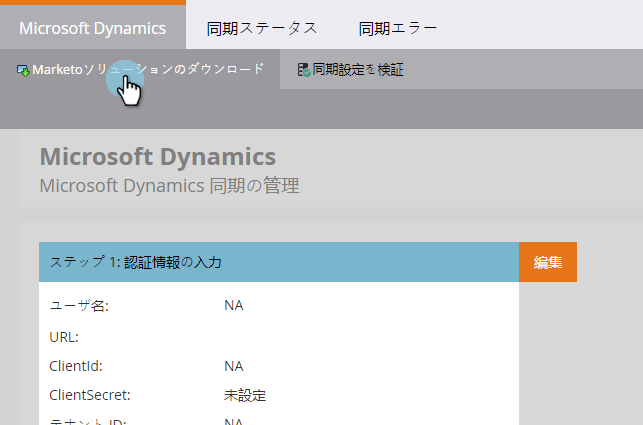

# Marketo リード管理ソリューションのダウンロード {#download-the-marketo-lead-management-solution}

>[!NOTE]
>
>**管理者権限が必要**

同期を開始するには、[!DNL Microsoft Dynamics] アカウントに Marketo ソリューションをダウンロードしてインストールする必要があります。

>[!CAUTION]
>
>アップグレードを実行する&#x200B;_前に、最新のMarketo ソリューション_&#x200B;をダウンロードする必要があります。

>[!NOTE]
>
>Marketo は、現時点では、Java 7 と互換性のある SSL 証明書のみをサポートしています。

1. 「**[!UICONTROL 管理者]**」領域に移動します。

   

1. 「**[!UICONTROL CRM]**」をクリックします。

   

1. 「**[!DNL Microsoft]**」を選択します。

   

1. 「**[!UICONTROL Marketo ソリューションをダウンロード]**」を選択します。

   

1. [!DNL Microsoft Dynamics] のバージョンに適したソリューションを選択します。

   

これで完了です。 ソリューションの zip ファイルがデバイスにダウンロードされます。
