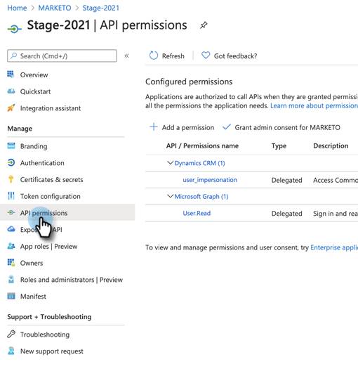
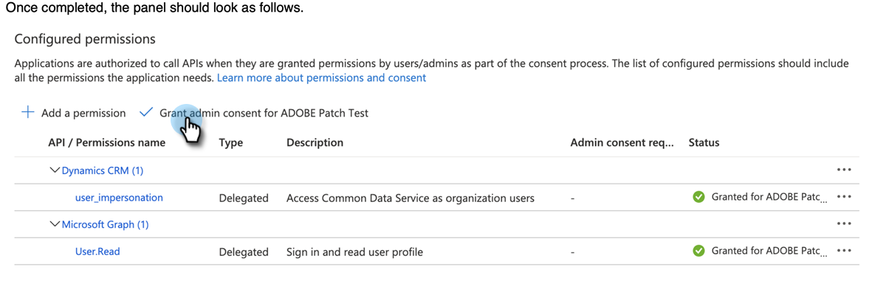

# クライアント ID とアプリ登録に対する同意の付与 {#grant-consent-for-client-id-and-app-registration}

## 同期ユーザーに委任されたユーザー権限を付与する {#grant-delegated-user-permissions-for-the-sync-user}

1. クリーンテキストプログラム（Windows の場合はメモ帳、Mac の場合はテキスト編集）を使用して、下のテキストを貼り付け、client_id、redirect_uri、state の値を置き換えて、認証用の Uniform Resource Identifier（URI）を作成します。

   ```
   https://login.microsoftonline.com/common/oauth2/authorize?
   client_id='xxxxxx-xxxx-xxxx-xxxx-xxxxxxxx'
   &response_type='code'
   &redirect_uri='https://www.<ourdomain>.com'
   &response_mode='query'
   &state='SOME_UNIQUE_UID'
   client_id value should be the client_id generated in App Registration process
   redirect_uri value should be same as value entered at the time of App registration-> Redirect URIs
   state value can be any ID (e.g.,12345)
   ```

   <table> 
    <colgroup> 
     <col> 
     <col> 
    </colgroup> 
    <tbody> 
     <tr> 
      <td><strong>client_id の値</strong></td> 
      <td>アプリ登録プロセスで生成される client_id である必要があります</td> 
     </tr> 
     <tr> 
      <td><strong>redirect_uri の値</strong></td> 
      <td>アプリの登録／リダイレクト URI の時点で入力された値と同じである必要があります</td> 
     </tr> 
     <tr> 
      <td><strong>state の値</strong></td> 
      <td>任意の ID を指定できます（例：12345）</td> 
     </tr> 
    </tbody> 
   </table>

   最終的な URL は次のようになります。`https://login.microsoftonline.com/common/oauth2/authorize?client_id=xxxxxx-xxxx-xxxx-xxxx-xxxxxxxx&response_type=code&redirect_uri=https://www.marketo.com&response_mode=query&state=12345`

1. 作成した URI を任意のブラウザーで開きます。

   

1. 権限を付与する同期ユーザーとしてログインします。

   

   >[!NOTE]
   >
   >別のタブで既に Azure に管理者としてログインしている場合は、別のブラウザーまたは匿名モードを使用して、同期ユーザーとしてログインする必要があります。

1. 「**承認**」をクリックします。

   

## すべてのユーザーに同意を付与する {#grant-consent-for-all-users}

管理者は、テナント内のすべてのユーザーに代わって、アプリケーションの委任された権限に同意することもできます。管理者の同意を得ると、テナント内のすべてのユーザーに対して同意ダイアログが表示されなくなります。これは、管理者の役割を持つユーザーが Azure ポータルで実行できます。[委任された権限に同意できる管理者の役割については、こちら](https://docs.microsoft.com/en-us/azure/active-directory/roles/permissions-reference)をご覧ください。

1. Azure ポータルで、アプリケーションのホームページに移動します。

1. 「管理」で、「**API 権限**」をクリックします。

   

1. 「**管理者の同意を付与**」（テナントの場合）ボタンをクリックします。

   

1. 「**はい**」をクリックして確認します。

   

