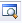
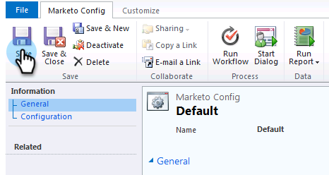

# 手順 2 / 3:Dynamics (2011 On-Premises) でのMarketo Sync ユーザーのセットアップ {#step-of-set-up-marketo-sync-user-in-dynamics-on-premises}

前述の手順を完了した素晴らしい仕事を続けましょう。

>[!PREREQUISITES]
>
>[手順1/3:Marketo Solution（2011年オンプレミス版）のインストール](/help/marketo/product-docs/crm-sync/microsoft-dynamics-sync/sync-setup/microsoft-dynamics-2011-on-premises/step-1-of-3-install.md)

## 同期ユーザーロールの割り当て {#assign-sync-user-role}

Marketo同期ユーザーの役割をMarketo同期ユーザーにのみ割り当てます。 他のユーザーに割り当てる必要はありません。

>[!NOTE]
>
>これは、Marketoプラグインバージョン 4.0.0.14 以降に適用されます。 以前のバージョンでは、すべてのユーザーに同期ユーザーの役割が必要です。 Marketoをアップグレードするには、 [Microsoft Dynamics 用Marketoソリューションのアップグレード](/help/marketo/product-docs/crm-sync/microsoft-dynamics-sync/sync-setup/update-the-marketo-solution-for-microsoft-dynamics.md).

>[!IMPORTANT]
>
>同期ユーザーの言語設定 [英語に設定する必要がある](https://portal.dynamics365support.com/knowledgebase/article/KA-01201/en-us).

1. 左下のメニューで、「 **設定**.

   

1. ツリーで、「 」を選択します。 **管理**.

   

1. 選択 **ユーザー**.

   

1. ユーザーのリストが表示されます。 専用のMarketo同期ユーザーを選択するか、 [Active Directory フェデレーションサービス (AFDS)](https://msdn.microsoft.com/en-us/library/bb897402.aspx) 管理者：Marketo専用の新しいユーザーを作成します。 クリック **役割の管理**.

   

1. チェック **Marketo Sync User** をクリックします。 **OK**.

   

   >[!TIP]
   >
   >の役割が表示されない場合は、 [手順 1 ～ 3](/help/marketo/product-docs/crm-sync/microsoft-dynamics-sync/sync-setup/microsoft-dynamics-2011-on-premises/step-1-of-3-install.md) をクリックし、ソリューションを読み込みます。

   >[!NOTE]
   >
   >ユーザーの同期で CRM でおこなわれた更新は、次のとおりです **not** がMarketoに同期されます。

## Marketo Solution の設定 {#configure-marketo-solution}

もう少しで終わりだ！ 次の記事に進む前に、最後の設定がいくつかあります。

1. 「**設定**」を選択します。次に、「 **Marketo Config** と入力します。

   

   >[!NOTE]
   >
   >Marketo Config がない場合は、ページの更新を試みてください。 問題が解決しない場合は、 [Marketoソリューションを再度公開する](/help/marketo/product-docs/crm-sync/microsoft-dynamics-sync/sync-setup/microsoft-dynamics-2011-on-premises/step-1-of-3-install.md) ログアウトしてから再度ログインする。

1. クリック **デフォルト**.

   

1. をクリックします。 

   

1. ポップアップで、同期ユーザーを選択します。 次に、「**OK**」をクリックします。

   

1. クリック **保存** をクリックして変更を保存します。

   

1. クリック **すべてのカスタマイズを公開**.

   

## 手順 3 に進む前に {#before-proceeding-to-step}

    *同期するレコードの数を制限する場合は、[ カスタム同期フィルターの設定 ](/help/marketo/product-docs/crm-sync/microsoft-dynamics-sync/create-a-custom-dynamics-sync-filter.md) を今すぐお試しください。
    * [Microsoft Dynamics Sync の検証 ](/help/marketo/product-docs/crm-sync/microsoft-dynamics-sync/sync-setup/validate-microsoft-dynamics-sync.md) プロセスを実行します。 初期設定が正しく行われたことを確認します。
    * Microsoft Dynamics CRM でMarketo同期ユーザーにログインします。

これで完了です。

>[!MORELIKETHIS]
>
>[手順3/3:Microsoft DynamicsとMarketo（2011オンプレミス）の接続](/help/marketo/product-docs/crm-sync/microsoft-dynamics-sync/sync-setup/microsoft-dynamics-2011-on-premises/step-3-of-3-connect.md)
