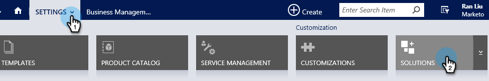

# 手順1/3:Marketor用の同期ユーザーの設定（2015オンプレムおよび2016 365オンプレム） {#step-of-configure-sync-user-for-marketo-on-premises-and-365}

Microsoft Dynamics 2015オンプレミスまたは2016 (Dynamics 365)をMarketoと同期する前に、DynamicsでMarketo Solutionをインストールする必要があります。

>[!NOTE]
>
>マーケティングをCRMに同期した後は、新しいCRMを既存のMarketorインスタンスに同期することはできません。

>[!PREREQUISITES]
>
>Microsoft Dynamics On-Premiseを使用する場合は、[Active Directoryフェデレーションサービス](https://msdn.microsoft.com/en-us/library/bb897402.aspx) 2.0+ (ADFS)が構成された[インターネット対応展開](https://www.microsoft.com/en-us/download/confirmation.aspx?id=41701) (IFD)が必要です。 注意：IFDドキュメントは、リンクをクリックすると自動的にダウンロードします。
>
>[開始する前に、Marketo Lead Management ](/help/marketo/product-docs/crm-sync/microsoft-dynamics-sync/sync-setup/download-the-marketo-lead-management-solution.md) Solutionをダウンロードします。

>[!NOTE]
>
>**Dynamics管理権限が必要です。**
>
>この同期を実行するには、CRMの管理者権限が必要です。

1. **Dynamicsにログインします。** 「 **Microsoft Dynamics** CRM」ドロップダウンメニューをクリックし、「 **設定**」を選択します。

   

1. 「**設定**」で、「**ソリューション**」を選択します。

   

1. 「**インポート**」をクリックします。

   

1. 「**参照**」をクリックし、[ダウンロードした](/help/marketo/product-docs/crm-sync/microsoft-dynamics-sync/sync-setup/download-the-marketo-lead-management-solution.md)ソリューションを選択します。 「**次へ**」をクリックします。

   

1. ソリューション情報を表示し、**表示ソリューションパッケージの詳細**&#x200B;をクリックします。

   

1. すべての詳細の確認が完了したら、[**閉じる**]をクリックします。

   

1. ソリューション情報ページに戻り、「**次へ**」をクリックします。

   

1. 「SDKオプション」チェックボックスが選択されていることを確認します。 「**インポート**」をクリックします。

   

1. インポートが完了するまで待ちます。

   >[!TIP]
   >
   >インストールプロセスを完了するには、ブラウザーでポップアップを有効にする必要があります。

   

1. ログファイルをダウンロードし（必要に応じて）、**閉じる**&#x200B;をクリックします。

   >[!NOTE]
   >
   >「Marketto Lead Management completed with warning」というメッセージが表示される場合があります。 これは完全に期待されています。

   

1. Marketto Lead Managementが&#x200B;**すべてのソリューション**&#x200B;ページに表示されます。

   

1. Marketoソリューションを選択し、「**すべてのカスタマイズを発行**」をクリックします。

   

   ハイフィーブ！ インストールが完了しました。

   >[!CAUTION]
   >
   >Marketto SDKのメッセージングプロセスを無効にすると、インストールが中断されます。

   >[!MORELIKETHIS]
   >
   >[Marketo for Dynamics 2015オンプレムおよび2016 365オンプレムのインストール手順2/3](/help/marketo/product-docs/crm-sync/microsoft-dynamics-sync/sync-setup/microsoft-dynamics-2015-on-premises-2016-dynamics-365-on-premises/step-2-of-3-set-up.md)
