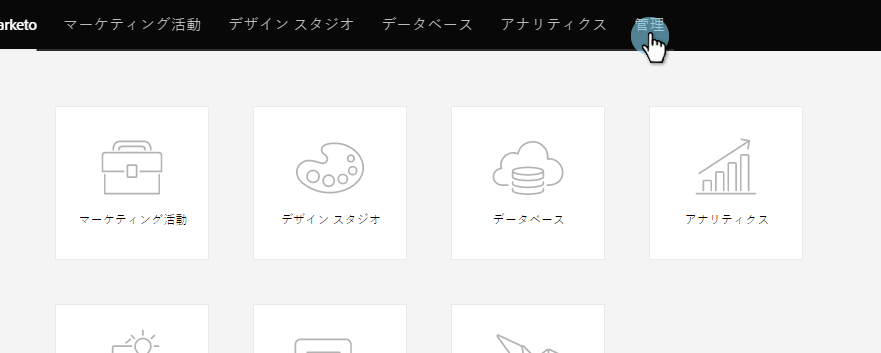

# Marketo for Dynamics 2015オンプレムおよび2016 365オンプレムステップ3 / 3 {#install-marketo-for-dynamics-on-prem-and-on-prem-step-of}のインストール

>[!PREREQUISITES]
>
>* [Marketo for Dynamics 2015オンプレムおよび2016 365オンプレムのインストール手順1/3](step-1-of-3-install.md)
>* [Marketo for Dynamics 2015オンプレムおよび2016 365オンプレムのインストール手順2/3](step-2-of-3-set-up.md)

>

>[!NOTE]
>
>**必要な管理者権限**

## Dynamics Syncユーザー情報を入力{#enter-dynamics-sync-user-information}

1. Marketorにログインし、**管理者**&#x200B;をクリックします。

   

1. 「**CRM**」をクリックします。

   

1. 「**Microsoft**」を選択します。

   

1. **手順1の「**&#x200B;編集&#x200B;**」をクリックします。資格情報**&#x200B;を入力します。

   

   >[!CAUTION]
   >
   >送信後のスキーマの変更を元に戻すことができないため、資格情報が正しいことを確認してください。 正しくない資格情報を保存した場合は、新しいMarketor購読を取得する必要があります。

1. **ユーザー名**、**パスワード**、Microsoft Dynamics **URL**、およびオプションの&#x200B;**クライアントID**&#x200B;を入力します。 終了したら「**保存**」をクリックします。

   

   >[!NOTE]
   >
   >Marketorのユーザー名は、CRMの同期ユーザーのユーザー名と一致する必要があります。 形式は[`[email protected]`](http://docs.marketo.com/cdn-cgi/l/email-protection#8cf9ffe9fecce8e3e1ede5e2a2efe3e1)またはDOMAIN\userです。

   >[!TIP]
   >
   >URLがわからない？ [Dynamics組織サービスのURL](../../../../../product-docs/crm-sync/microsoft-dynamics-sync/sync-setup/view-the-organization-service-url.md)を見つける方法を紹介します。

## 同期するフィールドを選択{#select-fields-to-sync}

1. **手順2:「同期するフィールド**」を選択します。****

   

1. マーケティング担当者と同期するフィールドを選択して、事前に選択されるようにします。 「**保存**」をクリックします。

   

## カスタムフィルターのフィールドを同期{#sync-fields-for-a-custom-filter}

カスタムフィルターを作成した場合は、Marketoと同期する新しいフィールドを必ず入力して選択してください。

1. 管理者に移動し、**Microsoft Dynamics**&#x200B;を選択します。

   

1. 「フィールドの同期の詳細」で「**編集**」をクリックします。

   

1. フィールドまで下にスクロールし、チェックします。 実際の名前はnew_synctomktoにする必要がありますが、表示名は任意の名前にすることができます。 「**保存**」をクリックします。

   

## 同期を有効にする{#enable-sync}

1. **手順3の**&#x200B;編集&#x200B;**をクリックします。同期**&#x200B;を有効にします。

   

   >[!CAUTION]
   >
   >Marketing Toは、Microsoft Dynamicsの同期に対して、またはユーザーを手動で入力した場合に、自動的に重複を排除しません。

1. ポップアップの内容をすべて読み、電子メールを入力し、**開始同期**&#x200B;をクリックします。

   

1. 最初の同期には数時間かかる場合があります。 完了すると、電子メール通知が届きます。

   

素晴らしい仕事！
