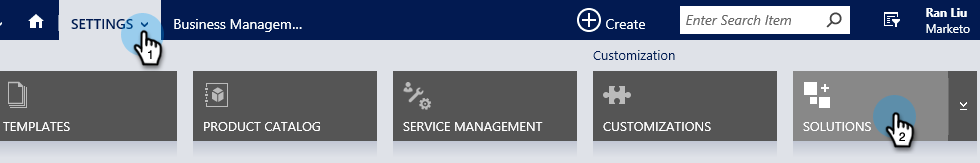
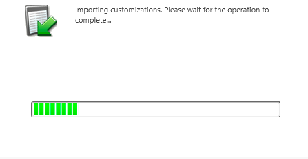

# 手順 1/3:Marketo (2016 On-Prem/Dynamics 365 On-Premises) の同期ユーザーを構成する {#step-of-configure-sync-user-for-marketo-on-premises-2016}

Microsoft Dynamics 2016 On-Prem/Dynamics 365 をMarketoと同期する前に、Dynamics にMarketoソリューションをインストールする必要があります。

>[!NOTE]
>
>Marketoを CRM に同期した後は、新しい CRM を既存のMarketoインスタンスに同期できません。

>[!PREREQUISITES]
>
>Microsoft Dynamics オンプレミスを使用している場合は、 [インターネット対応の導入](https://www.microsoft.com/en-us/download/confirmation.aspx?id=41701) (IFD) [Active Directory フェデレーションサービス](https://msdn.microsoft.com/en-us/library/bb897402.aspx) 2.0 以降 (ADFS) が設定されました。 注意：IFD ドキュメントは、リンクをクリックすると自動的にダウンロードされます。
>
>[Marketo Lead Management Solution のダウンロード](/help/marketo/product-docs/crm-sync/microsoft-dynamics-sync/sync-setup/download-the-marketo-lead-management-solution.md) 始める前に

>[!NOTE]
>
>**Dynamics 管理権限が必要です。**
>
>この同期を実行するには、CRM 管理者権限が必要です。

1. にログインします。 **Dynamics.** 次をクリック： **Microsoft Dynamics CRM** ドロップダウンメニューで「 」を選択します。 **設定**.

   

1. の下 **設定**&#x200B;を選択します。 **ソリューション**.

   

1. 「**インポート**」をクリックします。

   

1. クリック **参照** をクリックし、次の方法を選択します。 [ダウンロード](/help/marketo/product-docs/crm-sync/microsoft-dynamics-sync/sync-setup/download-the-marketo-lead-management-solution.md). 「**次へ**」をクリックします。

   

1. ソリューション情報を表示し、 **ソリューションパッケージの詳細を表示**.

   

1. すべての詳細を確認したら、 **閉じる**.

   

1. ソリューション情報ページに戻り、 **次へ**.

   

1. 「 SDK オプション」チェックボックスがオンになっていることを確認します。 「**インポート**」をクリックします。

   

1. インポートが完了するまで待ちます。

   >[!TIP]
   >
   >インストールプロセスを完了するには、ブラウザーでポップアップを有効にする必要があります。

   

1. 必要に応じて、ログファイルをダウンロードし、 **閉じる**.

   >[!NOTE]
   >
   >「Marketo Lead Management completed with warning」というメッセージが表示される場合があります。 これは完全に期待されています。

   

1. Marketoリード管理が **すべてのソリューション** ページ。

   

1. Marketoソリューションを選択し、 **すべてのカスタマイズを公開**.

   

   完成です。インストールが完了しました。

   >[!CAUTION]
   >
   >Marketo SDK メッセージングプロセスを無効にすると、インストールが壊れます。

   >[!MORELIKETHIS]
   >
   >[Dynamics 2015 オンプレミスおよび 2016 365 オンプレミス用Marketoのインストール手順 2 / 3](/help/marketo/product-docs/crm-sync/microsoft-dynamics-sync/sync-setup/microsoft-dynamics-2016-dynamics-365-on-premises/step-2-of-3-set-up.md)
