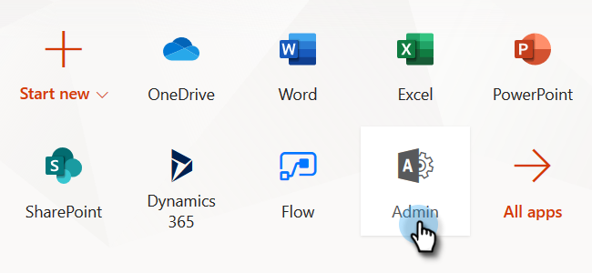

# 手順 2 / 4：リソース所有者のパスワード制御接続を使用した Marketo ソリューションの設定 {#step-2-of-4-set-up-the-marketo-solution-ropc}

まず、ユーザアカウントを作成します。

>[!PREREQUISITES]
>
>[手順 1 / 4：リソース所有者のパスワード制御接続を使用した Marketo ソリューションのインストール](/help/marketo/product-docs/crm-sync/microsoft-dynamics-sync/sync-setup/microsoft-dynamics-365-with-ropc-connection/step-1-of-4-install.md)

## ユーザの新規作成 {#create-a-new-user}

1. Dynamics にログインします。設定アイコンをクリックし、「**詳細設定**」を選択します。

   

1. 「**設定**」をクリックし、「**セキュリティ**」を選択します。

   

1. 「**ユーザ**」をクリックします。

   

1. 「**新規**」をクリックします。

   

1. 新しいウィンドウで「**ユーザを追加してライセンスを付与**」をクリックします。

   

1. 新しいタブが開きます。ページの上部にある「**管理**」をクリックします。

   

1. 別の新しいタブが開きます。「**ユーザを追加**」をクリックします。

   

   >[!IMPORTANT]
   >
   >同期ユーザには、Marketo 設定に対する読み取り権限が必要です。

1. すべての情報を入力します。完了したら、「**追加**」をクリックします。

   

   >[!NOTE]
   >
   >この名前は、既存の CRM ユーザアカウントではなく、専用の同期ユーザである必要があります。実際の電子メールアドレスである必要はありません。

1. 新しいユーザ認証情報を受け取る電子メールアドレスを入力し、「**メールを送信して閉じる**」をクリックします。

   

## 同期ユーザのロールの割り当て {#assign-sync-user-role}

Marketo 同期ユーザロールを Marketo 同期ユーザにのみ割り当てます。他のユーザに割り当てる必要はありません。

>[!NOTE]
>
>これは、Marketo バージョン 4.0.0.14 以降に当てはまります。以前のバージョンでは、すべてのユーザに同期ユーザロールが必要です。Marketo をアップグレードするには、[Microsoft Dynamics 用 Marketo ソリューションのアップグレード](/help/marketo/product-docs/crm-sync/microsoft-dynamics-sync/sync-setup/update-the-marketo-solution-for-microsoft-dynamics.md)を参照してください。

>[!IMPORTANT]
>
>同期ユーザの言語設定は[英語に設定する必要](https://portal.dynamics365support.com/knowledgebase/article/KA-01201/en-us)があります。

1. 「有効なユーザ」タブに戻り、ユーザリストを更新します。

   

1. 新規作成した Marketo 同期ユーザの横にポインタを合わせると、チェックボックスが表示されます。クリックして選択します。

   

1. 「**ロールを管理**」をクリックします。

   

1. 「**Marketo 同期ユーザ**」のチェックをオンにして、「**OK**」をクリックします。

   

   >[!NOTE]
   >
   >同期ユーザが CRM で行った更新は Marketo に同期&#x200B;**されません**。

## Marketo ソリューションの設定 {#configure-marketo-solution}

もう少しです。あとは、作成した新しいユーザについて Marketo ソルーションに知らせるだけです。

1. 詳細設定セクションに戻り、「設定」の横にあるアイコンをクリックし、「**Marketo 設定**」を選択します。

   

   >[!NOTE]
   >
   >設定メニューで「**Marketo 設定**」が表示されていない場合、ページを更新します。うまくいかない場合は、再度 [Marketo Solution を公開](/help/marketo/product-docs/crm-sync/microsoft-dynamics-sync/sync-setup/microsoft-dynamics-365-with-ropc-connection/step-1-of-4-install.md)するか、ログアウトしてから再度ログインしてください。

1. 「**デフォルト**」をクリックします。

   

1. **Marketo ユーザ**&#x200B;フィールドの検索ボタンをクリックして、作成した同期ユーザを選択します。

   

1. 右下隅にあるアイコンをクリックして、変更を保存します。

   

1. 右上にある「**X**」をクリックして画面を閉じます。

   

1. 「設定」の横にあるアイコンをクリックし、「**ソリューション**」を選択します。

   

1. 「**すべてのカスタマイズを公開**」ボタンをクリックします。

   

>[!MORELIKETHIS]
>
>[手順 3／4：Marketo ソリューションとリソース所有者パスワード制御接続の接続](/help/marketo/product-docs/crm-sync/microsoft-dynamics-sync/sync-setup/microsoft-dynamics-365-with-ropc-connection/step-3-of-4-set-up.md)
