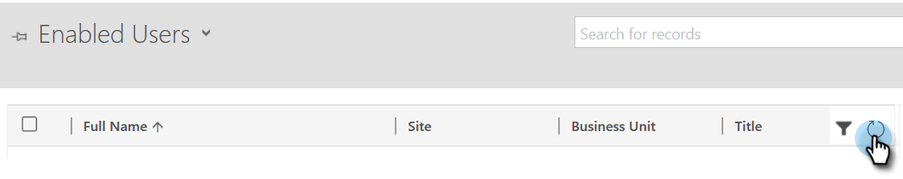

# 手順 2 / 3:リソース所有者のパスワード制御接続を使用したMarketoソリューションのセットアップ {#step-2-of-3-set-up-the-marketo-solution-ropc}

まず、ユーザーアカウントを作成します。

>[!PREREQUISITES]
>
>[手順 1/4:リソース所有者のパスワード制御接続を使用したMarketoソリューションのインストール](/help/marketo/product-docs/crm-sync/microsoft-dynamics-sync/sync-setup/microsoft-dynamics-365-with-ropc-connection/step-1-of-4-install.md)

## 新しいユーザーを作成 {#create-a-new-user}

1. Dynamics にログインします。 設定アイコンをクリックし、「 **詳細設定**.

   

1. クリック **設定** を選択し、 **セキュリティ**.

   

1. 「**ユーザー**」をクリックします。

   

1. クリック **新規：**

   

1. クリック **ユーザーの追加とライセンス** 新しいウィンドウで

   

1. 新しいタブが開きます。 クリック **管理者** をクリックします。

   

1. 別の新しいタブが開きます。 クリック **ユーザーの追加**.

   

1. すべての情報を入力します。 完了したら、「 **追加**.

   

   >[!NOTE]
   >
   >この名前は、既存の CRM ユーザーアカウントではなく、専用の同期ユーザーである必要があります。 実際の電子メールアドレスである必要はありません。

1. 新しいユーザー資格情報を受け取る電子メールアドレスを入力し、「 **メールを送信して閉じる**.

   

## 同期ユーザーロールの割り当て {#assign-sync-user-role}

Marketo同期ユーザーの役割をMarketo同期ユーザーにのみ割り当てます。 他のユーザーに割り当てる必要はありません。

>[!NOTE]
>
>これは、Marketoバージョン 4.0.0.14 以降に当てはまります。 以前のバージョンでは、すべてのユーザーに同期ユーザーの役割が必要です。 Marketoをアップグレードするには、 [Microsoft Dynamics 用Marketoソリューションのアップグレード](/help/marketo/product-docs/crm-sync/microsoft-dynamics-sync/sync-setup/update-the-marketo-solution-for-microsoft-dynamics.md).

>[!IMPORTANT]
>
>同期ユーザーの言語設定 [は英語に設定する必要があります](https://portal.dynamics365support.com/knowledgebase/article/KA-01201/en-us).

1. 「有効なユーザー」タブに戻り、ユーザーリストを更新します。

   

1. 新しく作成したMarketo同期ユーザーの横にマウスポインターを置くと、チェックボックスが表示されます。 クリックして選択します。

   

1. クリック **役割の管理**.

   

1. チェック **Marketo同期ユーザー** をクリックし、 **OK**.

   

   >[!NOTE]
   >
   >同期ユーザーが CRM でおこなった更新はすべて次のとおりです **not** をMarketoに同期し直します。

## Marketo Solution の設定 {#configure-marketo-solution}

もう少しです！ あとは、作成した新しいユーザーについてMarketo Solution に知らせるだけです。

1. 「詳細設定」セクションに戻り、  [ 設定 ] の横にあるアイコンをクリックし、 **Marketo Config**.

   

   >[!NOTE]
   >
   >見えない場合 **Marketo Config** 設定メニューで、ページを更新します。 うまくいかない場合は、 [Marketo Solution の公開](/help/marketo/product-docs/crm-sync/microsoft-dynamics-sync/sync-setup/microsoft-dynamics-365-with-ropc-connection/step-1-of-4-install.md) 再度ログアウトするか、ログアウトしてから再度ログインします。

1. クリック **デフォルト**.

   

1. 「 **Marketo User** 「 」フィールドを開き、作成した同期ユーザーを選択します。

   

1. 次をクリック：  アイコンを使用して、変更を保存します。

   

1. 次をクリック： **X** をクリックして画面を閉じます。

   

1. 次をクリック：  [ 設定 ] の横にあるアイコンをクリックし、 **ソリューション**.

   

1. 次をクリック： **すべてのカスタマイズを公開** 」ボタンをクリックします。

   

## 手順 3 に進む前に {#before-proceeding-to-step}

    *同期するレコードの数を制限する場合は、[ カスタム同期フィルターを設定 ](/help/marketo/product-docs/crm-sync/microsoft-dynamics-sync/create-a-custom-dynamics-sync-filter.md) を今すぐお使いください。
    * [Microsoft Dynamics Sync の検証 ](/help/marketo/product-docs/crm-sync/microsoft-dynamics-sync/sync-setup/validate-microsoft-dynamics-sync.md) プロセスを実行します。 初期設定が正しく行われたことを確認します。
    * Microsoft Dynamics CRM でMarketo同期ユーザーにログインします。

>[!MORELIKETHIS]
>
>[手順 3/4:Marketoソリューションとリソース所有者のパスワード制御接続の接続](/help/marketo/product-docs/crm-sync/microsoft-dynamics-sync/sync-setup/microsoft-dynamics-365-with-ropc-connection/step-3-of-4-connect.md)
