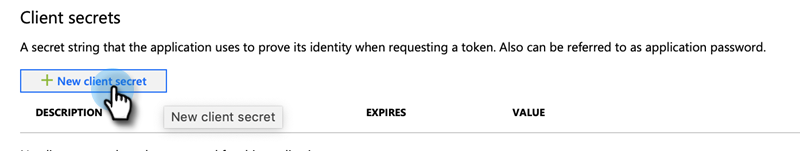

# 手順 3/4:MS Dynamics でのクライアントアプリのセットアップ {#step-3-of-4-set-up-client-app-ms-dynamics-ropc}

>[!PREREQUISITES]
>
>* [手順 1/4:リソース所有者のパスワード制御接続を使用したMarketoソリューションのインストール](/help/marketo/product-docs/crm-sync/microsoft-dynamics-sync/sync-setup/microsoft-dynamics-365-with-ropc-connection/step-1-of-4-install.md)
>* [手順 2/4:リソース所有者のパスワード制御接続を使用したMarketoソリューションのセットアップ](/help/marketo/product-docs/crm-sync/microsoft-dynamics-sync/sync-setup/microsoft-dynamics-365-with-ropc-connection/step-2-of-4-set-up.md)

1. https://docs.microsoft.com/ja-jp/powerapps/developer/common-data-service/walkthrough-register-app-azure-active-directory#create-an-application-registration に移動します。

1. すべての手順に従います。手順 3 で、関連するアプリケーション名（例：「Marketo 統合」）を入力します。「Supported Account Types」で、「Account in this organizational directory only」を選択します。

1. アプリケーション ID（ClientId）を書き留めます。後で Marketo に入力する必要があります。

1. [この記事](/help/marketo/product-docs/crm-sync/microsoft-dynamics-sync/sync-setup/grant-consent-for-client-id-and-app-registration.md)の手順に従って、管理者の同意を得ます。

1. 「**Certificates &amp; secrets**」をクリックして、管理センターでクライアントシークレットを生成します。

   

1. 「**New client secret**」をクリックします。

   

1. クライアントシークレットの説明を追加して、「**Add**」をクリックします。

   

   >[!CAUTION]
   >
   >後で必要になるので、クライアントシークレットの値（次のスクリーンショットを参照）を必ずメモしておきます。これは 1 回だけ表示され、再度取得することはできません。

   

## AD FS をオンプレミスで使用した Azure AD Federated {#azure-ad-federated-with-ad-fs-on-prem}

Federated Azure AD to ADFS Onprem では、特定のアプリケーションに対して Home Realm Discovery ポリシーを作成する必要があります。 このポリシーを使用すると、Azure AD は認証リクエストをフェデレーションサービスにリダイレクトします。このためには、AD Connect でパスワードハッシュの同期を有効にする必要があります。詳しくは、[ROPC による OAuth](https://docs.microsoft.com/ja-jp/azure/active-directory/develop/v2-oauth-ropc) および[アプリケーション用の HRD ポリシーを設定する](https://docs.microsoft.com/ja-jp/azure/active-directory/manage-apps/configure-authentication-for-federated-users-portal#example-set-an-hrd-policy-for-an-application)を参照してください。

その他のリファレンスは、[こちら](https://docs.microsoft.com/ja-jp/azure/active-directory/reports-monitoring/concept-all-sign-ins#:~:text=%E5%AF%BE%E8%A9%B1%E5%9E%8B%E3%83%A6%E3%83%BC%E3%82%B6%E3%83%BC%20%E3%82%B5%E3%82%A4%E3%83%B3%E3%82%A4%E3%83%B3%E3%81%AF%E3%80%81%E3%83%A6%E3%83%BC%E3%82%B6%E3%83%BC%E3%81%8C%20Azure%20AD%20%E3%81%AB%E8%AA%8D%E8%A8%BC%E8%A6%81%E7%B4%A0%E3%82%92%E6%8F%90%E4%BE%9B%E3%81%99%E3%82%8B%E3%81%8B%E3%80%81Azure%20AD%20%E3%81%BE%E3%81%9F%E3%81%AF%E3%83%98%E3%83%AB%E3%83%91%E3%83%BC%20%E3%82%A2%E3%83%97%E3%83%AA%20%28Microsoft%20Authenticator%20%E3%82%A2%E3%83%97%E3%83%AA%E3%81%AA%E3%81%A9%29%20%E3%81%A8%E7%9B%B4%E6%8E%A5%E3%82%84%E3%82%8A%E5%8F%96%E3%82%8A%E3%81%99%E3%82%8B%E3%82%B5%E3%82%A4%E3%83%B3%E3%82%A4%E3%83%B3%E3%81%A7%E3%81%99%E3%80%82&amp;text=%E3%81%93%E3%81%AE%E3%83%AD%E3%82%B0%E3%81%AB%E3%81%AF%E3%80%81Azure%20AD%20%E3%81%A8%E9%80%A3%E6%90%BA%E3%81%97%E3%81%A6%E3%81%84%E3%82%8B%20ID%20%E3%83%97%E3%83%AD%E3%83%90%E3%82%A4%E3%83%80%E3%83%BC%E3%81%AB%E3%82%88%E3%82%8B%E3%83%95%E3%82%A7%E3%83%87%E3%83%AC%E3%83%BC%E3%82%B7%E3%83%A7%E3%83%B3%20%E3%82%B5%E3%82%A4%E3%83%B3%E3%82%A4%E3%83%B3%E3%82%82%E5%90%AB%E3%81%BE%E3%82%8C%E3%81%BE%E3%81%99%E3%80%82)を参照してください。

>[!MORELIKETHIS]
>
>* [手順 4 / 4:Marketoソリューションとリソース所有者のパスワード制御接続の接続](/help/marketo/product-docs/crm-sync/microsoft-dynamics-sync/sync-setup/microsoft-dynamics-365-with-ropc-connection/step-4-of-4-connect.md)

