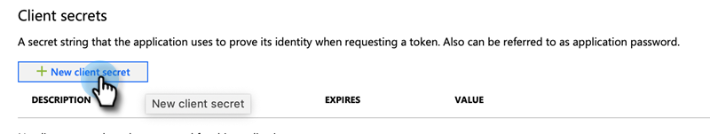
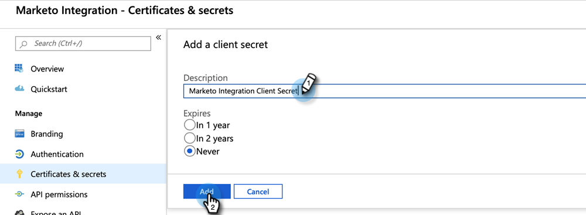
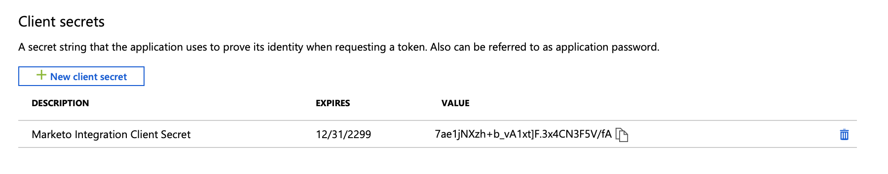

# 手順 3／4：MS [!DNL Dynamics] でのクライアントアプリの設定 {#step-3-of-4-set-up-client-app-ms-dynamics-ropc}

>[!PREREQUISITES]
>
>* [手順 1 / 4：リソース所有者のパスワード制御接続を使用した Marketo ソリューションのインストール](/help/marketo/product-docs/crm-sync/microsoft-dynamics-sync/sync-setup/microsoft-dynamics-365-with-ropc-connection/step-1-of-4-install.md){target="_blank"}
>* [手順 2 / 4：リソース所有者のパスワード制御接続を使用した Marketo ソリューションの設定](/help/marketo/product-docs/crm-sync/microsoft-dynamics-sync/sync-setup/microsoft-dynamics-365-with-ropc-connection/step-2-of-4-set-up.md){target="_blank"}

1. この [Microsoft 記事](https://docs.microsoft.com/ja-jp/powerapps/developer/common-data-service/walkthrough-register-app-azure-active-directory#create-an-application-registration){target="_blank"}に移動します。

1. すべての手順に従います。 手順 3 で、関連するアプリケーション名（例：「[!DNL Marketo Integration]」）を入力します。 「Supported Account Types」で、「Account in this organizational directory only」を選択します。

1. アプリケーション ID（ClientId）を書き留めます。 後でMarketoに入力します。

1. [この記事](/help/marketo/product-docs/crm-sync/microsoft-dynamics-sync/sync-setup/grant-consent-for-client-id-and-app-registration.md){target="_blank"}の手順に従って、管理者の同意を得ます。

1. 「**[!UICONTROL Certificates &amp; secrets]**」をクリックして、管理センターでクライアントシークレットを生成します。

   

1. 「**[!UICONTROL New client secret]**」をクリックします。

   

1. クライアントシークレットの説明を追加して、「**[!UICONTROL Add]**」をクリックします。

   

   >[!CAUTION]
   >
   >クライアント秘密鍵の値（以下のスクリーンショットに表示されます）は、1回しか表示されず、再取得できないため、注意してください。

   

## [!DNL Azure AD] と [!DNL AD FS On-prem] の連携 {#azure-ad-federated-with-ad-fs-on-prem}

[!DNL Azure] AD から [!DNL ADFS Onprem] への連携では、特定のアプリケーション用に Home Realm Discovery ポリシーを作成する必要があります。 このポリシーを使用すると、[!DNL Azure] AD は認証リクエストをフェデレーションサービスにリダイレクトします。 このためには、[!DNL AD Connect] でパスワードハッシュの同期を有効にする必要があります。 詳しくは、[[!DNL OAuth] with [!DNL ROPC]](https://docs.microsoft.com/ja-jp/azure/active-directory/develop/v2-oauth-ropc)および[ アプリケーションのハードポリシーの設定](https://docs.microsoft.com/ja-jp/azure/active-directory/manage-apps/configure-authentication-for-federated-users-portal#example-set-an-hrd-policy-for-an-application)を参照してください。

その他のリファレンスについて詳しくは、[こちら](https://docs.microsoft.com/en-us/azure/active-directory/reports-monitoring/concept-all-sign-ins#:~:text=Interactive%20user%20sign%2Dins%20are,as%20the%20Microsoft%20Authenticator%20app.&text=This%20report%20also%20includes%20federated,are%20federated%20to%20Azure%20AD){target="_blank"}を参照してください。

## 手順 4 に進む前に {#before-proceeding-to-step-4}

* 同期するレコード数を制限する場合は、[カスタム同期フィルターを設定](/help/marketo/product-docs/crm-sync/microsoft-dynamics-sync/create-a-custom-dynamics-sync-filter.md)します。
* [ [!DNL Microsoft Dynamics]  同期を検証](/help/marketo/product-docs/crm-sync/microsoft-dynamics-sync/sync-setup/validate-microsoft-dynamics-sync.md)プロセスを実行します。 初期設定が正しく行われたことを確認します。
* [!DNL Microsoft Dynamics] CRM で、Marketo 同期ユーザにログインします。

>[!MORELIKETHIS]
>
>* [手順 4／4：Marketo ソリューションとリソース所有者パスワード制御接続の接続](/help/marketo/product-docs/crm-sync/microsoft-dynamics-sync/sync-setup/microsoft-dynamics-365-with-ropc-connection/step-4-of-4-connect.md){target="_blank"}
