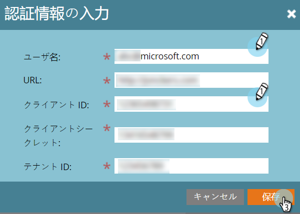

# 手順 4 / 4：Marketo ソリューションとリソース所有者のパスワード制御接続の接続 {#step-4-of-4-connect-the-marketo-solution-ropc}

これが同期の最後のステップです。もう少しです！

>[!PREREQUISITES]
>
>* [手順 1 / 4：リソース所有者のパスワード制御接続を使用した Marketo ソリューションのインストール](/help/marketo/product-docs/crm-sync/microsoft-dynamics-sync/sync-setup/microsoft-dynamics-365-with-ropc-connection/step-1-of-4-install.md)
>* [手順 2 / 4：リソース所有者のパスワード制御接続を使用した Marketo ソリューションの設定](/help/marketo/product-docs/crm-sync/microsoft-dynamics-sync/sync-setup/microsoft-dynamics-365-with-ropc-connection/step-2-of-4-set-up.md)
>* [手順 3 / 4：MS Dynamics でのクライアントアプリのセットアップ](/help/marketo/product-docs/crm-sync/microsoft-dynamics-sync/sync-setup/microsoft-dynamics-365-with-ropc-connection/step-3-of-4-set-up.md)

>[!NOTE]
>
>**管理者権限が必要**

>[!NOTE]
>
>基本認証から OAuth にアップグレードする場合は、[この記事](/help/marketo/product-docs/crm-sync/microsoft-dynamics-sync/sync-setup/reconfigure-dynamics-authentication-method.md)を参照して認証を再設定します。

## Dynamics 同期ユーザ情報の入力 {#enter-dynamics-sync-user-information}

1. Marketo にログインし、「**管理**」をクリックします。

   

1. 「**CRM**」をクリックします。

   

1. 「**Microsoft**」を選択します。

   

1. **手順 1：資格情報を入力**&#x200B;で「**編集**」をクリックします。

   

   >[!CAUTION]
   >
   >送信後に後続のスキーマの変更を元に戻すことができないので、組織 URL が正しいことを確認してください。誤った組織 URL が使用された場合、新しい Marketo サブスクリプションを取得する必要があります。URL がわからない場合は、[ここで見つける方法を学んでください](/help/marketo/product-docs/crm-sync/microsoft-dynamics-sync/sync-setup/view-the-organization-service-url.md)。

   >[!NOTE]
   >
   >新しい認証情報を入力する前に、[こちらでそれらを検証](/help/marketo/product-docs/crm-sync/microsoft-dynamics-sync/sync-setup/validate-microsoft-dynamics-sync.md)できます。

1. 「**ユーザ名**」、「**パスワード**」、Microsoft Dynamics の「**URL**」、「**クライアント ID**」、「**クライアントシークレット**」を入力します。終了したら「**保存**」をクリックします。

   

   >[!NOTE]
   >
   >Marketo のユーザ名は、CRM の同期ユーザのユーザ名と一致する必要があります。形式は、`user@domain.com` または DOMAIN\user です。

## 同期するフィールドの選択 {#select-fields-to-sync}

1. **手順 2：同期するフィールドを選択**&#x200B;の「**編集**」をクリックします。

   

1. Marketo と同期するフィールドを選択すると、事前に選択されるようになります。「**保存**」をクリックします。

   

>[!NOTE]
>
>Marketo は、同期するフィールドへの参照を保存します。Dynamics でフィールドを削除する場合は、[同期無効](/help/marketo/product-docs/crm-sync/salesforce-sync/enable-disable-the-salesforce-sync.md)の状態で実行することをお勧めします。次に、[同期するフィールドを選択](/help/marketo/product-docs/crm-sync/microsoft-dynamics-sync/microsoft-dynamics-sync-details/microsoft-dynamics-sync-field-sync/editing-fields-to-sync-before-deleting-them-in-dynamics.md)を編集および保存して、Marketo のスキーマを更新します。

## カスタムフィルターのフィールドを同期する {#sync-fields-for-a-custom-filter}

カスタムフィルターを作成した場合は、Marketo と同期する新しいフィールドを選択するようにします。

1. 「管理者」に移動し、「**Microsoft Dynamics**」を選択します。

   

1. 「フィールド同期の詳細」で「**編集**」をクリックします。

   

1. 下にスクロールしてフィールドを確認します。実際の名前は new_synctomkto にする必要がありますが、表示名は任意の名前にすることができます。「**保存**」をクリックします。

   

## 同期を有効にする {#enable-sync}

1. **手順 3：同期を有効にする**&#x200B;の「**編集**」をクリックします。

   

   >[!CAUTION]
   >
   >Marketo は、Microsoft Dynamics の同期や、手動で入力されたリードの場合には、自動的に重複排除を行いません。

1. ポップアップの内容をすべて読み、メールアドレスを入力して、「**同期を開始**」をクリックします。

   

1. 初回の同期には数時間かかる場合があります。完了したら、電子メール通知が届きます。

   

できましたね。

>[!MORELIKETHIS]
>
>[Dynamics 認証方法の再設定](/help/marketo/product-docs/crm-sync/microsoft-dynamics-sync/sync-setup/reconfigure-dynamics-authentication-method.md)