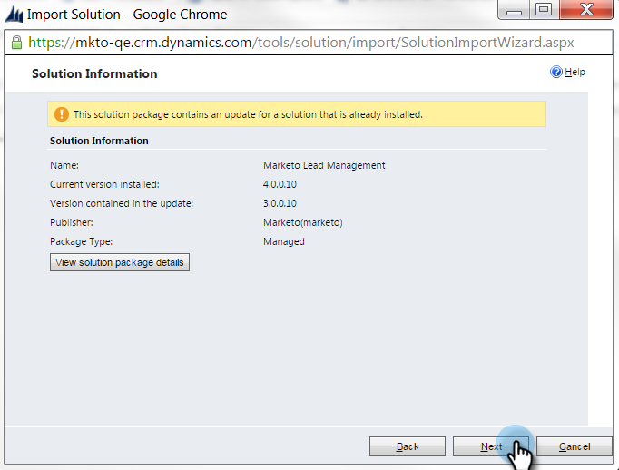
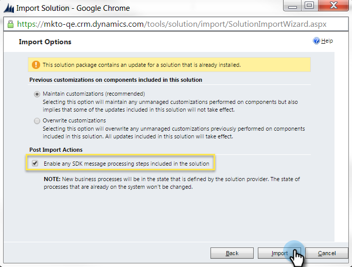

# 手順 1/3:S2S 接続を使用したMarketoソリューションのインストール {#step-1-of-3-install-the-marketo-solution-s2s}

Microsoft Dynamics 365 とMarketoを同期する前に、まず Dynamics にMarketoソリューションをインストールする必要があります。 **Dynamics 管理権限が必要です。**

>[!CAUTION]
>
>* 初期同期が完了する前にカスタムエンティティの同期を有効にしないでください。 初回同期が完了すると、電子メールで通知されます。
>* Dynamics 同期で多要素認証 (MFA) を有効にしている場合、Dynamics がMarketoと正しく同期するには、無効にする必要があります。 詳しくは、 [Marketoサポート](https://nation.marketo.com/t5/Support/ct-p/Support).

>[!NOTE]
>
>Marketoを CRM に同期した後は、インスタンスを置き換えないと、新しい同期を実行できません。

>[!PREREQUISITES]
>
>[Marketo リード管理ソリューションのダウンロード](/help/marketo/product-docs/crm-sync/microsoft-dynamics-sync/sync-setup/download-the-marketo-lead-management-solution.md)

1. にログインします。 **[Microsoft Office 365](https://login.microsoftonline.com/)**.

   

1. クリック  メニューと選択 **CRM**.

   

1. クリック  メニュー ドロップダウンメニューで、を選択します。 **設定** 次に、 **ソリューション**.

   

1. クリック **インポート。**

   

1. クリック **「ファイル」を選択します。** お使いのMarketo Lead Management ソリューションを選択してください [ダウンロード](/help/marketo/product-docs/crm-sync/microsoft-dynamics-sync/sync-setup/download-the-marketo-lead-management-solution.md). 「**次へ**」をクリックします。

   

1. ソリューション情報を表示し、 **ソリューションパッケージの詳細を表示**.

   

1. すべての詳細を確認したら、 **閉じる**.

   

1. 次に、ソリューション情報ページに戻り、 **次へ**.

   

1. 「 SDK オプション」チェックボックスがオンになっていることを確認します。 「**インポート**」をクリックします。

   

   >[!TIP]
   >
   >インストールプロセスを完了するには、ブラウザーでポップアップを有効にする必要があります。

1. インポートが完了するまで待ちます。起き上がってストレッチを行う。

   

1. クリック **閉じます。**

   >[!NOTE]
   >
   >「Marketo Lead Management completed with warning」というメッセージが表示される場合があります。 これは完全に期待されています。

   

1. Marketo Lead Management がソリューションのリストに表示されます。

   

1. 選択 **Marketoリード管理** をクリックし、 **すべてのカスタマイズを公開します。**

   

   完成です。インストールが完了しました。

   >[!MORELIKETHIS]
   >
   >[手順 2 / 3:S2S 接続を使用したMarketoソリューションのセットアップ](/help/marketo/product-docs/crm-sync/microsoft-dynamics-sync/sync-setup/microsoft-dynamics-365-with-s2s-connection/step-2-of-3-set-up.md)
