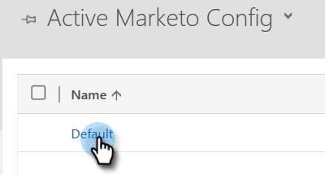
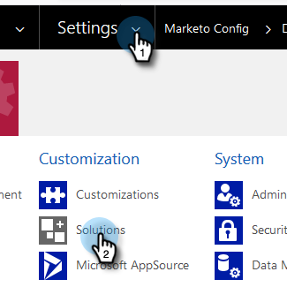

# 手順 2／3：サーバー間接続を使用した Marketo ソリューションの設定 {#step-2-of-3-set-up-marketo-sync-user-in-dynamics-s2s}

>[!PREREQUISITES]
>
>[手順 1 / 3 - サーバー間接続を使用した Marketo ソリューションのインストール](/help/marketo/product-docs/crm-sync/microsoft-dynamics-sync/sync-setup/microsoft-dynamics-365-with-s2s-connection/step-1-of-3-install.md){target="_blank"}

## [!DNL Azure AD] でのクライアントアプリケーションの作成 {#create-client-application-in-azure-ad}

1. [この Microsoft 記事](https://docs.microsoft.com/ja-jp/powerapps/developer/common-data-service/walkthrough-register-app-azure-active-directory#create-an-application-registration){target="_blank"}にアクセスします。

1. すべての手順に従います。 手順 3 で、関連するアプリケーション名（例：「[!DNL Marketo Integration]」）を入力します。 「サポートされたアカウントタイプ」で、「**この組織ディレクトリのアカウントのみ**」を選択します。

1. アプリケーション ID（ClientId）とテナント ID を書き留めます。 後で Marketo に入力する必要があります。

1. [この記事](/help/marketo/product-docs/crm-sync/microsoft-dynamics-sync/sync-setup/grant-consent-for-client-id-and-app-registration.md){target="_blank"}の手順に従って、管理者の同意を与えます。

1. 「**[!UICONTROL Certificates &amp; secrets]**」をクリックして、管理センターでクライアントシークレットを生成します。

   

1. 「**[!UICONTROL 新規クライアントシークレット]**」ボタンをクリックします。

   

1. クライアントシークレットの説明を追加して、「**[!UICONTROL 追加]**」をクリックします。

   

>[!CAUTION]
>
>クライアント秘密鍵の値（以下のスクリーンショットに表示されます）は、1回しか表示されず、再取得できないため、注意してください。

## Microsoft でのアプリケーションユーザの作成 {#create-application-user-in-microsoft}

1. 次のリンクから、[Microsoft でのアプリケーションユーザの設定](https://docs.microsoft.com/ja-jp/powerapps/developer/common-data-service/use-single-tenant-server-server-authentication#application-user-creation){target="_blank"}手順に従います。

   >[!IMPORTANT]
   >
   >* アプリケーションユーザーに権限を付与する際に、「Marketo Sync User Role」に割り当てます。
   >* Power Platform 上の[詳細を表示オプション](https://docs.microsoft.com/ja-jp/power-platform/admin/manage-application-users#view-or-edit-the-details-of-an-application-user)で、アプリケーションユーザのメールアドレスをメモします。 このメールアドレスは、Marketo 内で MS [!DNL Dynamics] への接続を設定する際のユーザ名として使用されます。

## [!DNL Azure AD] と [!DNL AD FS On-prem] の連携 {#azure-ad-federated-with-ad-fs-on-prem}

[!DNL Azure AD] から [!DNL ADFS Onprem] への連携では、特定のアプリケーション用に Home Realm Discovery ポリシーを作成する必要があります。 このポリシーを使用すると、[!DNL Azure AD] は認証リクエストをフェデレーションサービスにリダイレクトします。 このためには、[!DNL AD Connect] でパスワードハッシュの同期を有効にする必要があります。 詳しくは、 [!DNL ROPC] による [[!DNL OAuth] ](https://docs.microsoft.com/ja-jp/azure/active-directory/develop/v2-oauth-ropc) および[アプリケーション用の HRD ポリシーの設定](https://docs.microsoft.com/ja-jp/azure/active-directory/manage-apps/configure-authentication-for-federated-users-portal#example-set-an-hrd-policy-for-an-application)を参照してください。

その他のリファレンスについて詳しくは、[こちら](https://docs.microsoft.com/en-us/azure/active-directory/reports-monitoring/concept-all-sign-ins#:~:text=Interactive%20user%20sign%2Dins%20are,as%20the%20Microsoft%20Authenticator%20app.&text=This%20report%20also%20includes%20federated,are%20federated%20to%20Azure%20AD){target="_blank"}を参照してください。

## Marketo ソリューションの設定 {#configure-marketo-solution}

最後の手順は、Marketo ソリューションで作成された新しいユーザーについて通知することです。

1. 「[!UICONTROL 詳細設定]」セクションに戻り、「[!UICONTROL 設定]」の横にある  アイコンをクリックし、「**[!UICONTROL Marketo 設定]**」を選択します。

   

   >[!NOTE]
   >
   >設定メニューで「Marketo 設定」が表示されていない場合、ページを更新します。 うまくいかない場合は、再度 [Marketo Solution を公開](/help/marketo/product-docs/crm-sync/microsoft-dynamics-sync/sync-setup/microsoft-dynamics-365-with-s2s-connection/step-1-of-3-install.md){target="_blank"}するか、ログアウトしてから再度ログインしてください。

1. 「**[!UICONTROL デフォルト]**」をクリックします。

   

1. **[!UICONTROL Marketo ユーザー]**&#x200B;フィールドの検索ボタンをクリックして、作成した同期ユーザーを選択します。

   

1. 右下隅にあるアイコンをクリックして、変更を保存します。

   

1. 右上にある「**X**」をクリックして画面を閉じます。

   

1. 「[!UICONTROL 設定]」の横にある  アイコンをクリックし、「**[!UICONTROL ソリューション]**」を選択します。

   

1. 「**[!UICONTROL すべてのカスタマイズを公開]**」ボタンをクリックします。

   

   >[!NOTE]
   >
   >基本認証から [!DNL OAuth] にアップグレードする場合は、[この記事](/help/marketo/product-docs/crm-sync/microsoft-dynamics-sync/sync-setup/reconfigure-dynamics-authentication-method.md)を参照して認証を再設定できます。

## 手順 3 に進む前に {#before-proceeding-to-step}

* 同期するレコード数を制限する場合は、[カスタム同期フィルターを設定](/help/marketo/product-docs/crm-sync/microsoft-dynamics-sync/create-a-custom-dynamics-sync-filter.md)します。
* [ [!DNL Microsoft Dynamics]  同期を検証](/help/marketo/product-docs/crm-sync/microsoft-dynamics-sync/sync-setup/validate-microsoft-dynamics-sync.md)プロセスを実行します。 初期設定が正しく行われたことを確認します。
* [!DNL Microsoft Dynamics] CRM で、Marketo 同期ユーザにログインします。

>[!MORELIKETHIS]
>
>* [手順 3／3：サーバー間接続を使用した Marketo ソリューションの接続](/help/marketo/product-docs/crm-sync/microsoft-dynamics-sync/sync-setup/microsoft-dynamics-365-with-s2s-connection/step-3-of-3-connect.md)
>* [ [!DNL Dynamics]  認証方法の再設定](/help/marketo/product-docs/crm-sync/microsoft-dynamics-sync/sync-setup/reconfigure-dynamics-authentication-method.md)
