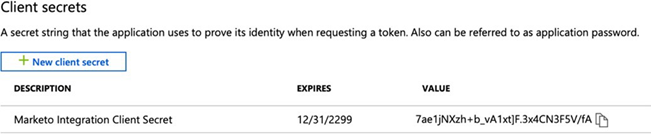

# 手順 2／3：サーバー間接続を使用した Marketo ソリューションの設定 {#step-2-of-3-set-up-marketo-sync-user-in-dynamics-s2s}

>[!PREREQUISITES]
>
>[手順 1／3 - サーバー間接続を使用した Marketo ソリューションのインストール](/help/marketo/product-docs/crm-sync/microsoft-dynamics-sync/sync-setup/microsoft-dynamics-365-with-s2s-connection/step-1-of-3-install.md)

## Azure AD でクライアントアプリケーションを作成する {#create-client-application-in-azure-ad}

1. [この Microsoft 記事](https://docs.microsoft.com/ja-jp/powerapps/developer/common-data-service/walkthrough-register-app-azure-active-directory#create-an-application-registration)にアクセスします。

1. すべての手順に従います。手順 3 で、関連するアプリケーション名（例：「Marketo 統合」）を入力します。「サポートされたアカウントタイプ」で、「**この組織ディレクトリのアカウントのみ**」を選択します。

1. アプリケーション ID（ClientId）とテナント ID を書き留めます。後で Marketo に入力する必要があります。

1. [この記事](/help/marketo/product-docs/crm-sync/microsoft-dynamics-sync/sync-setup/grant-consent-for-client-id-and-app-registration.md)の手順に従って、管理者の同意を与えます。

1. 「**Certificates &amp; secrets**」をクリックして、管理センターでクライアントシークレットを生成します。

   

1. 「**新規クライアントシークレット**」ボタンをクリックします。

   

1. クライアントシークレットの説明を追加して、「**追加**」をクリックします。

   

>[!CAUTION]
>
>後で必要になるので、クライアントシークレットの値（次のスクリーンショットを参照）を必ずメモしておきます。これは 1 回だけ表示され、再度取得することはできません。

## Microsoftでのアプリケーションユーザーの作成 {#create-application-user-in-microsoft}

1. 次のリンクから、[Microsoft でのアプリケーションユーザーの設定](https://docs.microsoft.com/ja-jp/powerapps/developer/common-data-service/use-single-tenant-server-server-authentication#application-user-creation)手順に従います。

   >[!IMPORTANT]
   >
   >* アプリケーションユーザーに権限を付与する際は、必ず「Marketo同期ユーザーロール」に割り当ててください。
   >* アプリケーションユーザーの電子メールアドレスを [「詳細を表示」オプション](https://docs.microsoft.com/en-us/power-platform/admin/manage-application-users#view-or-edit-the-details-of-an-application-user) （Power Platform 上） この電子メールアドレスは、Marketo内で MS Dynamics への接続を設定する際のユーザー名として使用されます。

## AD FS オンプレミスを使用した Azure AD Federated {#azure-ad-federated-with-ad-fs-on-prem}

Federated Azure AD to ADFS Onprem では、特定のアプリケーションに対して Home Realm Discovery ポリシーを作成する必要があります。このポリシーを使用すると、Azure AD は認証リクエストをフェデレーションサービスにリダイレクトします。このためには、AD Connect でパスワードハッシュの同期を有効にする必要があります。詳しくは、[ROPC による OAuth](https://docs.microsoft.com/ja-jp/azure/active-directory/develop/v2-oauth-ropc) および[アプリケーション用の HRD ポリシーを設定する](https://docs.microsoft.com/ja-jp/azure/active-directory/manage-apps/configure-authentication-for-federated-users-portal#example-set-an-hrd-policy-for-an-application)を参照してください。

その他のリファレンスは、[こちら](https://docs.microsoft.com/ja-jp/azure/active-directory/reports-monitoring/concept-all-sign-ins#:~:text=%E5%AF%BE%E8%A9%B1%E5%9E%8B%E3%83%A6%E3%83%BC%E3%82%B6%E3%83%BC%20%E3%82%B5%E3%82%A4%E3%83%B3%E3%82%A4%E3%83%B3%E3%81%AF%E3%80%81%E3%83%A6%E3%83%BC%E3%82%B6%E3%83%BC%E3%81%8C%20Azure%20AD%20%E3%81%AB%E8%AA%8D%E8%A8%BC%E8%A6%81%E7%B4%A0%E3%82%92%E6%8F%90%E4%BE%9B%E3%81%99%E3%82%8B%E3%81%8B%E3%80%81Azure%20AD%20%E3%81%BE%E3%81%9F%E3%81%AF%E3%83%98%E3%83%AB%E3%83%91%E3%83%BC%20%E3%82%A2%E3%83%97%E3%83%AA%20%28Microsoft%20Authenticator%20%E3%82%A2%E3%83%97%E3%83%AA%E3%81%AA%E3%81%A9%29%20%E3%81%A8%E7%9B%B4%E6%8E%A5%E3%82%84%E3%82%8A%E5%8F%96%E3%82%8A%E3%81%99%E3%82%8B%E3%82%B5%E3%82%A4%E3%83%B3%E3%82%A4%E3%83%B3%E3%81%A7%E3%81%99%E3%80%82&amp;text=%E3%81%93%E3%81%AE%E3%83%AD%E3%82%B0%E3%81%AB%E3%81%AF%E3%80%81Azure%20AD%20%E3%81%A8%E9%80%A3%E6%90%BA%E3%81%97%E3%81%A6%E3%81%84%E3%82%8B%20ID%20%E3%83%97%E3%83%AD%E3%83%90%E3%82%A4%E3%83%80%E3%83%BC%E3%81%AB%E3%82%88%E3%82%8B%E3%83%95%E3%82%A7%E3%83%87%E3%83%AC%E3%83%BC%E3%82%B7%E3%83%A7%E3%83%B3%20%E3%82%B5%E3%82%A4%E3%83%B3%E3%82%A4%E3%83%B3%E3%82%82%E5%90%AB%E3%81%BE%E3%82%8C%E3%81%BE%E3%81%99%E3%80%82)を参照してください。

## Marketo ソルーションの設定 {#configure-marketo-solution}

もう少しです。あとは、作成した新しいユーザーについて Marketo ソルーションに知らせるだけです。

>[!IMPORTANT]
>
>基本認証から OAuth にアップグレードする場合は、追加のパラメーターのアップデートについて [Marketo サポート](https://nation.marketo.com/t5/support/ct-p/Support)にお問い合わせください。デフォルト同期ユーザーに対する設定変更を実行すると、新しい資格情報が入力され、同期が再度有効になるまで、同期が一時的に停止されます。 リクエストに応じて、Marketoサポートは、古い認証方法に戻す必要がある場合に、この機能を（2022 年 4 月まで）無効にできます。

1. 詳細設定セクションに戻り、「設定」の横にあるアイコンをクリックし、「**Marketo 設定**」を選択します。

   

   >[!NOTE]
   >
   >設定メニューで「**Marketo 設定**」が表示されていない場合、ページを更新します。うまくいかない場合は、再度 [Marketo Solution を公開](/help/marketo/product-docs/crm-sync/microsoft-dynamics-sync/sync-setup/microsoft-dynamics-365-with-s2s-connection/step-1-of-3-install.md)するか、ログアウトしてから再度ログインしてください。

1. 「**デフォルト**」をクリックします。

   

1. **Marketo ユーザー**&#x200B;フィールドの検索ボタンをクリックして、作成した同期ユーザーを選択します。

   

1. 右下隅にあるアイコンをクリックして、変更を保存します。

   

1. 右上にある「**X**」をクリックして画面を閉じます。

   

1. 「設定」の横にあるアイコンをクリックし、「**ソリューション**」を選択します。

   

1. 「**すべてのカスタマイズを公開**」ボタンをクリックします。

   

## 手順 3 に進む前に {#before-proceeding-to-step}

* 同期するレコード数を制限する場合は、今すぐ[カスタム同期フィルターを設定](/help/marketo/product-docs/crm-sync/microsoft-dynamics-sync/create-a-custom-dynamics-sync-filter.md)してください。
* [Microsoft Dynamics 同期の検証](/help/marketo/product-docs/crm-sync/microsoft-dynamics-sync/sync-setup/validate-microsoft-dynamics-sync.md)プロセスを実行します。初期設定が正しくおこなわれたことを確認します。
* Microsoft Dynamics CRM で Marketo 同期ユーザーにログインします。

>[!MORELIKETHIS]
>
>* [手順 3／3：サーバー間接続を使用した Marketo ソリューションの接続](/help/marketo/product-docs/crm-sync/microsoft-dynamics-sync/sync-setup/microsoft-dynamics-365-with-s2s-connection/step-3-of-3-connect.md)
>* [Dynamics 認証方法の再設定](/help/marketo/product-docs/crm-sync/microsoft-dynamics-sync/sync-setup/reconfigure-dynamics-authentication-method.md)

