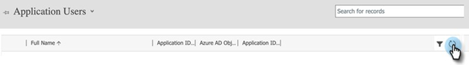
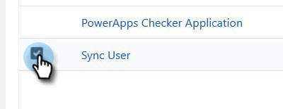

# 手順 2 / 3:Marketo Solution をサーバー間接続でセットアップする {#step-2-of-3-set-up-marketo-sync-user-in-dynamics-s2s}

>[!PREREQUISITES]
>
>[手順 1/3:Marketo Solution とサーバー間接続のインストール](/help/marketo/product-docs/crm-sync/microsoft-dynamics-sync/sync-setup/microsoft-dynamics-365-with-s2s-connection/step-1-of-3-install.md)

## Azure AD でクライアントアプリケーションを作成 {#create-client-application-in-azure-ad}

1. に移動します。 [このMicrosoft記事](https://docs.microsoft.com/en-us/powerapps/developer/common-data-service/walkthrough-register-app-azure-active-directory#create-an-application-registration).

1. すべての手順に従います。手順 3 で、関連するアプリケーション名（例：「Marketo 統合」）を入力します。「サポートされているアカウントタイプ」で、「 **この組織ディレクトリのみのアカウント**.

1. アプリケーション ID(ClientId) とテナント ID を書き留めます。 後で Marketo に入力する必要があります。

1. 手順に従って管理者の同意を得る [この記事では、](/help/marketo/product-docs/crm-sync/microsoft-dynamics-sync/sync-setup/grant-consent-for-client-id-and-app-registration.md).

1. 「**Certificates &amp; secrets**」をクリックして、管理センターでクライアントシークレットを生成します。

   

1. 次をクリック： **新しいクライアント秘密鍵** 」ボタンをクリックします。

   

1. クライアントシークレットの説明を入力し、「 **追加**.

   

>[!CAUTION]
>
>後で必要になるので、クライアントシークレットの値（次のスクリーンショットを参照）を必ずメモしておきます。これは 1 回だけ表示され、再度取得することはできません。

1. 次のリンクから次の手順に従います： [Microsoftでのアプリケーションユーザーの設定](https://docs.microsoft.com/en-us/powerapps/developer/common-data-service/use-single-tenant-server-server-authentication#application-user-creation). アプリケーションユーザーに権限を付与する際に、「Marketo同期ユーザーロール」に割り当てます。

## AD FS をオンプレミスで使用した Azure AD Federated {#azure-ad-federated-with-ad-fs-on-prem}

Federated Azure AD to ADFS Onprem では、特定のアプリケーションに対して Home Realm Discovery ポリシーを作成する必要があります。 このポリシーを使用すると、Azure AD は認証リクエストをフェデレーションサービスにリダイレクトします。このためには、AD Connect でパスワードハッシュの同期を有効にする必要があります。詳しくは、[ROPC による OAuth](https://docs.microsoft.com/ja-jp/azure/active-directory/develop/v2-oauth-ropc) および[アプリケーション用の HRD ポリシーを設定する](https://docs.microsoft.com/ja-jp/azure/active-directory/manage-apps/configure-authentication-for-federated-users-portal#example-set-an-hrd-policy-for-an-application)を参照してください。

その他のリファレンスは、[こちら](https://docs.microsoft.com/ja-jp/azure/active-directory/reports-monitoring/concept-all-sign-ins#:~:text=%E5%AF%BE%E8%A9%B1%E5%9E%8B%E3%83%A6%E3%83%BC%E3%82%B6%E3%83%BC%20%E3%82%B5%E3%82%A4%E3%83%B3%E3%82%A4%E3%83%B3%E3%81%AF%E3%80%81%E3%83%A6%E3%83%BC%E3%82%B6%E3%83%BC%E3%81%8C%20Azure%20AD%20%E3%81%AB%E8%AA%8D%E8%A8%BC%E8%A6%81%E7%B4%A0%E3%82%92%E6%8F%90%E4%BE%9B%E3%81%99%E3%82%8B%E3%81%8B%E3%80%81Azure%20AD%20%E3%81%BE%E3%81%9F%E3%81%AF%E3%83%98%E3%83%AB%E3%83%91%E3%83%BC%20%E3%82%A2%E3%83%97%E3%83%AA%20%28Microsoft%20Authenticator%20%E3%82%A2%E3%83%97%E3%83%AA%E3%81%AA%E3%81%A9%29%20%E3%81%A8%E7%9B%B4%E6%8E%A5%E3%82%84%E3%82%8A%E5%8F%96%E3%82%8A%E3%81%99%E3%82%8B%E3%82%B5%E3%82%A4%E3%83%B3%E3%82%A4%E3%83%B3%E3%81%A7%E3%81%99%E3%80%82&amp;text=%E3%81%93%E3%81%AE%E3%83%AD%E3%82%B0%E3%81%AB%E3%81%AF%E3%80%81Azure%20AD%20%E3%81%A8%E9%80%A3%E6%90%BA%E3%81%97%E3%81%A6%E3%81%84%E3%82%8B%20ID%20%E3%83%97%E3%83%AD%E3%83%90%E3%82%A4%E3%83%80%E3%83%BC%E3%81%AB%E3%82%88%E3%82%8B%E3%83%95%E3%82%A7%E3%83%87%E3%83%AC%E3%83%BC%E3%82%B7%E3%83%A7%E3%83%B3%20%E3%82%B5%E3%82%A4%E3%83%B3%E3%82%A4%E3%83%B3%E3%82%82%E5%90%AB%E3%81%BE%E3%82%8C%E3%81%BE%E3%81%99%E3%80%82)を参照してください。

## 同期ユーザーロールの割り当て {#assign-sync-user-role}

1. Marketo同期ユーザーの役割をMarketo同期ユーザーにのみ割り当てます。

>[!NOTE]
>
>これは、Marketoバージョン 4.0.0.14 以降に当てはまります。 以前のバージョンでは、すべてのユーザーに同期ユーザーの役割が必要です。 Marketoソリューションをアップグレードするには、 [この記事を参照](/help/marketo/product-docs/crm-sync/microsoft-dynamics-sync/sync-setup/update-the-marketo-solution-for-microsoft-dynamics.md).

1. 「アプリケーションユーザー」タブに戻り、ユーザーリストを更新します。

   

1. 新しく作成したアプリケーションユーザーの横にマウスポインターを置くと、チェックボックスが表示されます。 クリックして選択します。

   

1. クリック **役割の管理**.

   

1. チェック **Marketo同期ユーザー** をクリックし、 **OK**.

   

## Marketo Solution の設定 {#configure-marketo-solution}

もう少しです！ あとは、作成した新しいユーザーについてMarketo Solution に知らせるだけです。

>[!IMPORTANT]
>
>基本認証から OAuth にアップグレードする場合は、 [Marketoサポート](https://nation.marketo.com/t5/support/ct-p/Support) を参照してください。 この機能を有効にすると、新しい資格情報が入力され、同期が再度有効になるまで、同期が一時的に停止されます。 この機能は、古い認証モードに戻す際に（2022 年 4 月まで）無効にすることができます。

1. 「詳細設定」セクションに戻り、  [ 設定 ] の横にあるアイコンをクリックし、 **Marketo Config**.

   

   >[!NOTE]
   >
   >見えない場合 **Marketo Config** 設定メニューで、ページを更新します。 うまくいかない場合は、 [Marketo Solution の公開](/help/marketo/product-docs/crm-sync/microsoft-dynamics-sync/sync-setup/microsoft-dynamics-365-with-s2s-connection/step-1-of-3-install.md) 再度ログアウトするか、ログアウトしてから再度ログインします。

1. クリック **デフォルト**.

   

1. 「 **Marketo User** 「 」フィールドを開き、作成した同期ユーザーを選択します。

   

1. 次をクリック：  アイコンを使用して、変更を保存します。

   

1. 次をクリック： **X** をクリックして画面を閉じます。

   

1. 次をクリック：  [ 設定 ] の横にあるアイコンをクリックし、 **ソリューション**.

   

1. 次をクリック： **すべてのカスタマイズを公開** 」ボタンをクリックします。

   

## 手順 3 に進む前に {#before-proceeding-to-step}

* 同期するレコード数を制限する場合は、 [カスタム同期フィルターの設定](/help/marketo/product-docs/crm-sync/microsoft-dynamics-sync/create-a-custom-dynamics-sync-filter.md) 今すぐ。
* を実行します。 [Microsoft Dynamics 同期の検証](/help/marketo/product-docs/crm-sync/microsoft-dynamics-sync/sync-setup/validate-microsoft-dynamics-sync.md) プロセス。 初期設定が正しく行われたことを確認します。
* Microsoft Dynamics CRM でMarketo同期ユーザーにログインします。

>[!MORELIKETHIS]
>
>[手順 3 / 3:Marketo Solution とサーバー間の接続](/help/marketo/product-docs/crm-sync/microsoft-dynamics-sync/sync-setup/microsoft-dynamics-365-with-s2s-connection/step-3-of-3-connect.md)
