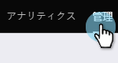
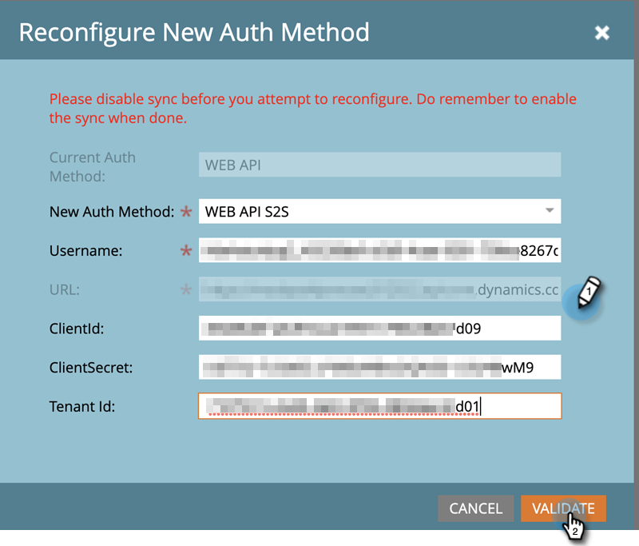

# Dynamics 認証方法の再設定 {#reconfigure-dynamics-authentication-method}

次の手順に従って、Dynamics 認証方法を更新します。

>[!PREREQUISITES]
>
>次の記事のいずれかで、目的の認証方法を使用して、Microsoft Dynamics および Active Directory(Azure AD/ADFS) でアプリケーションを設定します。
>
>* [手順 2 / 3:Marketo Solution をサーバー間接続でセットアップする](/help/marketo/product-docs/crm-sync/microsoft-dynamics-sync/sync-setup/microsoft-dynamics-365-with-s2s-connection/step-2-of-3-set-up.md)
>* [手順 2/4:リソース所有者のパスワード制御接続を使用したMarketoソリューションのセットアップ](/help/marketo/product-docs/crm-sync/microsoft-dynamics-sync/sync-setup/microsoft-dynamics-365-with-ropc-connection/step-2-of-4-set-up.md)

1. Marketoで **管理者**.

   

1. クリック **Microsoft Dynamics**&#x200B;を、 **同期の無効化**.

   

   >[!NOTE]
   >
   >認証方法を更新するには、グローバル同期を一時的に無効にする必要があります。

1. 次をクリック： **新しい認証方法の再設定** タブをクリックします。

   

1. 目的の新しい認証方法を選択します（この例では Web API を選択しています）。

   

1. 新しい認証方法に必要な資格情報を入力し、 **検証**.

   

   >[!NOTE]
   >
   >* 特定のフィールドは、選択した認証方法によって異なり、以前の認証方法に応じてフォームが自動的に更新されます。
   >* 以前と同期したことがある場合、上記のフォームのデータは事前に入力されている可能性があります。 すべての資格情報を再入力し、正しい値が設定されていることを確認してください。

1. すべて問題がない場合は、同期の検証で緑のチェックマークがすべて生成されます . メッセージを確認し、 **切り替え** 認証方法を更新する場合。

   

   >[!NOTE]
   >
   >次の項目が の場合は、その手順に問題があります。 詳しくは、 [Dynamics 検証同期の問題を修正](/help/marketo/product-docs/crm-sync/microsoft-dynamics-sync/sync-setup/validate-microsoft-dynamics-sync/fix-dynamics-validation-sync-issues.md) 問題を特定して修正する。 次に、上記の画像のような結果になるまで同期検証手順を再実行します。

1. クリック **確認** をクリックして続行します。

   

1. クリック **確認** 再び

   

1. 「**OK**」をクリックします。

   >[!IMPORTANT]
   >
   >新しい認証モードを受け入れるまでに 15 分かかります。 同期を再度有効にする前に、スイッチの時刻から 15 分待ってください。
