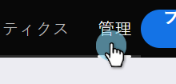
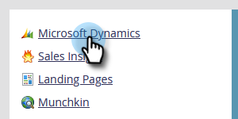

# オンライン用のMicrosoft Dynamics CRMアプリのセットアップ{#set-up-microsoft-dynamics-crm-app-for-online}

## {#set-up}の設定

1. https://docs.microsoft.com/en-us/powerapps/developer/common-data-service/walkthrough-register-app-azure-active-directory#create-an-application-registrationに移動します。

1. すべての手順に従います。 手順3で、関連するアプリ名(例：「Marketo統合」)を入力します。 「サポートされているアカウントの種類」で、「この組織のディレクトリにのみアカウントを選択します。

1. アプリケーションID(ClientId)を書き留めます。 後でMarketoに入力する必要があります。

1. [この記事](/help/marketo/product-docs/crm-sync/microsoft-dynamics-sync/sync-setup/set-up-oauth-authentication-for-dynamics/grant-consent-for-client-id-and-app-registration.md)の手順に従って、管理者の同意を得ます。

1. 「**証明書と秘密**」をクリックして、管理センターでクライアント秘密鍵を生成します。

   

1. 「**新しいクライアントシークレット**」をクリックします。

   

1. クライアントシークレットの説明を追加し、「**追加**」をクリックします。

   

   >[!CAUTION]
   >
   >後で必要になるので、クライアントシークレットの値（下のスクリーンショットに示す）を必ずメモしておきます。 これは1回だけ表示され、再度取得することはできません。

   

Marketoは、grant_type Resource Owner Password Credentials(ROPC)を使用して、OAuthでAzure ADに対して認証をおこないます。 このシナリオでは、特定のアプリケーション用にHome Realm Discoveryポリシーを作成する必要があります。 このポリシーを使用すると、Azure ADは認証要求をフェデレーションサービスにリダイレクトします。 このためには、AD Connectでパスワードハッシュの同期を有効にする必要があります。 詳しくは、[OAuth with ROPC](https://docs.microsoft.com/en-us/azure/active-directory/develop/v2-oauth-ropc)および[アプリケーションのhrdポリシーの設定](https://docs.microsoft.com/en-us/azure/active-directory/manage-apps/configure-authentication-for-federated-users-portal#example-set-an-hrd-policy-for-an-application)を参照してください。

追加の参照[は、](https://docs.microsoft.com/en-us/azure/active-directory/reports-monitoring/concept-all-sign-ins#:~:text=Interactive%20user%20sign%2Dins%20are,as%20the%20Microsoft%20Authenticator%20app.&amp;text=This%20report%20also%20includes%20federated,are%20federated%20to%20Azure%20AD.)にあります。

完了したら、Dynamics CRMで生成されたクライアントIDとシークレットをMarketo **に入力します。**

## Dynamics CRMで生成されたクライアントIdとシークレットをMarketoに入力{#enter-the-dynamics-crm-generated-client-id-and-secret-into-marketo}

次の手順は、オンライン版&#x200B;_および_&#x200B;オンプレミス版に適用されます。

1. Marketoで、「**管理者**」をクリックします。

   

1. 「**Microsoft Dynamics**」をクリックします。

   

1. 「**同期を無効にする**」をクリックします。

   

1. 資格情報の横にある「**編集**」をクリックします。

   

1. 前に取得した&#x200B;**クライアントID**&#x200B;と&#x200B;**クライアントシークレット**&#x200B;を入力し、**保存**&#x200B;を押します。

   

1. 「**同期設定を検証**」をクリックします。

   

1. 「**次へ**」をクリックします。

   

1. すべての緑色のチェックマークが表示されます。 「**閉じる**」をクリックします。

   

   >[!NOTE]
   >
   >緑のチェックマークの中に赤いXが表示される場合は、[この記事](/help/marketo/product-docs/crm-sync/microsoft-dynamics-sync/sync-setup/validate-microsoft-dynamics-sync/fix-dynamics-validation-sync-issues.md)を参照して修正オプションを確認してください。

1. 「**同期を有効にする**」をクリックします。

   

それで終わりだ！
