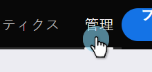
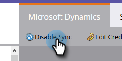

# AD FSのオンプレム、テナント、およびMicrosoft Onlineを使用してAzure ADフェデレーテッド用のMSDをセットアップする{#set-up-msd-for-azure-ad-federated-with-ad-fs-on-prem-tenant-and-microsoft-online}

## Microsoft Dynamics CRMアプリ{#set-up-microsoft-dynamics-crm-app}のセットアップ

1. https://docs.microsoft.com/en-us/powerapps/developer/common-data-service/walkthrough-register-app-azure-active-directory#create-an-application-registrationに移動します。

1. すべての手順に従います。 手順3で、関連するアプリ名（「マーケティングツールの統合」など）を入力します。 [サポートされるアカウントの種類]で、[この組織のディレクトリにのみアカウントを作成]を選択します。

1. アプリケーション ID(ClientId)を書き留めます。 後でMarketoに入力する必要があります。

1. [この記事](/help/marketo/product-docs/crm-sync/microsoft-dynamics-sync/sync-setup/set-up-oauth-authentication-for-dynamics/grant-consent-for-client-id-and-app-registration.md)の手順に従って、管理者の同意を得ます。

1. 管理センターで[**証明書とシークレット**]をクリックして、クライアントシークレットを生成します。

   

1. [**新しいクライアントシークレット**]をクリックします。

   

1. 追加クライアントシークレットの説明を入力し、**追加**&#x200B;をクリックします。

   

   >[!CAUTION]
   >
   >後で必要になるので、クライアントシークレットの値（下のスクリーンショットに表示されています）を必ず書き留めてください。 1回しか表示されず、再度取得することはできません。

   

Marketorは、grant_typeリソース所有者パスワード資格情報(ROPC)を使用して、OAuthを使用してAzure ADに認証します。 このシナリオでは、特定のアプリケーションに対してHome Realm Discoveryポリシーを作成する必要があります。 このポリシーを使用すると、Azure ADは、認証要求をフェデレーションサービスにリダイレクトします。 このためには、AD Connectでパスワードハッシュ同期を有効にする必要があります。 詳しくは、[OAuth with ROPC](https://docs.microsoft.com/en-us/azure/active-directory/develop/v2-oauth-ropc)および[アプリケーション](https://docs.microsoft.com/en-us/azure/active-directory/manage-apps/configure-authentication-for-federated-users-portal#example-set-an-hrd-policy-for-an-application)のhrdポリシーの設定を参照してください。

[参照先は](https://docs.microsoft.com/en-us/azure/active-directory/reports-monitoring/concept-all-sign-ins#:~:text=Interactive%20user%20sign%2Dins%20are,as%20the%20Microsoft%20Authenticator%20app.&amp;text=This%20report%20also%20includes%20federated,are%20federated%20to%20Azure%20AD.)を参照してください。

終了したら、**Dynamics CRMで生成されたクライアントIDとシークレットをMarketo**&#x200B;に入力します。

## Dynamics CRMで生成されたクライアントIdとシークレットをマーケティング担当者{#enter-the-dynamics-crm-generated-client-id-and-secret-into-marketo}に入力

1. Marketoで、「**管理者**」をクリックします。

   

1. **Microsoft Dynamics**&#x200B;をクリックします。

   

1. 「**同期を無効にする**」をクリックします。

   

1. 「資格情報」の横の「**編集**」をクリックします。

   

1. 以前に取得した&#x200B;**クライアントID**&#x200B;と&#x200B;**クライアントシークレット**&#x200B;を入力し、**保存**&#x200B;を押します。

   

1. 「**同期設定を検証**」をクリックします。

   

1. 「**次へ**」をクリックします。

   

1. すべての緑のチェックマークが表示されます。 「**閉じる**」をクリックします。

   

   >[!NOTE]
   >
   >緑のチェックマークの中に赤いX印が表示される場合は、[この記事](/help/marketo/product-docs/crm-sync/microsoft-dynamics-sync/sync-setup/validate-microsoft-dynamics-sync/fix-dynamics-validation-sync-issues.md)で修正オプションを参照してください。

1. 「**同期を有効にする**」をクリックします。

   

それだ！
