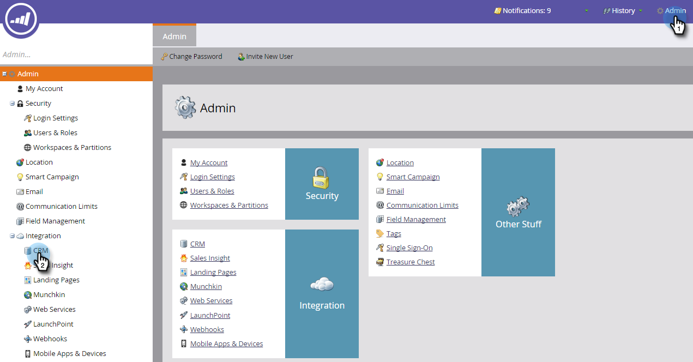
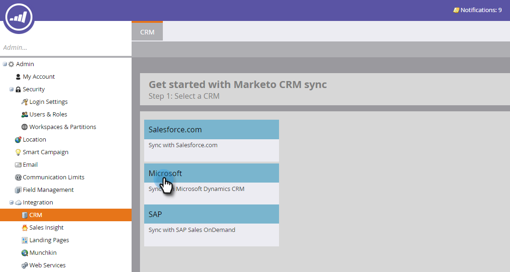
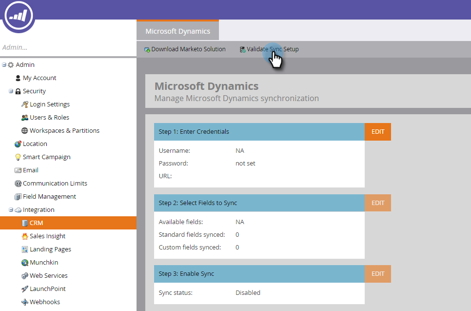
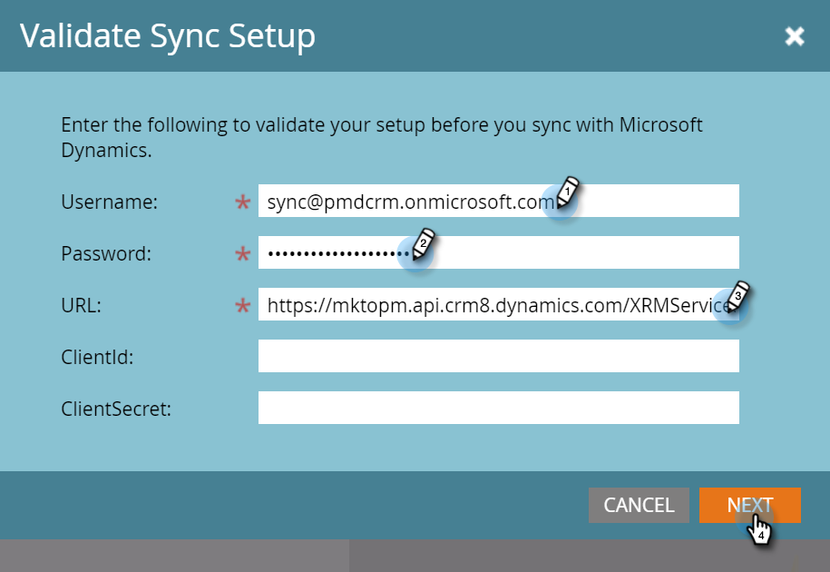
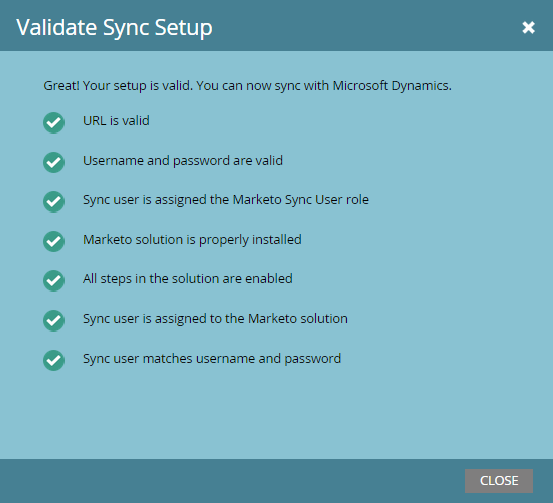

# [!DNL Microsoft Dynamics] 同期の検証 {#validate-microsoft-dynamics-sync}

>[!CAUTION]
>
>[!DNL Dynamics] 同期で多要素認証（MFA）を有効にしている場合、[!DNL Dynamics] が Marketo と正しく同期するには、無効にする必要があります。 詳細については、[Marketo サポート ](https://nation.marketo.com/t5/Support/ct-p/Support)にお問い合わせください。

## Marketo で同期検証を実行する {#run-validate-sync-in-marketo}

同期の検証ツールを実行して、[!DNL Microsoft Dynamics] Sync with Marketoが正しく設定されていることを確認してから、それらの間で最終的な接続を行うことが非常に重要です。 このプロセスでは、7 つのセットアップ手順のチェックリストが生成され、問題が存在する場所を特定します。 これらが正しく行われたことを確認すると、後で多くの時間を節約できます。

1. 「**[!UICONTROL 管理者]**」タブをクリックし、「統合」領域の「**[!DNL Microsoft Dynamics]**」リンクをクリックします。

   

1. 「**[!DNL Microsoft]**」を選択します。

   

1. 「**[!UICONTROL 同期設定の検証]**」タブをクリックします。

   

1. ユーザー名、パスワード、URL を入力します（クライアント ID とクライアントシークレットはオプションです）。 終了したら「**[!UICONTROL 次へ]**」をクリックします。

   

   >[!NOTE]
   >
   >以前と同期したことがある場合は、左のツリーの「**CRM**」が **[!DNL Microsoft Dynamics]** を読み込み、上記のフォームのデータが事前入力されている場合があります。

1. すべて問題ない場合、同期の検証で、すべてが緑のチェックマークがついたチェックリストが生成されます。

   

1.  が表示された場合は、その手順に問題があります。 問題を特定して修正する方法について詳しくは、[ [!DNL Dynamics]  検証同期に対する問題の修正](/help/marketo/product-docs/crm-sync/microsoft-dynamics-sync/sync-setup/validate-microsoft-dynamics-sync/fix-dynamics-validation-sync-issues.md)を参照してください。 次に、上記の画像のような結果になるまで同期検証手順を再実行します。

   >[!CAUTION]
   >
   >現在、[!DNL Marketo Dynamics] 同期のサンドボックス更新はサポートされていません。 [!DNL Dynamics] CRM サンドボックスを更新する必要がある場合は、新しい Marketo サンドボックスが必要です。 詳しくは、カスタマーサクセスマネージャーにお問い合わせください。

>[!MORELIKETHIS]
>
>[ [!DNL Dynamics]  検証同期に対する問題の修正](/help/marketo/product-docs/crm-sync/microsoft-dynamics-sync/sync-setup/validate-microsoft-dynamics-sync/fix-dynamics-validation-sync-issues.md)
