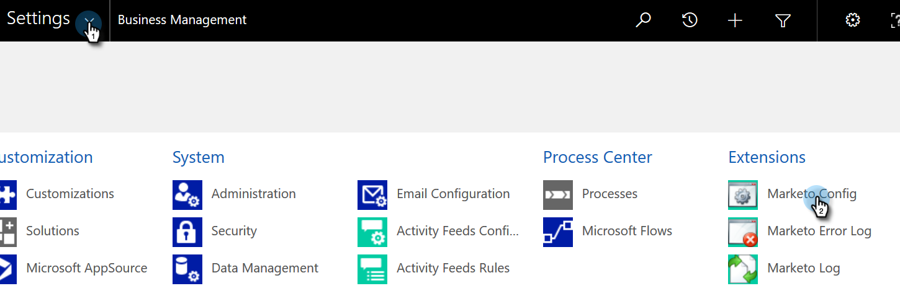

# Dynamics検証の同期の問題を修正{#fix-dynamics-validation-sync-issues}

## 同期ツールの結果の検証{#validate-sync-tool-results}

Dynamics Validate Syncを実行すると、このレポートが生成されます。 手順の横にがある場合は、以下を参照して問題を特定し、修正してください。 次に、結果にチェックマーク以外の内容が表示されるまで、同期検証手順を再実行します。

## URLは有効{#url-is-valid}です

ここにがある場合は、URLが有効であることを確認します。 開発者向けリソースで見つけて、組織サービスを参照してください。 URLが無効になる理由はいくつかあります。

1. Dynamicsにログインします。 設定アイコンをクリックし、「**詳細設定**」を選択します。

   

1. 「設定」をクリックし、「**カスタマイズ**」を選択します。

   

1. **開発者向けリソース**&#x200B;をクリックします。

   

1. 組織サービスのURLは、「サービスエンドポイント」の下にあります。

   

## ユーザー名とパスワードは有効です{#username-and-password-are-valid}

をお持ちの場合は、Microsoft Dynamicsのユーザー名とパスワードが有効であることを確認してください。

## 同期ユーザーがMarketto Syncユーザーロール{#sync-user-is-assigned-to-the-marketo-sync-user-role}に割り当てられています

ここにがある場合は、Microsoft DynamicsでMarketto Syncユーザーロールがチェック済みであることを確認する必要があります。 Microsoft Dynamicsのインストールドキュメントの手順2を参照してください。

1. Dynamicsで、設定アイコンをクリックし、**詳細設定**&#x200B;を選択します。

   

1. 「**設定**」をクリックし、「**セキュリティ**」を選択します。

   

1. 「**ユーザー」をクリックします。**

   

1. 同期ユーザーのリンクをクリックします。

   

1. 「**ロールの管理**」をクリックします。

   

1. Marketor Syncユーザーロールがチェック済みであることを確認します。 見つからない場合は、チェックして&#x200B;**OKをクリックします。**

   

## Marketo Solutionは適切にインストールされています{#marketo-solution-is-properly-installed}

をお持ちの場合は、Microsoft Dynamicsにアクセスして、Marketoのインストールが存在することを確認してください。 MIcrosoft Dynamicsセットアップドキュメントの手順1を参照してください。

1. Dynamicsで、設定アイコンをクリックし、**詳細設定**&#x200B;を選択します。

   

1. 「**設定**」をクリックし、「**ソリューション」を選択します。**

   

1. ソリューションが一覧に表示されることを確認します。

   

## ソリューション内のすべてのステップが有効{#all-steps-in-the-solution-are-enabled}

ここにがある場合は、デフォルトの手順がいずれも非アクティブ化されていないことを確認してください。 すべての手順は、インストール時に自動的に有効になりますが、カスタマイズ時に無効にすることができます。

## 同期ユーザーがMarketoソリューション{#sync-user-is-assigned-to-the-marketo-solution}に割り当てられている

ここにがある場合は、Microsoft DynamicsのMarketo Defaultページで同期ユーザーが割り当てられていることを確認してください。

1. Dynamicsで、設定アイコンをクリックし、**詳細設定**&#x200B;を選択します。

   

1. 「**設定**」をクリックし、「**Marketto Config**」を選択します。

   

1. 同期ユーザーがデフォルトとして割り当てられていることを確認します。

   

## 同期ユーザーがユーザー名とパスワード{#sync-user-matches-username-and-password}と一致

ここにがある場合は、Microsoft DynamicsのMarketo Configのデフォルト設定手順の「Marketoユーザー」フィールドに適切な同期ユーザーを割り当ててください。

>[!MORELIKETHIS]
>
>[Microsoft Dynamics同期の検証](../../../../../product-docs/crm-sync/microsoft-dynamics-sync/sync-setup/validate-microsoft-dynamics-sync.md)

