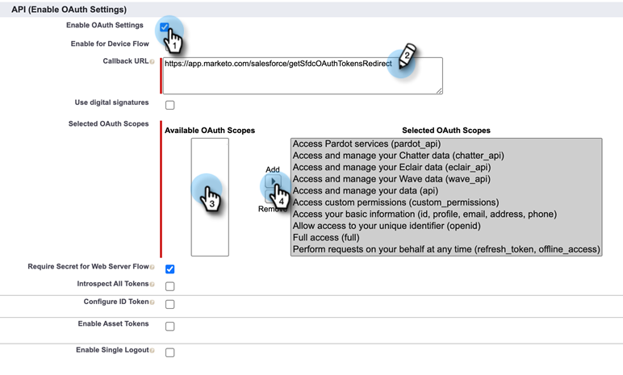

# OAuth 2.0 を使用したログイン {#log-in-using-oauth-2-0}

Salesforce は、OAuth プロトコルを使用して、アプリケーションのユーザがログイン認証情報を表示することなく、アプリケーションのデータに安全にアクセス（OAuth 2.0 を使用してアプリケーションを認証）できるようにします。Marketo を Salesforce と安全に接続し、同期するために実行する手順を以下に示します。

>[!IMPORTANT]
>
>OAuth を使用して Marketo と Salesforce に接続するには、誤ったユーザ名で Salesforce に接続しないよう、プライベート（匿名）ブラウザーで Marketo にログインします。

## 接続アプリの設定 {#set-up-connected-app}

1. Salesforce の「設定」で、プラットフォームツール内で「アプリ」、「アプリマネージャー」の順に移動し、「**新しい接続済みアプリ**」をクリックします。

   

1. 詳細を入力し、「**保存**」をクリックします。

   

1. 「**OAuth 設定を有効にする**」チェックボックスをクリックします。「コールバック URL」に `https://app.marketo.com/salesforce/getSfdcOAuthTokensRedirect` と入力します。使用可能なすべての OAuth 範囲を選択し、	**追加**&#x200B;をクリックします。

   

1. 「**保存**」をクリックします。

   

1. 「**続行**」をクリックします。

   

1. Consumer Key と Consumer Secret をコピーします。

   

>[!NOTE]
>
>後で Marketo で使用するために、Consumer Key と Consumer Secret の情報を保存します。

## Marketo の設定 {#set-up-marketo}

>[!PREREQUISITES]
>
>* Salesforce 同期ユーザに対して API アクセスを有効にする必要があります（Salesforce Professional Edition ユーザの場合、そのアクセスはデフォルトでは使用できません。Salesforce アカウント担当者にお問い合わせください）。
>* Marketo 同期ユーザを Salesforce で作成する必要があります。
>* 既存の顧客の場合、顧客のサブスクリプションで「OAuth for SFDC 同期を有効にする」機能が有効になります。
>* ポップアップブロッカーが無効になっています。
>* Connected App が作成され、Consumer Key と Consumer Secret を使用できるようになりました。

>[!CAUTION]
>
>同期ユーザから Marketo で不要なフィールドをすべて非表示にした後で、「**同期フィールド**」をクリックするようにしてください。「同期フィールド」をクリックすると、ユーザが SFDC で表示できるすべてのフィールドが Marketo に作成され、削除できなくなります。

1. Marketo の管理セクションで、**CRM**／**Salesforce と同期**&#x200B;をクリックします。

   

1. 以前に記録した Consumer Key および Consumer Secret の情報を追加し、「**保存**」をクリックします。

   

1. Marketo Salesforce 同期ページで、「**Salesforce でログイン**」ボタンをクリックします。

   

   >[!CAUTION]
   >
   >「Salesforce でログイン」ボタンではなく、「ユーザ名」、「パスワード」、「トークン」の各フィールドが表示されている場合は、Marketo サブスクリプションが基本認証で有効になっています。詳しくは、[基本認証を使用した Marketo の設定](/help/marketo/product-docs/crm-sync/salesforce-sync/setup/enterprise-unlimited-edition/step-3-of-3-connect-marketo-and-salesforce-enterprise-unlimited.md)を参照してください。同期が一連の認証情報を使用し始めると、Salesforce の認証情報またはサブスクリプションを切り替えられなくなります。Oauth 2.0 を使用する場合は、カスタマーサクセスマネージャーにお問い合わせください。

1. Salesforce ログインページのポップアップが表示されます。「Marketo 同期ユーザ」認証情報をキーで入力し、ログインします。

   

1. 受け取った検証コード（Salesforce から送信）を入力し、**検証**&#x200B;をクリックします。

   

1. 検証が成功すると、アクセスをリクエストするアクセスページが表示されいます。「**許可**」をクリックします。

   

1. 数分後に、Marketo にポップアップが表示されます。「**認証情報を確認**」をクリックします。

   

1. フィールドの同期が完了したら、「**Salesforce 同期を開始**」をクリックします。

   

1. 「**同期の開始**」をクリックします。

   

Marketo と Salesforce の同期が進行中です。

>[!MORELIKETHIS]
>
>* [手順 1 / 3：Marketo フィールドの Salesforce への追加（Enterprise／Unlimited）](/help/marketo/product-docs/crm-sync/salesforce-sync/setup/enterprise-unlimited-edition/step-1-of-3-add-marketo-fields-to-salesforce-enterprise-unlimited.md)
>* [手順 2 / 3：Marketo 用の Salesforce ユーザの作成（Enterprise／Unlimited）](/help/marketo/product-docs/crm-sync/salesforce-sync/setup/enterprise-unlimited-edition/step-2-of-3-create-a-salesforce-user-for-marketo-enterprise-unlimited.md)
>* [Salesforce AppExchange での Marketo Sales Insight パッケージのインストール](/help/marketo/product-docs/marketo-sales-insight/msi-for-salesforce/installation/install-marketo-sales-insight-package-in-salesforce-appexchange.md)
>* [Salesforce Enterprise／Unlimited での Marketo Sales Insight の設定](/help/marketo/product-docs/marketo-sales-insight/msi-for-salesforce/configuration/configure-marketo-sales-insight-in-salesforce-enterprise-unlimited.md)

