# OAuth 2.0 を使用したログイン {#log-in-using-oauth-2-0}

Salesforce は、OAuth プロトコルを使用して、アプリケーションのユーザがログイン資格情報を表示することなく、アプリケーションのデータに安全にアクセス（OAuth 2.0 を使用してアプリケーションを認証）できるようにします。 以下は、Salesforce と安全に接続し、Marketo Engageを同期するために実行する手順です。

>[!IMPORTANT]
>
>OAuth を使用して Marketo と [!DNL Salesforce] に接続するには、誤ったユーザ名で [!DNL Salesforce] に接続しないよう、プライベート（匿名）ブラウザーで Marketo にログインします。

## 外部クライアントアプリの設定 {#set-up-external-client-app}

>[!NOTE]
>
>2025年9月より、[Connected Apps](https://help.salesforce.com/s/articleView?id=005132365&type=1){target="_blank"}の使用をSalesforceで制限し始めました。 ドキュメントに基づいてConnected Appを設定している既存のユーザーの場合は、Marketo Sync ユーザーのプロファイルに「アンインストールされたConnected Appsの承認」権限を追加するか、以下の手順に従って新しい外部クライアントアプリを作成できます。

1. Salesforceで、歯車アイコンをクリックし、**設定**&#x200B;を選択します。

   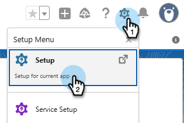

1. クイック検索ボックスに「`App Manager`」と入力し、**App Manager**&#x200B;を選択します。

   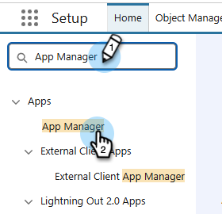

1. **新しい外部クライアントアプリ**&#x200B;をクリックします。

   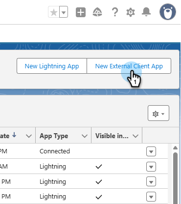

1. _基本情報_&#x200B;に詳細を入力します。 _配布状態_&#x200B;を&#x200B;**ローカル**&#x200B;に設定します。

   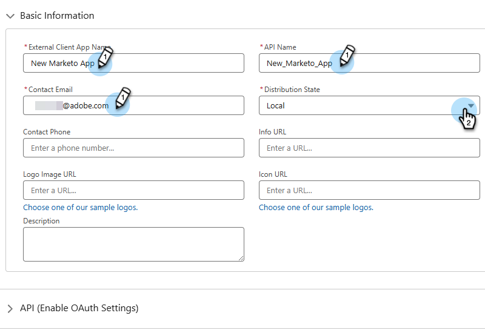

1. 「**API （OAuth設定を有効にする）**」セクションを展開し、「**[!UICONTROL OAuthを有効にする]**」チェックボックスを選択します。 _コールバック URL_&#x200B;に、`https://app.marketo.com/salesforce/getSfdcOAuthTokensRedirect`と入力します。 使用可能なすべてのOAuth スコープを選択し、右矢印をクリックして追加します。

   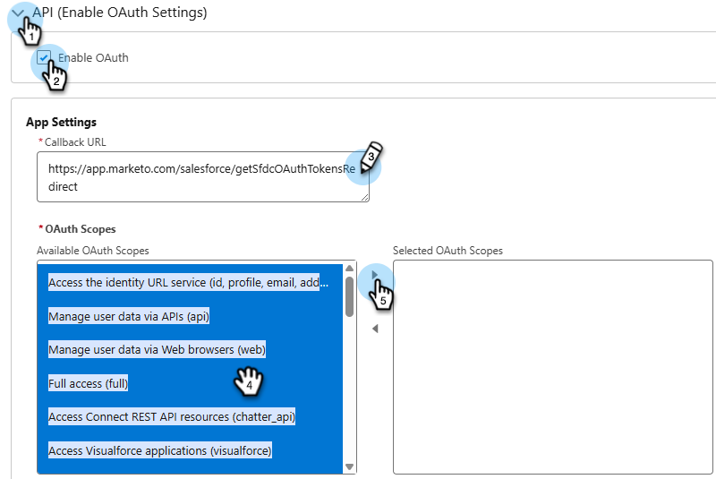

1. _フローの有効化_&#x200B;で、ボックスが選択されていないことを確認します。

   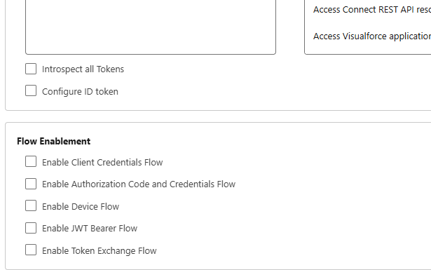

1. 「_セキュリティ_」で、「**Web サーバーフローにシークレットを必要とする**」と「**リフレッシュトークンフローにシークレットを必要とする**」のみが選択されていることを確認します。

   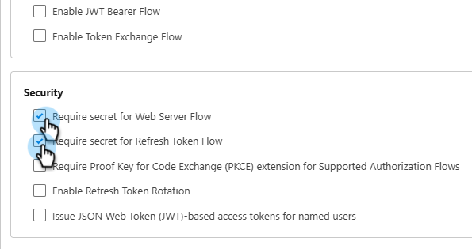

1. 最後の4つのセクションをスキップして、**作成**&#x200B;をクリックします。

   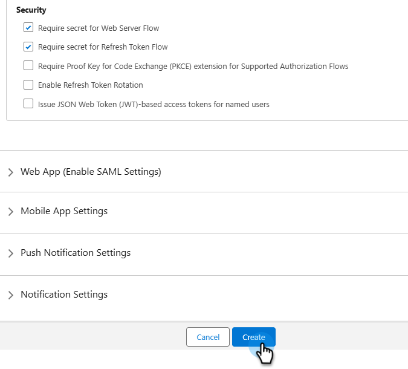

1. 新しい外部クライアントアプリを作成したら、「**設定**」タブを選択し、**OAuth設定** セクションを展開します。

   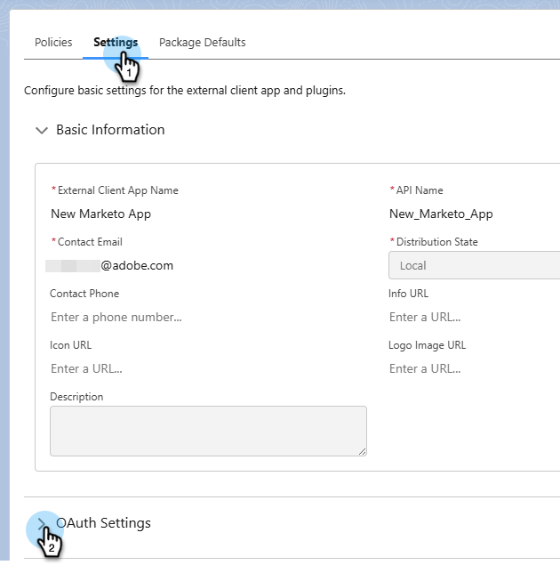

1. 「**Consumer Key and Secret**」ボタンをクリックし、新しいタブを開くように求めます。 両方の番号をコピーして保存します（後でMarketo Engageで使用するために必要になります）。

   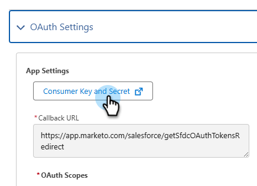

## Marketo の設定 {#set-up-marketo}

>[!PREREQUISITES]
>
>* SALESFORCE Sync ユーザーに対してAPI アクセスを有効にする必要があります（Salesforce Professional Edition ユーザーの場合、そのアクセスはデフォルトでは使用できません。Salesforce アカウントの担当者にお問い合わせください）。
>* Marketo 同期ユーザを Salesforce で作成する必要があります。
>* 既存の顧客の場合、顧客のサブスクリプションで「SFDC 同期で OAuth を有効にする」機能が有効になります。
>* ポップアップブロッカーが無効になっています。
>* Connected App が作成され、[!UICONTROL Consumer Key] と [!UICONTROL Consumer Secret] を使用できるようになりました。

>[!CAUTION]
>
>同期ユーザから Marketo で不要なフィールドをすべて非表示にした後で、「**[!UICONTROL 同期フィールド]**」をクリックするようにしてください。 「同期フィールド」をクリックすると、ユーザが SFDC で表示できるすべてのフィールドが Marketo に作成され、削除できなくなります。

1. Marketo の管理セクションで、**[!UICONTROL CRM]**／**[!UICONTROL Salesforce と同期]**&#x200B;をクリックします。

   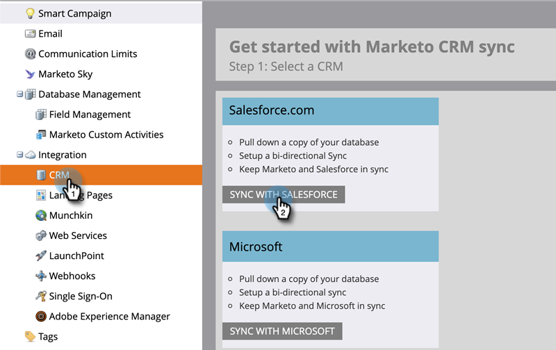

1. 以前に記録した Consumer Key および Consumer Secret の情報を追加し、「**[!UICONTROL 保存]**」をクリックします。

   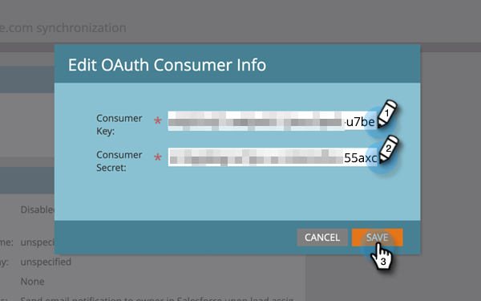

1. Marketo Salesforce 同期ページで、「**[!UICONTROL Salesforce でログイン]**」ボタンをクリックします。

   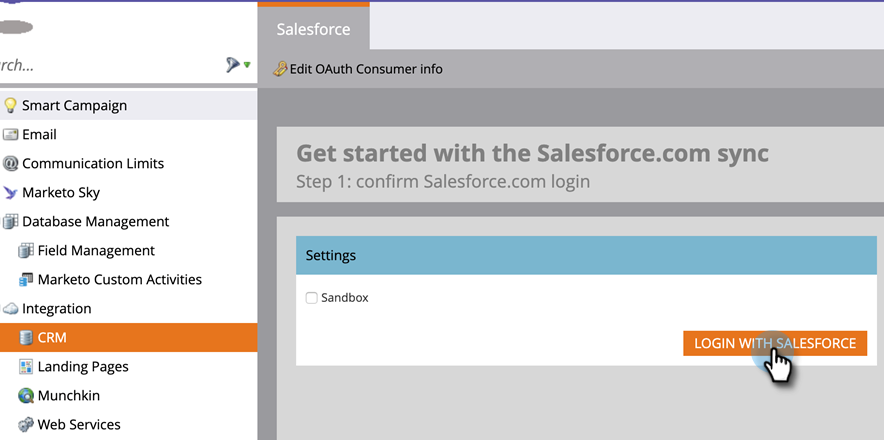

   >[!CAUTION]
   >
   >「Salesforceでログイン」ボタンではなく、ユーザー名/パスワード/トークンフィールドが表示されている場合は、Marketo サブスクリプションが基本認証に対して有効になっています。 詳しくは、[基本認証を使用した Marketo の設定](/help/marketo/product-docs/crm-sync/salesforce-sync/setup/enterprise-unlimited-edition/step-3-of-3-connect-marketo-and-salesforce-enterprise-unlimited.md){target="_blank"}を参照してください。 同期が一連の資格情報を使用し始めると、Salesforce の資格情報またはサブスクリプションを切り替えられなくなります。 Salesforce認証用にOauth 2.0を設定するには、[Marketo サポート &#x200B;](https://nation.marketo.com/t5/support/ct-p/Support){target="_blank"}にお問い合わせください。

1. Salesforce ログインページのポップアップが表示されます。 「Marketo 同期ユーザー」資格情報をキー入力し、ログインします。

   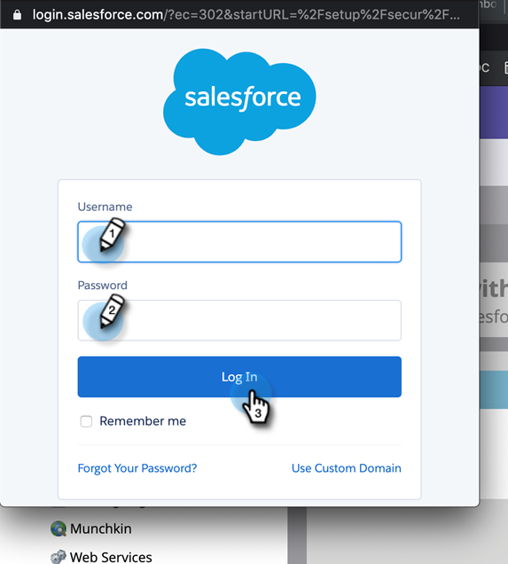

1. メールで受け取った検証コード（Salesforce から送信）を入力し、**[!UICONTROL 検証]**&#x200B;をクリックします。

   

1. 検証が成功すると、アクセスをリクエストするアクセスページが表示されいます。 「**[!UICONTROL 許可]**」をクリックします。

   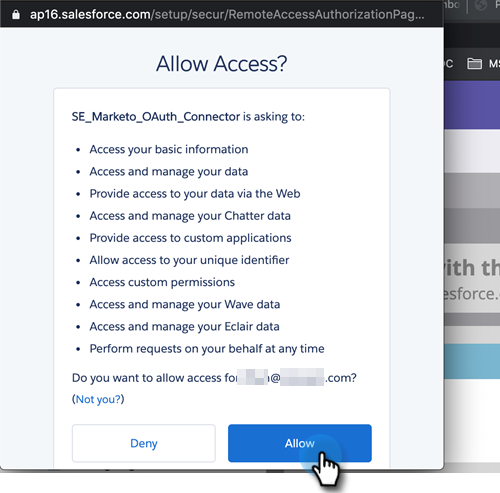

1. 数分後に、Marketo にポップアップが表示されます。 「**[!UICONTROL 資格情報を確認]**」をクリックします。

   

1. フィールドの同期が完了したら、「**[!UICONTROL Salesforce 同期を開始]**」をクリックします。

   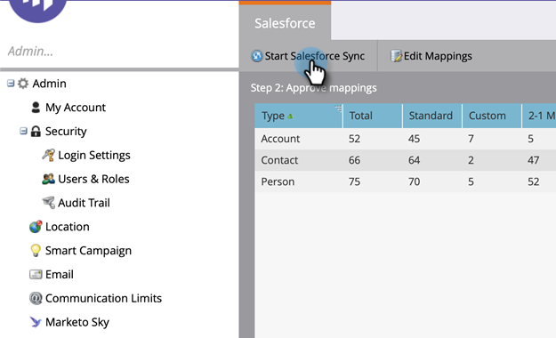

1. 「**[!UICONTROL 同期の開始]**」をクリックします。

   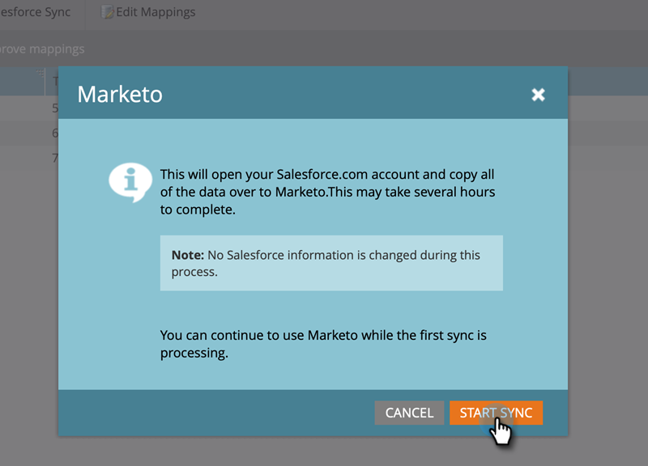

Marketo と [!DNL Salesforce] の同期が進行中です。

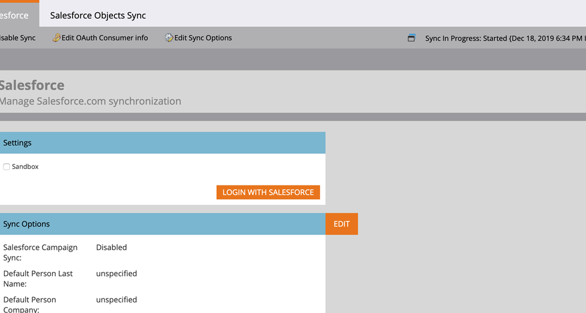

>[!MORELIKETHIS]
>
>* [手順 1／3：Marketo フィールドの Salesforce への追加（Enterprise／Unlimited）](/help/marketo/product-docs/crm-sync/salesforce-sync/setup/enterprise-unlimited-edition/step-1-of-3-add-marketo-fields-to-salesforce-enterprise-unlimited.md){target="_blank"}
>* [手順 2 / 3：Marketo 用の Salesforce ユーザの作成（Enterprise／Unlimited）](/help/marketo/product-docs/crm-sync/salesforce-sync/setup/enterprise-unlimited-edition/step-2-of-3-create-a-salesforce-user-for-marketo-enterprise-unlimited.md){target="_blank"}
>* [Salesforce AppExchange での Marketo セールスインサイトパッケージのインストール](/help/marketo/product-docs/marketo-sales-insight/msi-for-salesforce/installation/install-marketo-sales-insight-package-in-salesforce-appexchange.md){target="_blank"}
>* [Salesforce Enterprise／Unlimited での Marketo セールスインサイトの設定](/help/marketo/product-docs/marketo-sales-insight/msi-for-salesforce/configuration/configure-marketo-sales-insight-in-salesforce-enterprise-unlimited.md){target="_blank"}
