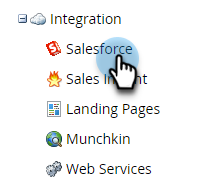
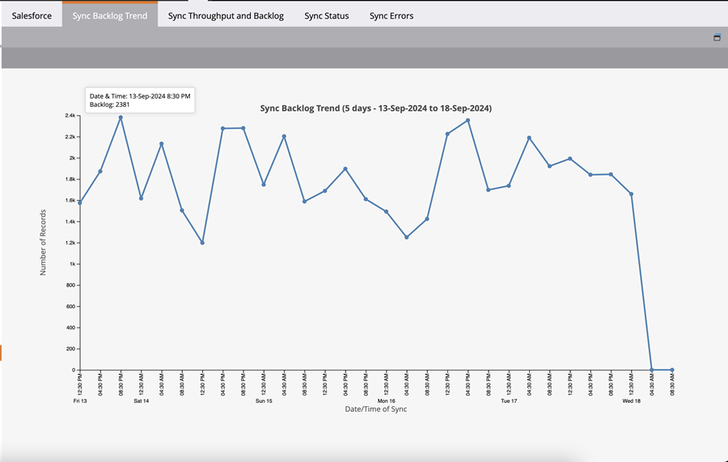
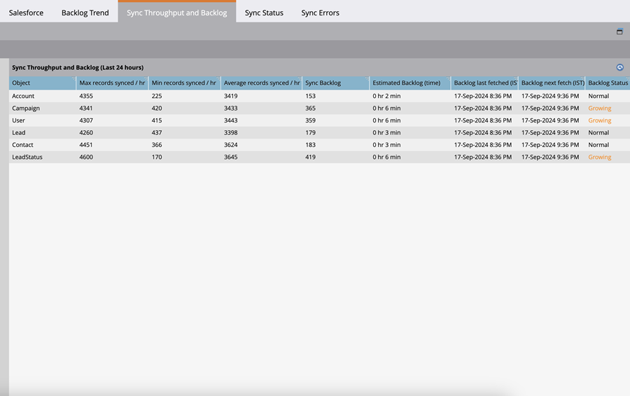

# Salesforce 同期バックログ指標  {#salesforce-sync-backlog-metrics}

同期バックログは、同期が保留中のレコードに使用される名前です。 SalesforceからMarketo Engageへの同期が保留中のレコードを考慮します。 バックログを管理することで、スムーズな同期と時間を実現できます。 バックログには、同期リードからSFDCへの同期フローステップなどの同期フローステップで実行される数ではなく、いずれかの側で同期ポストの更新を保留中の数が含まれます。

## アクセス方法 {#how-to-access}

1. Marketo Engage で、**管理**&#x200B;エリアに移動します。

   

1. **Salesforce**&#x200B;を選択します。

   

## 同期バックログトレンド {#sync-backlog-trend}

バックログのトレンドには、過去 5 日間に記録されたバックログの変化が反映されます。 バックログは、5 日間にわたって 4 時間間隔で表示されます。 したがって、グラフには 5 日の期間、1 日あたり 6 つの間隔（30 回の間隔）が表示されます。

バックログは、X 軸上の特定の 4 時間間隔で観測されます。 この値は、同期中のすべてのオブジェクトに適用されます。 これは、同期を待機している Salesforce と Marketo Engage のバックログの合計です。

## 同期スループットおよびバックログ {#sync-throughput-and-backlog}

統計には、過去 24 時間に同期されたすべてのオブジェクトタイプのスループットとバックログステータスが反映されます。 オブジェクトタイプには、リード、取引先責任者、アカウント、商談、キャンペーン、ユーザ、カスタムオブジェクトなど、同期対象のすべてのオブジェクトが含まれます。 スループット統計は 15 分ごとに自動更新されますが、更新アイコンを使用すると手動で更新できます。 バックログは 1 時間ごとに取得されます。

>[!NOTE]
>
>統計は、カレンダー日ではなく、周期的に更新されます。

<table><thead>
  <tr>
    <th>フィールド</th>
    <th>説明</th>
  </tr></thead>
<tbody>
  <tr>
    <td>1 時間あたりに同期される最大レコード数</td>
    <td>オブジェクトタイプに対して過去 24 時間に観測された、1 時間あたりに同期される最大レコード数（最大スループット）。 24 時間の期間は、カレンダー日ではなく、時間と共に循環します。</td>
  </tr>
  <tr>
    <td>1 時間あたりに同期される最小レコード数</td>
    <td>オブジェクトタイプに対して過去 24 時間に観測された、1 時間あたりに同期される最小レコード数（最小スループット）。 24 時間の期間は、カレンダー日ではなく、時間と共に循環します。</td>
  </tr>
  <tr>
    <td>1 時間あたりに同期される平均レコード数</td>
    <td>オブジェクトタイプに対して過去 24 時間に観測された、1 時間あたりに同期される平均レコード数（最小スループット）。 24 時間の期間は、カレンダー日ではなく、時間と共に循環します。 過去 24 時間に同期される合計レコード数として計算されます。</td>
  </tr>
  <tr>
    <td>同期バックログ</td>
    <td>オブジェクトタイプの同期が保留中のレコードのバックログ。 両方向（Salesforce から Marketo Engage へ、およびその逆）の同期が保留中のバックログの合計です。 Salesforce からのバックログは、Salesforce への API 呼び出しを使用して取得され、Marketo Engage からのバックログは、変更データログから取得された統計を使用して計算されます。 これは 1 時間ごとに計算されます。 この表の次の 2 つのフィールドには、それぞれバックログが最後に計算された日時と次の計算スケジュールが示されます。</td>
  </tr>
  <tr>
    <td>推定バックログ（時間）</td>
    <td>オブジェクトタイプごとのバックログの同期に要する推定時間。 「バックログの同期/1時間あたりの平均同期レコード」として計算されます。</td>
  </tr>
  <tr>
    <td>前回のバックログ取得時間</td>
    <td>前回のバックログ計算時間。</td>
  </tr>
  <tr>
    <td>次回のバックログの取得時間</td>
    <td>次回のバックログ計算時間。</td>
  </tr>
  <tr>
    <td>バックログステータス</td>
    <td>これは、過去 6 時間にバックログが増加したかどうかを示します。 現在のバックログが 6 時間前に記録されたバックログよりも大きい場合は、「増加中」と推定されます。 それ以外の場合は、「通常」と表示されます。 これは、同期スループットがバックログに追いついているかどうかを示すことを目的としています。</td>
  </tr>
</tbody></table>

## 同期バックログの原因 {#what-causes-sync-backlogs}

更新がMarketo Engage側で行われても、CRM側で行われても、通常のMarketo EngageからCRMへの同期サイクルを通じて、もう一方の側の情報を更新するために再同期されるレコードがトリガーされます。 Salesforce上のレコードに更新が行われるたびに、システム変更タイムスタンプ（「SysModStamp」と呼ばれる）が生成されます。 これにより変更内容が同期されます。

大量の更新（フィールド値の変更など）が行われると、多くのレコードが変更され、新しいSysModStampsが作成されます。 大量のレコードを更新する場合、Marketo EngageとCRMの間で再同期する必要があり、一時的なバックログを作成する必要もあります。

## 同期バックログの管理に関するベストプラクティス {#best-practices}

**同期ユーザーに表示されるフィールド**：同期に表示されるフィールドが、同期する必要があり、マーケティング活動に対する価値を持つフィールドのみであることを確認します。 最後に変更されたタイムスタンプを更新するSalesforceのレコードに対する更新は、レコードを同期バックログにキューに入れます。また、不要なフィールドの同期は、同期中のより重要なフィールドの処理を遅らせる可能性があります。 不要なフィールドが同期ユーザーから非表示になっている場合、それらのフィールドを更新すると、更新よりもはるかに速いスキップが発生します。 Salesforce管理者と協力して、ベストプラクティス [ここ](https://nation.marketo.com/t5/marketo-whisperer-blogs/best-practices-for-determining-which-fields-to-sync-with-marketo/ba-p/247449){target="_blank"}を確認し、Marketo Sync ユーザーに表示されるフィールドを更新します。

**不要なレコードを非表示またはフィルター**: レコードがマーケティング可能でない場合、同期リソースが無駄になる可能性があります。 同期ユーザーが同期を確認できない場合、同期を試みるリソースを無駄にすることはありません。 [Marketo Engage サポート ](https://nation.marketo.com/t5/support/ct-p/Support#_blank){target="_blank"}は、追加の条件に基づいてレコードの同期を禁止する同期フィルターの設定を支援します。 カスタム同期フィルター[の設定に関する詳細については、こちらを参照してください](https://nation.marketo.com/t5/product-blogs/instructions-for-creating-a-custom-sync-rule/ba-p/242758){target="_blank"}。 Salesforce内でインデックスフィールドを使用することを強くお勧めします（詳しくはsalesforceにお問い合わせください）。

**重要でない時間帯に一括更新をスケジュール**: データ同期パターンを確認して、重要でない期間を特定します。 可能であれば、これらの重要でない期間に一括更新をスケジュールできるかどうかを確認します。

**頻繁に更新されるフィールド**：一部のフィールドは頻繁に更新される傾向があります。 例えば、通貨の変更の対象となる通貨フィールド。 これらのフィールドを同期する必要があるかどうか、またはフィールドのデザインを変更する必要があるかどうかを確認します。 頻繁に更新され、不要な他のフィールドがある場合は、同期ユーザーから非表示にします。 フィールドを更新する可能性のある統合について、SFDC管理者と話し合います。

**カスタムオブジェクト**：同期が有効になっている[ カスタムオブジェクト ](https://experienceleague.adobe.com/en/docs/marketo/using/product-docs/crm-sync/salesforce-sync/sfdc-sync-details/sfdc-sync-custom-object-sync){target="_blank"}を定期的に確認し、同期する必要がなくなったオブジェクトを同期および無効化します。

**アクティビティ**: [いずれかのアクティビティ ](https://experienceleague.adobe.com/en/docs/marketo/using/product-docs/crm-sync/salesforce-sync/setup/optional-steps/customize-activities-sync){target="_blank"}で同期が有効になり、同期から削除される可能性があるかどうかを確認します。  これらのアクティビティは、リードごとに1日に1回のみ同期されます。

**同期の確認エラー**：例外処理により、同期が遅くなる場合があります。 ユーザー通知を確認し、エラーを解決すると、同期の正常性が向上する可能性があります。

**サポートにお問い合わせください**：上記のベストプラクティスをすべて実行していても、重大なバックログが発生している場合は、[Marketo Engage サポート ](https://nation.marketo.com/t5/support/ct-p/Support#_blank){target="_blank"}にお問い合わせください。
