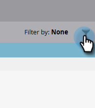
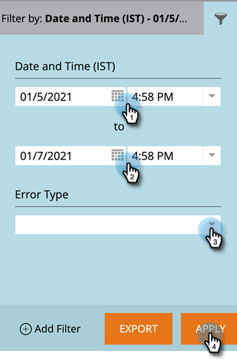

# [!DNL Salesforce] 同期エラー {#salesforce-sync-errors}

同期処理中に発生したエラーの概要を表示します。 これには、互換性のないデータを同期できなかったことによって発生したエラーも含まれます。

>[!NOTE]
>
>**管理者権限が必要**

## 同期エラーの表示 {#view-sync-errors}

1. 「**[!UICONTROL 管理]**」をクリックします。

   

1. 「統合」で、「**Salesforce**」をクリックして、「**[!UICONTROL 同期エラー]**」タブをクリックします。

   

>[!NOTE]
>
>表示されるエラーの範囲は、現在の時刻から現在の同期の 5 日前までです。

| フィールド | 説明 |
|---|---|
| 失敗 | レコードレベル&#x200B;_または_&#x200B;ジョブレベル |
| 失敗の日時 | エラーの詳細 |
| エラータイプ | SFDC から返されるメッセージ |

>[!TIP]
>
>レコードレベルのレコードをクリックすると、関連オブジェクトの Marketo ID および [!DNL Salesforce] ID が表示されます。 場合によっては、レコードレベルおよびジョブレベルのエラーのメッセージは、[!DNL Salesforce] から直接送信されます。 オンラインで検索すると、追加の詳細が表示される場合があります。

## 同期エラーのフィルタリング {#filter-sync-errors}

1. データをフィルタリングするには、ページの右端にあるフィルターアイコンをクリックします。

   

1. 日付と時間の範囲を選択して、エラータイプ（ジョブレベルまたはレコードレベル）でフィルタリングします。 終了したら「**[!UICONTROL 適用]**」をクリックします。

   

**オプションの手順**：同期エラーをエクスポートするには、「**[!UICONTROL エクスポート]**」をクリックします。 データは CSV としてエクスポートされます。

