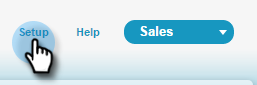

# 手順 1／3：Marketo フィールドの Salesforce への追加（Enterprise／Unlimited） {#step-of-add-marketo-fields-to-salesforce-enterprise-unlimited}

>[!PREREQUISITES]
>
>MarketoとSalesforceの間で同期するには、Salesforce APIへのアクセス権が必要です。

Marketoは、一連のフィールドを使用して、特定の種類のマーケティング関連情報を取り込みます。 Salesforceでこのデータを使用する場合は、以下の手順に従ってください。

1. リードおよびコンタクトオブジェクトのSalesforceで、次の3つのカスタムフィールドを作成します。スコア、獲得プログラムおよび獲得日。
1. リードと連絡先の間でこれらのカスタムフィールドをマッピングし、Salesforceでのコンバージョン時に値が持ち越されるようにします。
1. 必要に応じて、その他のフィールドを作成できます（以下の表を参照）。

これらのカスタムフィールドはすべてオプションで、MarketoとSalesforceを同期するために必要なものではありません。 ベストプラクティスとして、「スコア」、「獲得プログラム」、「獲得日」のフィールドを作成することをお勧めします。

## SalesforceへのMarketoフィールドの追加 {#add-marketo-fields-to-salesforce}

上記のSalesforceのリードおよびコンタクトオブジェクトに3つのカスタムフィールドを追加します。 さらに追加する場合は、この節の最後にある使用可能なフィールドのテーブルを参照してください。

3つのカスタムフィールドのそれぞれに対して次の手順を実行して追加します。 「スコア」で始まります。

1. Salesforceにログインし、「**設定**」をクリックします。

   

1. 左側のビルドメニューで、「**カスタマイズ**」をクリックし、「**リード**」を選択します。 「**フィールド**」をクリックします。

   

1. ページ下部の「カスタムフィールドと関係」セクションで「**新規**」をクリックします。

   

1. 適切なフィールドタイプを選択します（「スコア」の場合は数値）。獲得プログラム — テキスト；「取得日」 — 日時)。

   

1. 「**次へ**」をクリックします。

   

1. 次の表に示すように、フィールドの「フィールドラベル」、「長さ」、「フィールド名」を入力します。

<table> 
 <thead> 
  <tr> 
   <th> 
    

      フィールドラベル 
    
</th> 
   <th> 
    

      フィールド名 
    
</th> 
   <th> 
    

      データタイプ 
    
</th> 
   <th> 
    

      フィールド属性 
    
</th> 
  </tr> 
 </thead> 
 <tbody> 
  <tr> 
   <td>スコア</td> 
   <td>mkto71_Lead_Score</td> 
   <td>数字</td> 
   <td>長さ10 小数点第0位 </td> 
  </tr> 
  <tr> 
   <td>取得日</td> 
   <td>mkto71_Acquisition_Date</td> 
   <td>日時</td> 
   <td> </td> 
  </tr> 
  <tr> 
   <td>新規顧客獲得プログラム</td> 
   <td>mkto71_Acquisition_Program</td> 
   <td>テキスト</td> 
   <td>長さ255</td> 
  </tr> 
 </tbody> 
</table>

>[!NOTE]
>
>Salesforceは、API名の作成に使用する際に__cをフィールド名に追加します。

>[!NOTE]
>
>テキストフィールドと数値フィールドには長さが必要ですが、日付/時間フィールドには必要ありません。説明はオプションです。

1. 「**次へ**」をクリックします。

   

1. アクセス設定を指定し、「**次へ**」をクリックします。

   * すべてのロールを&#x200B;**Visible**&#x200B;および&#x200B;**Read-Only**&#x200B;に設定します。

   * 同期ユーザーのプロファイルの「**読み取り専用**」チェックボックスをオフにします。

      * _System Administrator_&#x200B;のプロファイルを同期ユーザーとして持つユーザーがいる場合は、以下に示すように、「**読み取り専用**」チェックボックスをオフにします
      * 同期ユーザーに&#x200B;_カスタムプロファイル_&#x200B;を作成した場合は、そのカスタムプロファイルの「**読み取り専用**」チェックボックスをオフにします

   

1. フィールドを表示するページレイアウトを選択します。

   

1. 「**保存して新規**」をクリックして戻り、他の2つのカスタムフィールドをそれぞれ作成します。 3つの操作が完了したら、「**保存**」をクリックします。

   

1. 左側のBuildメニューで、**Customize**&#x200B;をクリックし、「Contacts」を選択します。 「フィールド」をクリックします。
1. リードオブジェクトの場合と同様に、コンタクトオブジェクトの「スコア」、「獲得日」、「獲得プログラム」フィールドの手順3 ～ 10を実行します。
1. 必要に応じて、このテーブルの追加のカスタムフィールドに対して上記の手順を実行します。

<table> 
 <thead> 
  <tr> 
   <th> 
    

      フィールドラベル 
    
</th> 
   <th> 
    

      フィールド名 
    
</th> 
   <th> 
    

      データタイプ 
    
</th> 
   <th> 
    

      フィールド属性 
    
</th> 
  </tr> 
 </thead> 
 <tbody> 
  <tr> 
   <td>獲得プログラムID</td> 
   <td>mkto71_Acquisition_Program_Id</td> 
   <td>数字</td> 
   <td>長さ18 小数点第0位 </td> 
  </tr> 
  <tr> 
   <td>訪問者の参照元</td> 
   <td>mkto71_Original_Referrer</td> 
   <td>テキスト</td> 
   <td>長さ255</td> 
  </tr> 
  <tr> 
   <td>参照元検索エンジン</td> 
   <td>mkto71_Original_Search_Engine</td> 
   <td>テキスト</td> 
   <td>長さ255</td> 
  </tr> 
  <tr> 
   <td>参照元検索フレーズ</td> 
   <td>mkto71_Original_Search_Phrase</td> 
   <td>テキスト</td> 
   <td>長さ255</td> 
  </tr> 
  <tr> 
   <td>参照元のソース情報</td> 
   <td>mkto71_Original_Source_Info</td> 
   <td>テキスト</td> 
   <td>長さ255</td> 
  </tr> 
  <tr> 
   <td>参照元のソースのタイプ</td> 
   <td>mkto71_Original_Source_Type</td> 
   <td>テキスト</td> 
   <td>長さ255</td> 
  </tr> 
  <tr> 
   <td>推測される市区町村</td> 
   <td>mkto71_Inderred_City</td> 
   <td>テキスト</td> 
   <td>長さ255</td> 
  </tr> 
  <tr> 
   <td>推測される企業</td> 
   <td>mkto71_Inferred_Company</td> 
   <td>テキスト</td> 
   <td>長さ255</td> 
  </tr> 
  <tr> 
   <td>推測される国</td> 
   <td>mkto71_Inferred_Country</td> 
   <td>テキスト</td> 
   <td>長さ255</td> 
  </tr> 
  <tr> 
   <td>推測される都市圏</td> 
   <td>mkto71_Inferred_Metropolitan_Area</td> 
   <td>テキスト</td> 
   <td>長さ255</td> 
  </tr> 
  <tr> 
   <td>推測される市外局番</td> 
   <td>mkto71_Inderred_Phone_Area_Code</td> 
   <td>テキスト</td> 
   <td>長さ255</td> 
  </tr> 
  <tr> 
   <td>推測される郵便番号</td> 
   <td>mkto71_Inferred_Postal_Code</td> 
   <td>テキスト</td> 
   <td>長さ255</td> 
  </tr> 
  <tr> 
   <td>推測される都道府県／地域</td> 
   <td>mkto71_Inderred_State_Region</td> 
   <td>テキスト</td> 
   <td>長さ255</td> 
  </tr> 
 </tbody> 
</table>

>[!NOTE]
>
>Marketoによって自動的に割り当てられたフィールドの値は、新しいフィールドが作成されたときにSalesforceですぐに使用できるわけではありません。 Marketoは、次にいずれかのシステム上のレコードを更新すると(つまり、MarketoとSalesforceの間で同期されているフィールドのいずれかに対する更新)、Salesforceにデータを同期します。

## コンバージョンのカスタムフィールドのマッピング {#map-custom-fields-for-conversions}

変換が発生したときにデータが引き継がれるように、Salesforceのリードオブジェクトのカスタムフィールドを、コンタクトオブジェクトのコンタクトフィールドにマッピングする必要があります。

1. 右上隅の「**設定**」をクリックします。

   

1. ナビゲーション検索にEnterキーを押さずに「Fields」と入力します。 フィールドは別のオブジェクトの下に表示されます。「リード」の下の「**フィールド**」をクリックします。

   

1. 「リードのカスタムフィールドと関係」セクションに移動し、「**リードフィールドをマップ**」をクリックします。

   

1. マッピングするフィールドの横にあるドロップダウンをクリックします。

   

1. 対応する連絡先カスタムフィールドを選択します。

   

1. 作成した他のフィールドに対して、上記の手順を繰り返します。

1. 完了したら、「**保存**」をクリックします。

   簡単だろ？

>[!MORELIKETHIS]
>
>[手順 2／3：Marketo 用の Salesforce ユーザーの作成（Enterprise／Unlimited）](/help/marketo/product-docs/crm-sync/salesforce-sync/setup/enterprise-unlimited-edition/step-2-of-3-create-a-salesforce-user-for-marketo-enterprise-unlimited.md)
