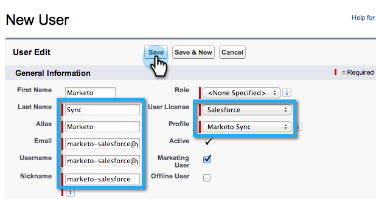

# 手順2/3:Marketor向けSalesforceユーザーの作成(Enterprise/Unlimited) {#step-of-create-a-salesforce-user-for-marketo-enterprise-unlimited}

>[!NOTE]
>
>これらの手順は、Salesforce管理者が実行する必要があります

>[!NOTE]
>
>**前提条件**
>
>* [手順1/3:Salesforce追加に対するマーケティング担当者のフィールド(Enterprise/Unlimited)](step-1-of-3-add-marketo-fields-to-salesforce-enterprise-unlimited.md)

>

この記事では、Salesforceプロファイルでユーザー権限を設定し、Marketor-Salesforce統合アカウントを作成します。

## プロファイルの作成 {#create-a-profile}

1. 「 **設定**」をクリックします。

   

1. ナビゲーション検索バーに「プロファイル」と入力し、 **プロファイル** リンクをクリックします。

   

1. [ **新規作成**]をクリックします。

   

1. 「 **標準ユーザー**」を選択し、プロファイルに「Marketo-Salesforce Sync」という名前を付けて、「 **保存**」をクリックします。

   

## プロファイル権限の設定 {#set-profile-permissions}

1. 「 **編集** 」をクリックして、セキュリティ権限を設定します。

   

1. 「 **管理権限** 」セクションで、次のチェックボックスがオンになっていることを確認します。

   * API有効
   * HTMLテンプレートの編集
   * パブリックドキュメントの管理
   * 公開テンプレートの管理

   

   >[!TIP]
   >
   >「 **パスワードを無期限にする** 」ボックスにチェックマークを付けてください。

1. 「一般的なユーザー権限」セクションで、次のチェックボックスがオンになっていることを確認します。

   * リードのコンバージョン
   * イベントの編集
   * タスクの編集

   

1. 「標準オブジェクト権限」セクションで、「読み取り」、「作成」、「編集」、「削除」の権限が次の対象になっていることを確認します。

   * アカウント
   * キャンペーン
   * 連絡先
   * リード
   * オポチュニティ

   >[!NOTE]
   >
   >キャンペーン同期を使用する予定がある場合は、キャンペーンに権限を付与します。

   

1. 終了したら、ページの下部にある **「保存** 」をクリックします。

   

## フィールド権限の設定 {#set-field-permissions}

1. 同期に必要なカスタムフィールドを調べるには、マーケターと相談してください。

   >[!NOTE]
   >
   >この手順により、不要なフィールドがMarketoに表示されるのを防ぎ、混乱を軽減し、同期を高速化します。

1. プロファイルの詳細ページで、「 **フィールドレベルのセキュリティ** 」セクションに移動します。 オブジェクトのアクセシビリティを編集するには、 **表示** (A)をクリックします。

   * `Lead`
   * `Contact`
   * `Account`
   * `Opportunity`

   >[!TIP]
   >
   >組織のニーズに応じて、他のオブジェクトを設定できます。

   

1. 各オブジェクトに対して、「 **編集**」をクリックします。

   

1. 不要なフィールドを見つけ、「**Read Access」と「Edit Access ****** 」がオフになっていることを確認します。 完了したら **「保存** 」をクリックします。

   >[!NOTE]
   >
   >**Reminder**
   >
   >
   >カスタムフィールドのアクセシビリティの編集のみを行います。

   

1. 不要なフィールドをすべて無効にした後、以下のオブジェクトフィールドに対して「**読み取りアクセス」と「アクセスを編集**」をオンにする必要があります。 完了したら **「保存** 」をクリックします。

<table> 
 <tbody> 
  <tr> 
   <th colspan="1" rowspan="1">
オブジェクト
</th> 
   <th colspan="1" rowspan="1">
フィールド
</th> 
  </tr> 
  <tr> 
   <td colspan="1" rowspan="1">
アカウント
</td> 
   <td colspan="1" rowspan="1">
タイプフィールド
</td> 
  </tr> 
  <tr> 
   <td colspan="1" rowspan="1">
イベント
</td> 
   <td colspan="1" rowspan="1">
すべてのフィールド
</td> 
  </tr> 
  <tr> 
   <td colspan="1" rowspan="1">
タスク
</td> 
   <td colspan="1" rowspan="1">
すべてのフィールド
</td> 
  </tr> 
 </tbody> 
</table>

## Marketor-Salesforce同期アカウントの作成 {#create-marketo-salesforce-sync-account}

>[!TIP]
>
>専用のSalesforceアカウントを作成します(例： [`[email protected]`](http://docs.marketo.com/cdn-cgi/l/email-protection#89e4e8fbe2ecfde6c9f0e6fcfbeae6e4f9e8e7f0a7eae6e4))を使用して、Marketoが加えた変更と他のSalesforceユーザーを区別します。

1. ナビゲーション検索バーに「ユーザーを管理」と入力し、「 **ユーザー**」をクリックします。 「 **New User**」をクリックします。

   

1. 必須フィールドに入力します。 次に、 **ユーザライセンスを選択します。Salesforce** 、および以前に作成したプロファイル。 完了したら **「保存** 」をクリックします。

   

ステップ2/2が完了。

>[!NOTE]
>
>**関連記事**
>
>* [手順3/3:MarketoとSalesforceの連携(Enterprise/Unlimited)](step-3-of-3-connect-marketo-and-salesforce-enterprise-unlimited.md)

>

