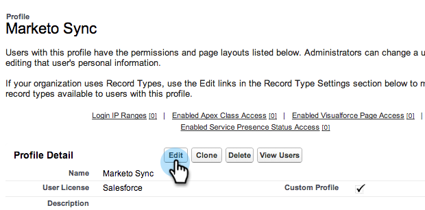

# 手順 2/3:Marketoの [!DNL Salesforce] ユーザーを作成する（Enterprise/Unlimited） {#step-of-create-a-salesforce-user-for-marketo-enterprise-unlimited}

>[!NOTE]
>
>これらの手順は、[!DNL Salesforce] 管理者が実行する必要があります

>[!PREREQUISITES]
>
>[ 手順 1/3:Marketo フィールドの追加先  [!DNL Salesforce]  （Enterprise/Unlimited） ](/help/marketo/product-docs/crm-sync/salesforce-sync/setup/enterprise-unlimited-edition/step-1-of-3-add-marketo-fields-to-salesforce-enterprise-unlimited.md)

この記事では、プロファイルでユーザー権限 [!DNL Salesforce] 設定し、Marketoと [!DNL Salesforce] の統合アカウントを作成します。

## プロファイルの作成 {#create-a-profile}

1. 「**[!UICONTROL 設定]**」をクリックします。

   

1. ナビゲーション検索バーに「プロファイル」と入力し、**[!UICONTROL プロファイル]**&#x200B;リンクをクリックします。

   

1. 「**[!UICONTROL 新規]**」をクリックします。

   

1. 「**[!UICONTROL 標準ユーザー]**」を選択して、プロファイルに「Marketo-Salesforce 同期」という名前を付け、「**[!UICONTROL 保存]**」をクリックします。

   

## プロファイル権限の設定 {#set-profile-permissions}

1. 「**[!UICONTROL 編集]**」をクリックしてセキュリティ権限を設定します。

   

1. **[!UICONTROL 管理権限]**&#x200B;セクションで、次のボックスがオンになっていることを確認します。

   * [!UICONTROL API 有効 ]
   * [!UICONTROL HTML テンプレートの編集 ]
   * [!UICONTROL  公開文書の管理 ]
   * [!UICONTROL  公開テンプレートの管理 ]

   

   >[!TIP]
   >
   >**[!UICONTROL パスワードの有効期限なし]**&#x200B;ボックスのチェックは必ずオンにしてください。

1. 「[!UICONTROL  一般ユーザー権限 ]」セクションで、次のボックスがオンになっていることを確認します。

   * [!UICONTROL  リードを変換 ]
   * [!UICONTROL  イベントの編集 ]
   * [!UICONTROL  タスクの編集 ]

   

1. 「[!UICONTROL  標準オブジェクトの権限 ]」セクションで、[!UICONTROL  読み取り、作成、編集、削除 ] 権限がオンになっていることを確認します。

   * [!UICONTROL アカウント]
   * [!UICONTROL キャンペーン]
   * [!UICONTROL 取引先責任者]
   * [!UICONTROL リード]
   * [!UICONTROL 商談]

   >[!NOTE]
   >
   >キャンペーン同期を使用する場合は、[!UICONTROL Campaigns] に権限を付与します。

   

1. 終了したら、ページの下部にある「**[!UICONTROL 保存]**」をクリックします。

   

## フィールド権限の設定 {#set-field-permissions}

1. 同期に必要なカスタムフィールドをマーケターと話し合います。

   >[!NOTE]
   >
   >この手順を実行すると、Marketo に表示する必要のないフィールドが防止され、混乱が軽減され、同期が高速化されます。

1. プロファイルの詳細ページで、**[!UICONTROL フィールドレベルのセキュリティ]**&#x200B;セクションに移動します。オブジェクトのアクセシビリティを編集するには、「**[!UICONTROL 表示]**」をクリックします。

   * [!UICONTROL リード]
   * [!UICONTROL 取引先責任者]
   * [!UICONTROL アカウント]
   * [!UICONTROL 商談]

   >[!TIP]
   >
   >組織のニーズに応じて、他のオブジェクトを設定できます。

   

1. 各オブジェクトに対して、「**[!UICONTROL 編集]**」をクリックします。

   

1. 不要なフィールドを見つけ、**[!UICONTROL 読み取りアクセス]**&#x200B;と&#x200B;**[!UICONTROL 編集アクセスを]**&#x200B;がオフになっていることを確認してください。完了したら、「**[!UICONTROL 保存]**」をクリックします。

   >[!NOTE]
   >
   >カスタムフィールドのアクセシビリティのみを編集します。

   

1. 不要なフィールドをすべて無効にした後で、次のオブジェクトフィールドの&#x200B;**[!UICONTROL 読み取りアクセスと編集アクセス]**&#x200B;のチェックをオンにします。完了したら、「**[!UICONTROL 保存]**」をクリックします。

<table> 
 <tbody> 
  <tr> 
   <th>オブジェクト</th> 
   <th>フィールド</th> 
  </tr> 
  <tr> 
   <td>アカウント</td> 
   <td>タイプフィールド</td> 
  </tr> 
  <tr> 
   <td>イベント</td> 
   <td>すべてのフィールド</td> 
  </tr> 
  <tr> 
   <td>タスク</td> 
   <td>すべてのフィールド</td> 
  </tr> 
 </tbody> 
</table>

## Marketo-Salesforce 同期アカウントを作成 {#create-marketo-salesforce-sync-account}

>[!TIP]
>
>専用の [!DNL Salesforce] アカウント（例：marketo@yourcompany.com）を作成して、Marketoによる変更を他の [!DNL Salesforce] ユーザーと区別します。

1. ナビゲーション検索バーに「ユーザーを管理」と入力し、「**[!UICONTROL ユーザー]**」をクリックします。「**[!UICONTROL 新規ユーザー]**」をクリックします。

   

1. 必須フィールドに入力します。次に、「**[!UICONTROL ユーザライセンス：Salesforce]**」と、以前に作成したプロファイルを選択します。完了したら、「**[!UICONTROL 保存]**」をクリックします。

   

手順 2／3 が完了しました。

>[!NOTE]
>
>[ 手順 3/3:Marketoと  [!DNL Salesforce]  を接続する（Enterprise/Unlimited） ](/help/marketo/product-docs/crm-sync/salesforce-sync/setup/enterprise-unlimited-edition/step-3-of-3-connect-marketo-and-salesforce-enterprise-unlimited.md)
