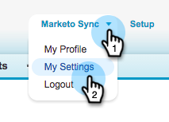
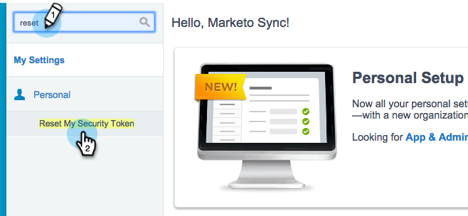
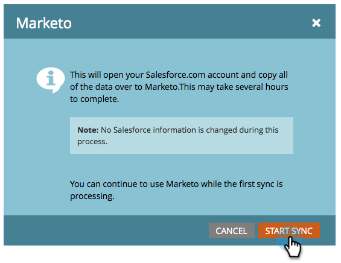
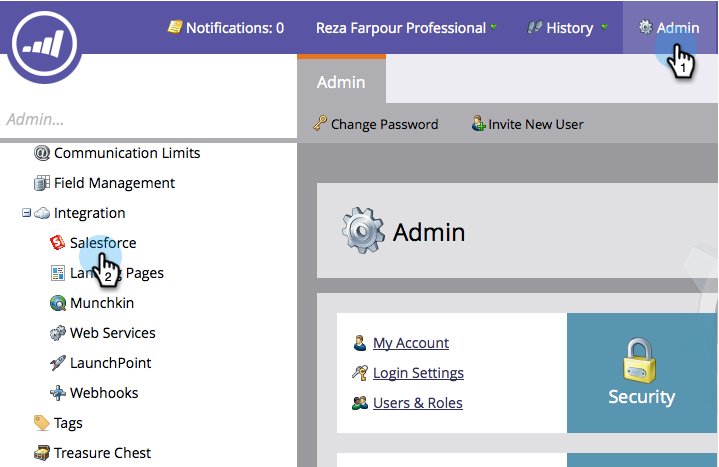
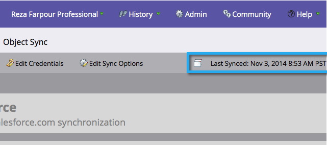
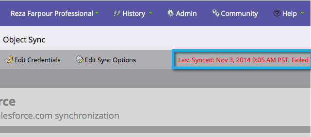

# 手順 3 / 3：Marketo と [!DNL Salesforce] の接続（Enterprise／Unlimited） {#step-of-connect-marketo-and-salesforce-enterprise-unlimited}

この記事では、設定済みの [!DNL Salesforce] インスタンスと同期するように Marketo を設定します。

>[!PREREQUISITES]
>
>* [手順 1 / 3：Marketo フィールドの  [!DNL Salesforce]  への追加（Enterprise／Unlimited）](/help/marketo/product-docs/crm-sync/salesforce-sync/setup/enterprise-unlimited-edition/step-1-of-3-add-marketo-fields-to-salesforce-enterprise-unlimited.md)
>* [手順 2 / 3：Marketo の  [!DNL Salesforce]  ユーザの作成（Enterprise／Unlimited）](/help/marketo/product-docs/crm-sync/salesforce-sync/setup/enterprise-unlimited-edition/step-2-of-3-create-a-salesforce-user-for-marketo-enterprise-unlimited.md)

## 同期ユーザーセキュリティトークンの取得 {#retrieve-sync-user-security-token}

>[!TIP]
>
>既にセキュリティトークンを持っている場合は、直接「同期ユーザー資格情報の設定」に進んで、準備を完了させます。

1. Marketo 同期ユーザで [!DNL Salesforce] にログインし、同期ユーザの名前をクリックしてから、「**[!UICONTROL マイ設定]**」をクリックします。

   

1. クイック検索で、&quot;reset&quot; と入力して、**[!UICONTROL Reset My Security Token]** をクリックします。

   

1. 「**[!UICONTROL Reset Security Token]**」をクリックします。

   

   セキュリティトークンはメールで送信されます。

## 同期ユーザー資格情報の設定 {#set-sync-user-credentials}

1. Marketo で、「**[!UICONTROL 管理]**」に移動し、「**CRM**」を選択して、「**[!UICONTROL Salesforce.com との同期]**」をクリックします。

   

   >[!NOTE]
   >
   >[同期ユーザーから&#x200B;**[!UICONTROL フィールドの同期]**&#x200B;をクリックする前に、Marketoで必要ないすべてのフィールド &#x200B;](/help/marketo/product-docs/crm-sync/salesforce-sync/sfdc-sync-details/hide-a-salesforce-field-from-the-marketo-sync.md)を非表示にします。 「[!UICONTROL フィールドを同期]」をクリックすると、ユーザが表示できるすべてのフィールドが Marketo に作成され、削除できなくなります。

1. [!DNL Salesforce]設定（[Professional](/help/marketo/product-docs/crm-sync/salesforce-sync/setup/professional-edition/step-2-of-3-create-a-salesforce-user-for-marketo-professional.md)または[Enterprise](/help/marketo/product-docs/crm-sync/salesforce-sync/setup/enterprise-unlimited-edition/step-2-of-3-create-a-salesforce-user-for-marketo-enterprise-unlimited.md)）のパート 2で作成された[!DNL Salesforce]Sync User資格情報を入力し、**[!UICONTROL Sync Fields]**&#x200B;をクリックします（**[!UICONTROL Sandbox]**&#x200B;は、[!DNL Salesforce]SandboxにMarketo Sandboxを同期している場合にのみチェックします）。

   

   >[!CAUTION]
   >
   >ユーザー名/パスワード/トークン フィールドの代わりに「Login To [!DNL Salesforce]」ボタンが表示された場合、Marketo サブスクリプションはOAuthに対して有効になっています。 [この記事を参照してください](/help/marketo/product-docs/crm-sync/salesforce-sync/log-in-using-oauth-2-0.md)。 同期が一連の資格情報を使用し始めるとすぐに、**[!DNL Salesforce] の資格情報またはサブスクリプションを切り替えられなくなります**。 基本認証を使用する場合は、アカウントマネージャーにお問い合わせください。

1. 警告を読んでから、「**[!UICONTROL 資格情報の確認]**」をクリックします。

   

   >[!CAUTION]
   >
   >[マッピングを調べてカスタマイズしたい](/help/marketo/product-docs/crm-sync/salesforce-sync/setup/optional-steps/edit-initial-field-mappings.md)場合、これが唯一のチャンスです。 「[!UICONTROL &#x200B; Salesforce Syncを開始]」をクリックすると完了です。

## [!DNL Salesforce] 同期の開始 {#start-salesforce-sync}

1. 「**[!UICONTROL Salesforce 同期を開始]**」をクリックして、Marketo と [!DNL Salesforce] の間の永続的な同期を開始します。

   

   >[!CAUTION]
   >
   >Marketo は、[!DNL Salesforce] の同期や、リードを手動で入力した場合には、自動的に重複排除を行いません。

1. 「**[!UICONTROL 同期の開始]**」をクリックします。

   

   >[!NOTE]
   >
   >最初の同期が完了するまでの時間は、データベースのサイズと複雑さによって異なります。

## 同期の検証 {#verify-sync}

Marketo の「管理」領域に、[!DNL Salesforce] 同期に関するステータスメッセージが表示されます。 次の手順に従うことで、同期が正しく機能していることを確認できます。

1. Marketo で、「**[!UICONTROL 管理]**」をクリックして、「**[!UICONTROL Salesforce]**」をクリックします。

   

1. 同期ステータスは、右上隅に表示されます。 **[!UICONTROL 最終同期]**、**[!UICONTROL 同期が進行しています]**、**[!UICONTROL 失敗]**&#x200B;のいずれかのメッセージが表示されます。

   

   

   

Marketoの最も強力な機能の1つを設定しました。

>[!MORELIKETHIS]
>
>* [手順 1 / 3：Marketo フィールドの  [!DNL Salesforce]  への追加（Enterprise／Unlimited）](/help/marketo/product-docs/crm-sync/salesforce-sync/setup/enterprise-unlimited-edition/step-1-of-3-add-marketo-fields-to-salesforce-enterprise-unlimited.md)
>* [手順 2 / 3：Marketo の  [!DNL Salesforce]  ユーザの作成（Enterprise／Unlimited）](/help/marketo/product-docs/crm-sync/salesforce-sync/setup/enterprise-unlimited-edition/step-2-of-3-create-a-salesforce-user-for-marketo-enterprise-unlimited.md)
>* [&#x200B; [!DNL Salesforce] AppExchange](/help/marketo/product-docs/marketo-sales-insight/msi-for-salesforce/installation/install-marketo-sales-insight-package-in-salesforce-appexchange.md) での Marketo セールスインサイトパッケージのインストール
>* [&#x200B; [!DNL Salesforce]  Enterprise／Unlimited](/help/marketo/product-docs/marketo-sales-insight/msi-for-salesforce/configuration/configure-marketo-sales-insight-in-salesforce-enterprise-unlimited.md) での Marketo セールスインサイトの設定
