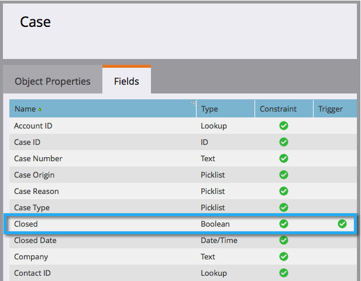

# スマートリスト/トリガー制約としての追加カスタムオブジェクトフィールドの削除 {#add-remove-custom-object-field-as-smart-list-trigger-constraints}

Marketorは、Salesforceカスタムオブジェクトの同期を細かく制御できます。 これにより、カスタムオブジェクトフィルターで制約として使用できるフィールドを選択し、スマートキャンペーンでトリガーとして使用できます。

>[!NOTE]
>
>**必要な管理者権限**

1. 「 **管理者」をクリックします。**

   

1. 「 **管理者** 」をクリックし、「 **Salesforceオブジェクトの同期」をクリックします。**

   

1. **左側の列にSalesforceオブジェクト同期** (Sync)が表示されます。

   

1. 変更するオブジェクトを選択します。

   

1. 「表示されるフィールドを **編集**」をクリックします。

   >[!TIP]
   >
   >「 **表示フィールドを** 編集」ボタンがグレー表示になっている場合は、そのオブジェクトは現在スマートリストまたはスマートキャンペーンで使用されています。 続行するには、すべての関連付けを削除します。

   

1. グローバル同期が有効になっている場合は、「グローバル同期を **無効にする**」をクリックします。

   

1. 必要なフィルター/トリガー制約の横のチェックボックスをオンにし、「 **保存**」をクリックします。

   

   >[!NOTE]
   >
   >デフォルトでは、すべてのフィールドがフィルターの制約として選択されます。

1. 「 **フィールド** 」タブをクリックして、変更を確認します。

   

   >[!NOTE]
   >
   >**Reminder**
   >
   >
   >グローバル同期を再度有効にするのを忘れないでください。

うわぁ！ スマートリストとスマートキャンペーンのパワーがさらに高まります。

>[!MORELIKETHIS]
>
>* [カスタムオブジェクト同期の有効化/無効化](enable-disable-custom-object-sync.md)

>

