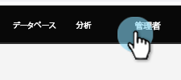

# アクティビティ同期のカスタマイズ {#customize-activities-sync}

Marketo セールスインサイトを使用しない場合、Marketo Engage は特定のイベントに対して Salesforce のアクティビティ履歴レコードを作成できます。有効にする方法は、以下のとおりです。

>[!NOTE]
>
>Salesforce／Marketo Engage の同期では、ユーザが Salesforce にプッシュされる前に発生したアクティビティは Salesforce にプッシュされません。

1. 「**[!UICONTROL Admin]**」に移動します。

   

1. **[!DNL Salesforce]** をクリックし、「**[!UICONTROL 同期オプションを編集]**」をクリックします。

   

1. Marketo で Salesforce にプッシュするアクティビティの横にあるチェックボックスをオンにして、「**[!UICONTROL 保存]**」をクリックします。

   

   >[!NOTE]
   >
   >有効化すると、Marketo は 3 か月分のアクティビティ履歴をプッシュします。データの量に応じて、_これには数日かかる場合があります_。アクティビティの初回プッシュ中に発生したアップデートは、アクティビティの初回同期が完了するまで遅延する場合があります。

<table>
 <colgroup>
  <col>
  <col>
 </colgroup>
 <thead>
  <tr>
   <th>アクティビティのタイプ</th>
   <th>説明</th>
  </tr>
 </thead>
 <tbody>
  <tr>
   <td>[!UICONTROL フォームに入力済み]</td>
   <td>任意の Marketo フォームに入力しました。</td>
  </tr>
  <tr>
   <td>[!UICONTROL リストに追加済み]</td>
   <td>
フローステップ：静的リストに追加されました。
</td>
  </tr>
  <tr>
   <td>[!UICONTROL メール送信済み]</td>
   <td>フローステップ：メールが送信されました。</td>
  </tr>
  <tr>
   <td>[!UICONTROL メール配信済み]</td>
   <td>メールを受信しました（バウンスなし）</td>
  </tr>
  <tr>
   <td>[!UICONTROL メール開封済み]</td>
   <td>メールを開きました（画像ブロックなし）</td>
  </tr>
  <tr>
   <td>[!UICONTROL メール内リンクをクリック済み]</td>
   <td>Marketo から送信されたメール内のリンクをクリックしました。</td>
  </tr>
  <tr>
   <td>[!UICONTROL リストから削除済み]</td>
   <td>フローステップ：静的リストから削除されました。</td>
  </tr>
  <tr>
   <td>[!UICONTROL フローから削除]</td>
   <td>フローステップ：フローから削除されました。</td>
  </tr>
  <tr>
   <td>[!UICONTROL セールスメール送信済み]</td>
   <td>Marketo セールスインサイト経由でメールを送信されました。</td>
  </tr>
  <tr>
   <td>[!UICONTROL セールスメール開封済み]</td>
   <td>Marketo セールスインサイト経由で送信したメールを開封しました。</td>
  </tr>
  <tr>
   <td>[!UICONTROL セールスメール内リンクをクリック]</td>
   <td>Marketo セールスインサイトを通じて送信されたメール内のリンクをクリックしました。</td>
  </tr>
  <tr>
   <td>[!UICONTROL セールスメール受信済み]</td>
   <td>MSI Outlook プラグインでセールス担当者がメールを受信し、ログに記録しました</td>
  </tr>
 </tbody>
</table>

>[!NOTE]
>
>「セールスメール受信済み」は、配達済みとは&#x200B;_違います_。Sales Insight 経由で送信されたメールの配信ステータスはキャプチャされません。

>[!TIP]
>
>Marketo の情報を更に Salesforce に追加することに関心がある場合は、[Marketo Sales Insight](/help/marketo/product-docs/marketo-sales-insight/msi-for-salesforce/installation/install-marketo-sales-insight-package-in-salesforce-appexchange.md){target="_blank"} 製品をご確認ください。
