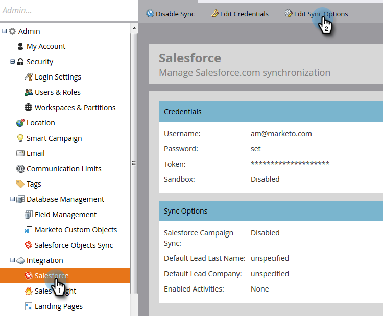

# アクティビティ同期のカスタマイズ{#customize-activities-sync}

Marketo Sales Insightを使用しない場合、Marketorは特定のイベントに対してSalesforceアクティビティ履歴レコードを作成できます。 有効にする方法を次に示します。

1. **管理者**&#x200B;に移動します。

   

1. 「**Salesforce**」をクリックし、「**同期オプションを編集**」をクリックします。

   

1. MarketがSalesforceにプッシュするアクティビティの横のチェックボックスをオンにし、「**保存**」をクリックします。

   

   >[!NOTE]
   >
   >有効になると、Marketoは3か月分のアクティビティ履歴をプッシュします。 データの量によっては、__&#x200B;を完了するのに数日かかる場合があります。 最初のアクティビティのプッシュ中に発生する更新は、最初のアクティビティの同期が完了するまで遅延する可能性があります。

<table> 
 <colgroup> 
  <col> 
  <col> 
 </colgroup> 
 <thead> 
  <tr> 
   <th>アクティビティタイプ</th> 
   <th>説明</th> 
  </tr> 
 </thead> 
 <tbody> 
  <tr> 
   <td>記入済みのフォーム</td> 
   <td>任意のマーケティングフォームへの入力</td> 
  </tr> 
  <tr> 
   <td>リストに追加</td> 
   <td>
フローステップ：静的リストに追加されました
</td> 
  </tr> 
  <tr> 
   <td>電子メール送信</td> 
   <td>フローステップ：Eメールが送信されました</td> 
  </tr> 
  <tr> 
   <td>電子メール配信</td> 
   <td>電子メールを受信（バウンスなし）</td> 
  </tr> 
  <tr> 
   <td>開封済み電子メール</td> 
   <td>電子メールを開きました（画像をブロックしません）</td> 
  </tr> 
  <tr> 
   <td>電子メール内のクリックされたリンク</td> 
   <td>Marketorが送信した電子メール内のリンクをクリック</td> 
  </tr> 
  <tr> 
   <td>リストから削除</td> 
   <td>フローステップ：静的リストから削除されました</td> 
  </tr> 
  <tr> 
   <td>フローから削除</td> 
   <td>フローステップ：フローから削除</td> 
  </tr> 
  <tr> 
   <td>送信された販売の電子メール</td> 
   <td>Marketor Sales Insight経由で電子メールが送信された</td> 
  </tr> 
  <tr> 
   <td>開封済みの販売電子メール</td> 
   <td>Marketor Sales Insight経由で送信される電子メールを開きました。</td> 
  </tr> 
  <tr> 
   <td>販売の電子メールのリンクをクリック</td> 
   <td>Marketor Sales Insight経由で送信される電子メール内のリンクをクリックしました</td> 
  </tr> 
  <tr> 
   <td>受信した販売の電子メール</td> 
   <td>販売担当者がMSI Outlookプラグインで電子メールを受信し、ログに記録しました</td> 
  </tr> 
 </tbody> 
</table>

>[!NOTE]
>
>&quot;受信した販売の電子メール&quot;が&#x200B;**配信されない**。 Sales Insight経由で送信された電子メールの配信ステータスはキャプチャされません。

>[!TIP]
>
>Salesforceに対するより多くのマーケティング情報の取り込みに関心がある場合は、弊社の[Marketo Sales Insight](/help/marketo/product-docs/marketo-sales-insight/msi-for-salesforce/installation/install-marketo-sales-insight-package-in-salesforce-appexchange.md)製品をご覧ください。
