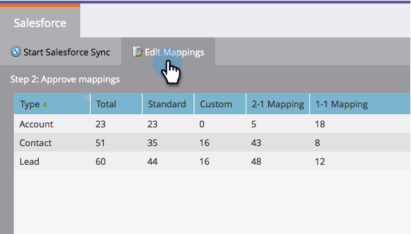
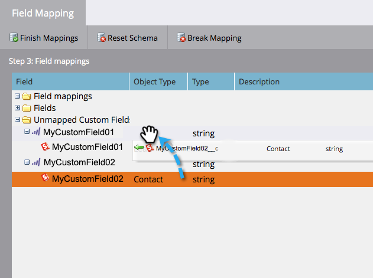
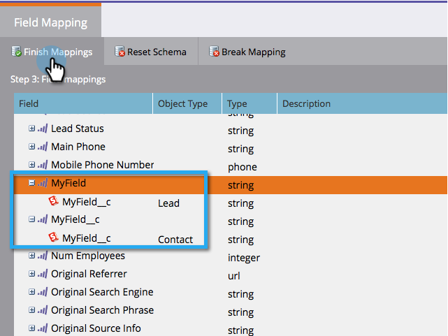

# 初期フィールドマッピングの編集 {#edit-initial-field-mappings}

>[!NOTE]
>
>この機能は、Salesforceに最初に同期する前にのみアクセスできます。 一度「**[!UICONTROL 今すぐ同期]**」ボタンが押されると、この操作は実行できなくなります。

Adobe Marketo Engageでは、Salesforceとの初回同期時に、同様の名前のカスタムフィールドをMarketo側の1つのフィールドに自動的に組み合わせ、CRMのリードオブジェクトと連絡先オブジェクトの両方とデータをやり取りできるようにしています。 この記事では、これらのマッピングをカスタマイズする方法について説明します。

## マッピングされていないフィールドをマッピング {#map-unmapped-fields}

「[!UICONTROL  マッピングされていないフィールド ]」フォルダーにフィールドが表示された場合、Salesforceのリードまたは取引先責任者の同様のフィールドにマッピングされていないことを意味します。 これは修正できます。

1. 「**[!UICONTROL マッピングを編集]**」をクリックします。

1. **[!UICONTROL マッピングされていないカスタムフィールド]**&#x200B;フォルダーを開きます。

   

1. マッピングされていないカスタムフィールドをドラッグして別のマッピングされていないカスタムフィールドに重ね、まとめます。

   >[!NOTE]
   >
   >編集できるのは、カスタムフィールドマッピングのみです。 標準フィールドマッピングは変更できません。

   

1. 完了したら「**[!UICONTROL マッピングを終了]**」をクリックします。

   

## 既存のマッピングを解除 {#break-existing-mapping}

リードと連絡先オブジェクトに似た名前のフィールドがある場合、Marketo はそれらを自動的にマッピングします。 異なるデータを保持し、異なるデータを持つと見なすこともできます。 このようにマッピングを解除します。

1. 「**[!UICONTROL マッピングを編集]**」をクリックします。

   

1. マッピングされたフィールドをハイライトし、「**[!UICONTROL マッピングを解除]**」をクリックしてフィールドを分けます。

   

1. 完了したら「**[!UICONTROL マッピングを終了]**」をクリックします。

   

   初期同期はほぼ完了です。

## スキーマのリセット {#reset-schema}

1. マッピングの操作中に Salesforce のスキーマに変更を加えた場合は、「**[!UICONTROL スキーマをリセット]**」をクリックして変更を適用します。

   * すべてのマッピングの変更がリセットされます。
   * スキーマのリセットでは、フィールドの追加のみがおこなわれ、削除はおこなわれません（同期ユーザーから非表示にした場合でも）。

   
