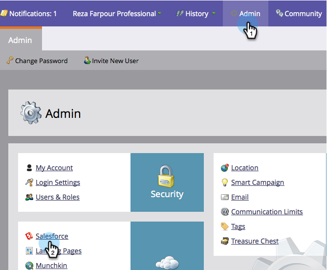
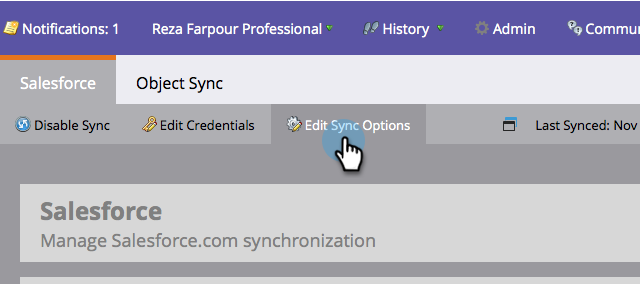
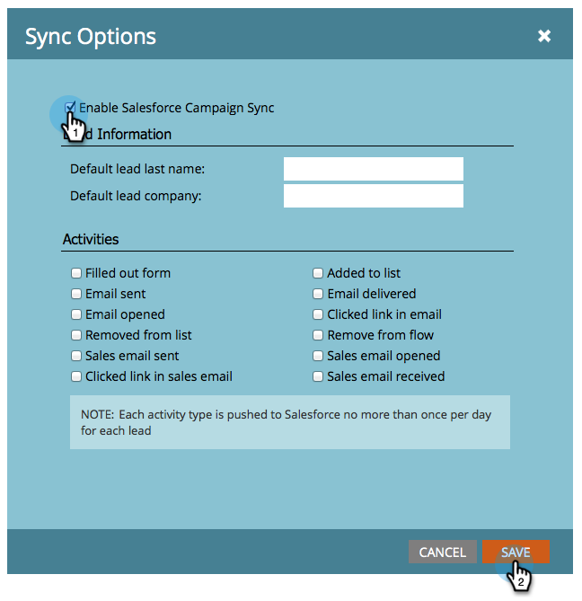

# キャンペーン同期の有効化／無効化 {#enable-disable-campaign-sync}

>[!NOTE]
>
>**管理者権限が必要**

このオプションを使用すると、Marketo EngageのプログラムメンバーシップとステータスをSalesforce キャンペーンと同期できます。その逆も可能です。

1. 「**[!UICONTROL 管理者]**」に移動し、「**[!DNL Salesforce]**」をクリックします。

   

1. 「**[!UICONTROL 同期設定を編集]**」をクリックします。

   

1. **[!UICONTROL Salesforce Campaign Syncを有効にする]**&#x200B;にチェックを入れ、**[!UICONTROL 保存]**&#x200B;をクリックします。

   

Salesforceからデータを取得するには、同期に時間がかかる場合があります。

>[!MORELIKETHIS]
>
>* [SFDC 同期：キャンペーンの同期](/help/marketo/product-docs/crm-sync/salesforce-sync/sfdc-sync-details/sfdc-sync-campaign-sync.md){target="_blank"}
>* [デフォルトのリードの姓と会社の値の設定](/help/marketo/product-docs/crm-sync/salesforce-sync/setup/optional-steps/set-default-person-last-name-and-company-name.md){target="_blank"}
>* [アクティビティ同期のカスタマイズ](/help/marketo/product-docs/crm-sync/salesforce-sync/setup/optional-steps/customize-activities-sync.md){target="_blank"}
