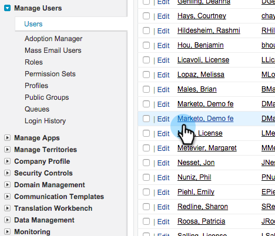
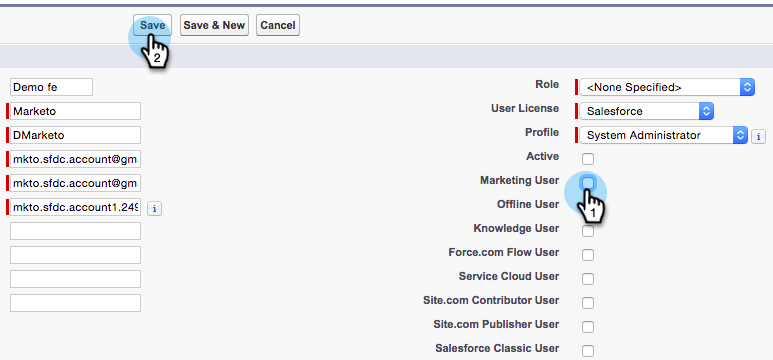

# Marketo 同期ユーザーをマーケティングユーザーにする {#make-marketo-sync-user-a-marketing-user}

Salesforce キャンペーン同期が正しく機能するには、[Marketo 同期ユーザー](/help/marketo/product-docs/crm-sync/salesforce-sync/setup/enterprise-unlimited-edition/step-2-of-3-create-a-salesforce-user-for-marketo-enterprise-unlimited.md){target="_blank"}はマーケティングユーザーである必要があります。 次に、Salesforce でユーザーをマーケティングユーザーにする方法を示します。

>[!NOTE]
>
>**管理者権限が必要**

1. Salesforce にログインします。 左の検索バーでユーザーを検索し、「**[!UICONTROL ユーザーを管理]**」で「**[!UICONTROL ユーザー]**」をクリックします。

   

1. 同期ユーザーを見つけて、名前をクリックします。

   

1. 「**[!UICONTROL 編集]**」をクリックします。

   

1. **[!UICONTROL マーケティングユーザー]**&#x200B;チェックをオンにして、「**[!UICONTROL 保存]**」をクリックします。

   

   この Marketo 同期ユーザーは、マーケティングユーザーになりました。
