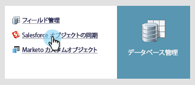
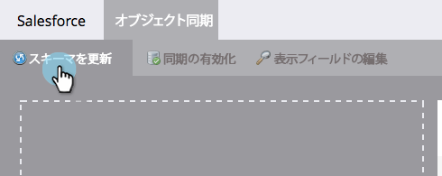

# カスタムオブジェクト同期の有効化／無効化 {#enable-disable-custom-object-sync}

Salesforce インスタンスで作成されたカスタムオブジェクトも、Marketo Engage の一部にすることができます。その設定方法を説明しましょう。

## カスタムオブジェクト同期の有効化／無効化 {#enable-disable-custom-object-sync-1}

>[!NOTE]
>
>**管理者権限が必要**

1. 「**[!UICONTROL 管理者]**」領域に移動します。

   

1. データベース管理メニューで、「**[!UICONTROL Salesforce オブジェクト同期]**」をクリックします。

   

1. これが最初のカスタムオブジェクトの場合は、「**[!UICONTROL スキーマを同期]**」をクリックします。それ以外の場合は、「**[!UICONTROL スキーマを更新]**」をクリックして最新であることを確認します。

   

1. グローバル同期が実行中の場合は、「**[!UICONTROL グローバル同期を無効にする]**」をクリックして無効にする必要があります。

   

   >[!NOTE]
   >
   >[!DNL Salesforce] カスタムオブジェクトスキーマの同期には、数分かかる場合があります。

1. 「**[!UICONTROL スキーマを更新]**」をクリックします。

   

1. 同期するオブジェクトを選択し、「**[!UICONTROL 同期を有効にする]**」をクリックします。

   >[!TIP]
   >
   >Marketoがカスタムオブジェクトを同期できるのは、[!DNL Salesforce] のリード、連絡先またはアカウントのオブジェクトと直接の関係がある場合のみです。

   

1. 「**[!UICONTROL 同期を有効にする]**」を再度クリックします。

   

1. 「**[!DNL Salesforce]**」タブに戻って、「**[!UICONTROL 同期を有効にする]**」をクリックします。

   

## カスタムオブジェクトの使用 {#using-your-custom-objects}

>[!NOTE]
>
>スマートキャンペーンでは、カスタムオブジェクトをトリガーと共に使用することはできません。

1. スマートリストで、**[!UICONTROL 商談あり]**&#x200B;フィルターをドラッグして、**[!UICONTROL true]** に設定します。

   

1. 次に、フィルター制約を使用してフォーカスを絞り込みます。

   

   これで完了です。このカスタムオブジェクトのデータをスマートキャンペーンとスマートリストで使用できるようになりました。

>[!MORELIKETHIS]
>
>[スマートリスト／トリガー制約としてのカスタムオブジェクトフィールドの追加／削除](/help/marketo/product-docs/crm-sync/salesforce-sync/setup/optional-steps/add-remove-custom-object-field-as-smart-list-trigger-constraints.md){target="_blank"}
